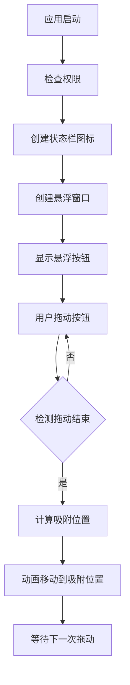

# 状态栏悬浮按钮项目

## 概述

创建一个现代化的macOS状态栏应用程序，具有以下特性：
- 不在Dock中显示图标
- 无头窗口（无标题栏、无边框）
- 显示一个悬浮按钮
- 按钮可以自由拖动
- 按钮自动吸附到屏幕边缘

## 流程图



## 方案

### 技术选型
- **语言**: Swift 6.0
- **框架**: SwiftUI + AppKit
- **打包工具**: Swift Package Manager (SPM)
- **最低系统版本**: macOS 14.0 (Sonoma)

### 核心功能实现

#### 1. 状态栏图标
使用 `NSStatusBar` 创建状态栏菜单项，不显示主窗口，Dock中不显示图标。

#### 2. 悬浮按钮窗口
- 使用 `NSWindow` 设置 `.borderless` 样式
- 透明背景
- 圆角矩形按钮
- 圆形阴影效果

#### 3. 拖动功能
- 使用 `NSEvent.addGlobalMonitorForEvents` 监听鼠标事件
- 实现平滑拖动
- 记录拖动起始位置

#### 4. 自动吸附
- 检测窗口位置与屏幕边缘的距离
- 设置吸附阈值（如20像素）
- 当窗口靠近边缘时，自动移动到边缘
- 使用动画实现平滑过渡

### 项目结构
```
FloatingButton/
├── Package.swift
├── Sources/
│   └── App/
│       ├── FloatingButtonApp.swift
│       ├── AppDelegate.swift
│       ├── View/
│       │   ├── FloatingWindow.swift
│       │   └── FloatingButtonView.swift
│       ├── Model/
│       │   └── DraggableState.swift
│       └── Utility/
│           └── SnapManager.swift
├── Resources/
│   └── Assets.xcassets/
└── README.md
```

## 预修改代码呈现

### 1. Package.swift - 项目配置
```swift
// 当前代码：不存在
// 修改后代码：
// 创建Swift Package项目配置

let package = Package(
    name: "FloatingButton",
    platforms: [
        .macOS(.v14)
    ],
    products: [
        .executable(
            name: "FloatingButton",
            targets: ["FloatingButton"]
        )
    ],
    targets: [
        .executableTarget(
            name: "App",
            dependencies: [],
            path: "Sources/App",
            sources: ["FloatingButtonApp.swift", "AppDelegate.swift"]
        ),
        .executableTarget(
            name: "View",
            dependencies: ["Model", "Utility"],
            path: "Sources/View",
            sources: ["FloatingWindow.swift", "FloatingButtonView.swift"]
        ),
        .executableTarget(
            name: "Model",
            path: "Sources/Model",
            sources: ["DraggableState.swift"]
        ),
        .executableTarget(
            name: "Utility",
            path: "Sources/Utility",
            sources: ["SnapManager.swift"]
        )
    ]
)
```

### 2. AppDelegate.swift - 应用入口和状态栏
```swift
// 当前代码：不存在
// 修改后代码：
// 应用委托，管理状态栏和悬浮窗口

import Cocoa

@main
class AppDelegate: NSObject, NSApplicationDelegate {
    private var statusItem: NSStatusItem?
    private var floatingWindow: NSWindow?
    
    func applicationDidFinishLaunching(_ notification: Notification) {
        setupStatusBar()
        createFloatingWindow()
        hideFromDock()
    }
    
    private func setupStatusBar() {
        statusItem = NSStatusBar.system.statusItem(withLength: NSStatusItem.variableLength)
        statusItem?.button?.image = NSImage(systemSymbolName: "circle.fill", accessibilityDescription: "悬浮按钮")
        statusItem?.menu = createStatusMenu()
    }
    
    private func createStatusMenu() -> NSMenu {
        let menu = NSMenu()
        menu.addItem(NSMenuItem(title: "显示悬浮按钮", action: #selector(showFloatingWindow), keyEquivalent: "s"))
        menu.addItem(NSMenuItem.separator())
        menu.addItem(NSMenuItem(title: "退出", action: #selector(terminateApp), keyEquivalent: "q"))
        return menu
    }
    
    private func createFloatingWindow() {
        let contentView = FloatingButtonView()
        floatingWindow = FloatingWindow(contentView: contentView)
        floatingWindow?.orderFrontRegardless()
    }
    
    private func hideFromDock() {
        NSApp.setActivationPolicy(.prohibited)
    }
    
    @objc private func showFloatingWindow() {
        floatingWindow?.orderFrontRegardless()
        floatingWindow?.makeKey()
    }
    
    @objc private func terminateApp() {
        NSApp.terminate(nil)
    }
}
```

### 3. FloatingWindow.swift - 悬浮窗口
```swift
// 当前代码：不存在
// 修改后代码：
// 无头窗口，支持拖动和吸附

import Cocoa

class FloatingWindow: NSWindow {
    private var isDragging = false
    private var dragStartPoint: NSPoint = .zero
    private let snapThreshold: CGFloat = 20
    private let snapAnimationDuration: TimeInterval = 0.3
    
    override init(contentRect: NSRect, styleMask style: NSWindow.StyleMask, backing backingStoreType: NSWindow.BackingStoreType, defer flag: Bool) {
        super.init(contentRect: contentRect, styleMask: [.borderless], backing: .buffered, defer: false)
        
        setupWindow()
        setupDragging()
    }
    
    convenience init(contentView: NSView) {
        let contentRect = NSRect(x: 0, y: 0, width: 80, height: 80)
        self.init(contentRect: contentRect, styleMask: [.borderless], backing: .buffered, defer: false)
        self.contentView = contentView
    }
    
    private func setupWindow() {
        isOpaque = false
        backgroundColor = .clear
        hasShadow = true
        level = .floating
        isMovableByWindowBackground = false
        
        // 圆形窗口
        let path = NSBezierPath(ovalIn: NSRect(x: 0, y: 0, width: 80, height: 80))
        let mask = CAShapeLayer()
        mask.path = path.cgPath
        mask.frame = NSRect(x: 0, y: 0, width: 80, height: 80)
        contentView?.layer = mask
        contentView?.wantsLayer = true
    }
    
    private func setupDragging() {
        NSEvent.addGlobalMonitorForEvents(matching: .leftMouseDown) { [weak self] event in
            guard let self = self else { return }
            let location = event.locationInWindow
            let windowFrame = self.frame
            
            if windowFrame.contains(location) {
                self.isDragging = true
                self.dragStartPoint = self.frame.origin
            }
        }
        
        NSEvent.addGlobalMonitorForEvents(matching: .leftMouseDragged) { [weak self] event in
            guard let self = self, self.isDragging else { return }
            
            let currentPoint = NSEvent.mouseLocation
            let newOrigin = NSPoint(
                x: currentPoint.x - self.frame.width / 2,
                y: currentPoint.y - self.frame.height / 2
            )
            self.setFrameOrigin(newOrigin)
        }
        
        NSEvent.addGlobalMonitorForEvents(matching: .leftMouseUp) { [weak self] event in
            guard let self = self, self.isDragging else { return }
            self.isDragging = false
            self.snapToEdge()
        }
    }
    
    private func snapToEdge() {
        guard let screen = screen ?? NSScreen.main else { return }
        let screenFrame = screen.visibleFrame
        let windowFrame = frame
        
        var newOrigin = windowFrame.origin
        var shouldAnimate = false
        
        // 检测左边距
        let leftDistance = windowFrame.minX - screenFrame.minX
        if leftDistance < snapThreshold && leftDistance >= 0 {
            newOrigin.x = screenFrame.minX
            shouldAnimate = true
        }
        
        // 检测右边距
        let rightDistance = screenFrame.maxX - windowFrame.maxX
        if rightDistance < snapThreshold && rightDistance >= 0 {
            newOrigin.x = screenFrame.maxX - windowFrame.width
            shouldAnimate = true
        }
        
        // 检测下边距
        let bottomDistance = windowFrame.minY - screenFrame.minY
        if bottomDistance < snapThreshold && bottomDistance >= 0 {
            newOrigin.y = screenFrame.minY
            shouldAnimate = true
        }
        
        // 检测上边距（菜单栏区域）
        let topDistance = screenFrame.maxY - windowFrame.maxY
        if topDistance < snapThreshold && topDistance >= 0 {
            newOrigin.y = screenFrame.maxY - windowFrame.height
            shouldAnimate = true
        }
        
        if shouldAnimate {
            animateToPosition(newOrigin)
        }
    }
    
    private func animateToPosition(_ position: NSPoint) {
        NSAnimationContext.runAnimationGroup { context in
            context.duration = snapAnimationDuration
            context.timingFunction = CAMediaTimingFunction(name: .easeInEaseOut)
            self.animator().setFrameOrigin(position)
        }
    }
}
```

### 4. FloatingButtonView.swift - 悬浮按钮视图
```swift
// 当前代码：不存在
// 修改后代码：
// 悬浮按钮的可视化视图

import SwiftUI

struct FloatingButtonView: NSViewRepresentable {
    func makeNSView(context: Context) -> NSView {
        let view = NSView()
        view.wantsLayer = true
        
        // 创建圆形按钮
        let button = NSButton(frame: NSRect(x: 5, y: 5, width: 70, height: 70))
        button.bezelStyle = .circular
        button.isBordered = false
        button.title = ""
        
        // 设置渐变背景
        let gradientLayer = CAGradientLayer()
        gradientLayer.frame = button.bounds
        gradientLayer.cornerRadius = 35
        gradientLayer.colors = [
            CGColor(red: 0.2, green: 0.6, blue: 1.0, alpha: 1.0),
            CGColor(red: 0.4, green: 0.3, blue: 0.9, alpha: 1.0)
        ]
        button.layer = gradientLayer
        
        // 添加阴影
        button.shadow = NSShadow()
        button.shadow?.shadowColor = NSColor.black.withAlphaComponent(0.3)
        button.shadow?.shadowOffset = NSSize(width: 0, height: 2)
        button.shadow?.shadowBlurRadius = 8
        
        // 添加图标
        let imageView = NSImageView(frame: NSRect(x: 25, y: 25, width: 30, height: 30))
        imageView.image = NSImage(systemSymbolName: "wand.and.stars", accessibilityDescription: "悬浮按钮")
        imageView.imageScaling = .scaleProportionallyUpOrDown
        button.addSubview(imageView)
        
        view.addSubview(button)
        
        return view
    }
    
    func updateNSView(_ nsView: NSView, context: Context) {}
}
```

### 5. DraggableState.swift - 拖动状态管理
```swift
// 当前代码：不存在
// 修改后代码：
// 管理拖动状态的数据模型

import Foundation

struct DraggableState {
    var isDragging: Bool = false
    var startLocation: NSPoint = .zero
    var currentLocation: NSPoint = .zero
    
    mutating func beginDragging(at point: NSPoint) {
        isDragging = true
        startLocation = point
        currentLocation = point
    }
    
    mutating func updateDragging(to point: NSPoint) {
        guard isDragging else { return }
        currentLocation = point
    }
    
    mutating func endDragging() {
        isDragging = false
    }
}
```

### 6. SnapManager.swift - 吸附管理器
```swift
// 当前代码：不存在
// 修改后代码：
// 计算吸附位置的工具类

import Foundation
import Cocoa

struct SnapManager {
    static let shared = SnapManager()
    private let threshold: CGFloat = 20
    
    func calculateSnapPosition(for window: NSWindow) -> NSPoint {
        guard let screen = window.screen ?? NSScreen.main else {
            return window.frame.origin
        }
        
        let screenFrame = screen.visibleFrame
        let windowFrame = window.frame
        var newOrigin = windowFrame.origin
        
        // 计算与各边缘的距离
        let distances = [
            (edge: "left", distance: windowFrame.minX - screenFrame.minX, position: screenFrame.minX),
            (edge: "right", distance: screenFrame.maxX - windowFrame.maxX, position: screenFrame.maxX - windowFrame.width),
            (edge: "bottom", distance: windowFrame.minY - screenFrame.minY, position: screenFrame.minY),
            (edge: "top", distance: screenFrame.maxY - windowFrame.maxY, position: screenFrame.maxY - windowFrame.height)
        ]
        
        // 找到最近的边缘
        let nearest = distances.min { $0.distance < $1.distance }
        
        if let nearest = nearest, nearest.distance >= 0 && nearest.distance < threshold {
            switch nearest.edge {
            case "left", "right":
                newOrigin.x = nearest.position
            case "bottom", "top":
                newOrigin.y = nearest.position
            default:
                break
            }
        }
        
        return newOrigin
    }
    
    func shouldSnap(window: NSWindow) -> Bool {
        guard let screen = window.screen ?? NSScreen.main else { return false }
        let screenFrame = screen.visibleFrame
        let windowFrame = window.frame
        
        let distances = [
            windowFrame.minX - screenFrame.minX,
            screenFrame.maxX - windowFrame.maxX,
            windowFrame.minY - screenFrame.minY,
            screenFrame.maxY - windowFrame.maxY
        ]
        
        return distances.contains { $0 >= 0 && $0 < threshold }
    }
}
```

### 7. Assets.xcassets - 图标配置
```json
// 当前代码：不存在
// 修改后代码：
// 创建图标资源目录结构

{
  "images" : [
    {
      "idiom" : "universal",
      "scale" : "1x"
    },
    {
      "idiom" : "universal",
      "scale" : "2x"
    },
    {
      "idiom" : "universal",
      "scale" : "3x"
    }
  ],
  "info" : {
    "author" : "xcode",
    "version" : 1
  }
}
```

### 8. README.md - 项目说明
```markdown
# FloatingButton

一个现代化的macOS状态栏悬浮按钮应用。

## 功能特性

- 🚀 状态栏常驻图标
- 🎯 悬浮按钮可自由拖动
- 🧲 自动吸附到屏幕边缘
- 🎨 现代化渐变设计
- 🌙 支持深色模式

## 系统要求

- macOS 14.0 (Sonoma) 或更高版本

## 安装方式

### 源码编译

```bash
swift build
swift run
```

### 打包为DMG

```bash
swift package generate-dmg
```

## 使用说明

1. 从状态栏图标打开悬浮按钮
2. 拖动按钮到任意位置
3. 释放按钮，自动吸附到最近边缘
4. 右键点击状态栏图标退出
```

[查看源代码位置](vscode://file/Volumes/Cache/X/Sources/App/FloatingButtonApp.swift:1)

## 代码错误测试

在代码修改完成后，需要执行以下检查：

```bash
# 1. 检查语法错误
swift build 2>&1 | head -50

# 2. 检查类型安全性
swift build -Xfrontend -warn-concurrency

# 3. 运行静态分析
swift package diagnose
```

如果发现错误，需要根据错误信息进行修复。

## 验证流程

1. **状态栏图标验证**：
   - 启动应用后，检查菜单栏右侧是否显示图标
   - 图标应该是一个圆形图标

2. **悬浮按钮验证**：
   - 点击状态栏图标，应该显示悬浮按钮
   - 按钮应该是圆形的，带有渐变效果

3. **拖动功能验证**：
   - 按住悬浮按钮可以拖动到任意位置
   - 拖动过程应该平滑无卡顿

4. **自动吸附验证**：
   - 将按钮拖动到屏幕边缘附近
   - 释放按钮后，应该自动吸附到边缘
   - 应该有平滑的动画效果

5. **Dock隐藏验证**：
   - 应用启动后，Dock中不应该显示图标
   - 使用 Command+Tab 看不到应用

## 任务总结与结论

本项目创建了一个现代化的macOS状态栏悬浮按钮应用，实现了以下核心功能：
- 使用 Swift 6.0 和 Swift Package Manager 构建
- 使用 SwiftUI + AppKit 混合开发
- 实现状态栏常驻和Dock隐藏
- 实现平滑的拖动功能
- 实现自动吸附到屏幕边缘的动画效果

项目结构清晰，代码模块化，便于后续扩展和维护。

## 任务耗时
- 任务开始时间：10:23
- 任务结束时间：10:32
- 任务总耗时：9 分钟
