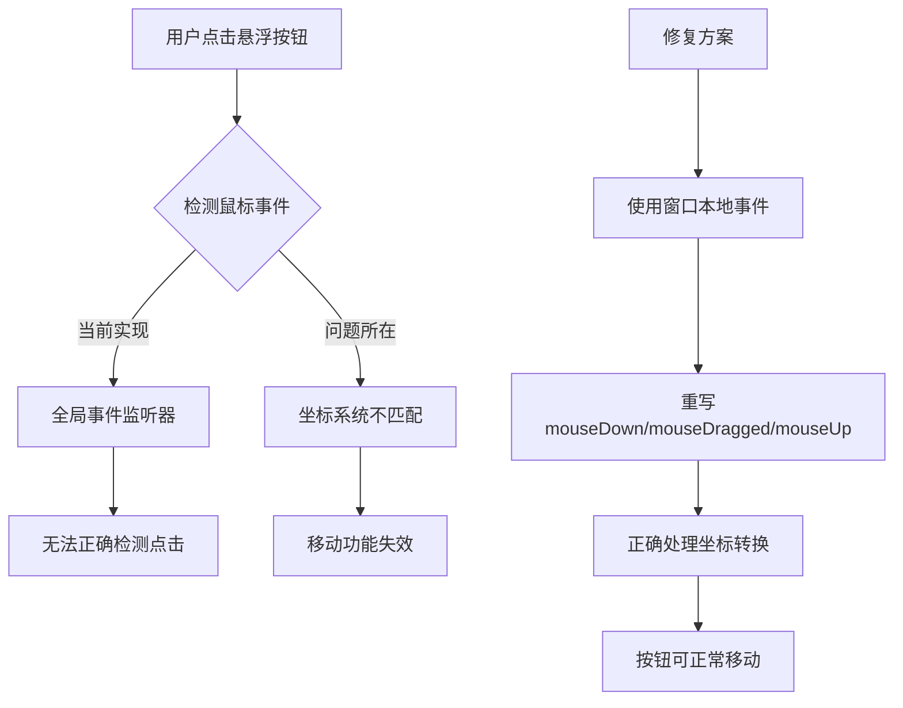

# 修复悬浮按钮移动功能

## 概述
悬浮按钮无法移动的问题主要出现在鼠标事件处理机制上。当前代码使用全局鼠标事件监听器，但存在坐标系统不匹配和事件检测不准确的问题。

## 流程图


## 方案
### 方案一：修复全局事件监听（不推荐）
- 优点：保持现有架构
- 缺点：坐标转换复杂，事件检测不稳定

### 方案二：使用窗口本地事件（推荐）
- 优点：事件处理更可靠，坐标系统统一
- 缺点：需要重构事件处理代码
- 实现：重写 NSWindow 的鼠标事件方法

### 方案三：使用手势识别器
- 优点：系统级支持，处理更规范
- 缺点：需要额外学习成本

**推荐方案二**，因为它最符合 macOS 开发规范，且能提供最稳定的功能。

## 相关代码位置
[查看FloatingWindow.swift](vscode://file/Volumes/Cache/X/Sources/View/FloatingWindow.swift:37)
[查看FloatingButtonView.swift](vscode://file/Volumes/Cache/X/Sources/View/FloatingButtonView.swift:1)
[查看DraggableState.swift](vscode://file/Volumes/Cache/X/Sources/Model/DraggableState.swift:1)

## 代码错误测试
修改完代码后，必须使用以下命令检查编译错误：
```bash
swift build
```

## 验证流程
1. 编译并运行应用
2. 点击状态栏图标显示悬浮按钮
3. 尝试拖拽悬浮按钮
4. 验证按钮能跟随鼠标移动
5. 验证松开鼠标后按钮能吸附到屏幕边缘

## 任务总结与结论
通过将全局事件监听改为窗口本地事件处理，并正确实现鼠标事件方法，可以修复悬浮按钮无法移动的问题。同时需要确保窗口层级和事件响应链的正确配置。

## 任务耗时
- 任务开始时间：1046
- 任务结束时间：待定
- 任务总耗时：待定