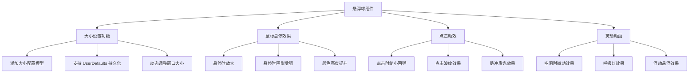

# 悬浮球功能完善

## 概述

当前悬浮球是一个静态的圆形按钮，缺乏交互动效和用户自定义功能。本任务将对悬浮球进行完善，增加大小设置功能、鼠标悬停效果、点击动效，使悬浮球更加灵动和个性化。

## 流程图

## 方案

### 1. 大小设置功能

**方案A：使用配置模型 + 持久化**
- 创建一个 `FloatingButtonConfig` 模型来管理悬浮球配置
- 使用 `UserDefaults` 持久化保存大小设置
- 支持动态调整大小，无需重启应用

**方案B：硬编码固定值**
- 直接修改代码中的尺寸常量
- 简单但不够灵活

**推荐方案A**，因为它提供了更好的用户体验和扩展性。

### 2. 鼠标悬停效果

**实现方式：**
- 重写 `mouseEntered` 和 `mouseExited` 方法
- 使用 `CABasicAnimation` 实现平滑的缩放动画
- 增强阴影效果（增加阴影模糊半径和透明度）
- 调整颜色亮度（切换到更亮的渐变色）

### 3. 点击动效

**实现方式：**
- 点击时使用 `CASpringAnimation` 实现弹性缩放效果
- 添加波纹动画效果（从中心向外扩散的圆形）
- 添加脉冲发光效果（光晕扩散）

### 4. 灵动动画

**实现方式：**
- **呼吸灯效果**：使用 `CABasicAnimation` 循环改变透明度
- **浮动悬浮效果**：使用 `CABasicAnimation` 在 Y 轴上做微小的往复运动
- **脉冲效果**：周期性放大缩小（幅度较小）

## 相关代码位置

### 需要修改的文件

1. [FloatingButtonView.swift](vscode://file/Volumes/Cache/X/Sources/View/FloatingButtonView.swift)
   - 添加大小配置支持
   - 添加鼠标悬停效果
   - 添加点击动效
   - 添加灵动动画

2. [AppDelegate.swift](vscode://file/Volumes/Cache/X/Sources/App/AppDelegate.swift)
   - 添加大小设置菜单项
   - 实现大小调整逻辑
   - 持久化配置

3. [FloatingWindow.swift](vscode://file/Volumes/Cache/X/Sources/View/FloatingWindow.swift)
   - 动态调整窗口大小
   - 支持鼠标事件转发

### 需要创建的文件

1. `Sources/Model/FloatingButtonConfig.swift`
   - 悬浮球配置模型
   - 大小、颜色等配置项

## 代码错误测试

代码修改完成后，执行以下检查：
1. 编译项目确认无错误
2. 检查所有动画正确运行
3. 确认大小设置功能正常

## 验证流程

1. **启动应用**
   - 运行应用，观察悬浮球是否正常显示

2. **测试悬停效果**
   - 鼠标移动到悬浮球上，观察是否有放大和亮度提升效果
   - 移开鼠标，观察是否有平滑的恢复效果

3. **测试点击效果**
   - 点击悬浮球，观察是否有弹性缩放效果
   - 观察点击时的波纹/发光效果

4. **测试设置功能**
   - 点击菜单栏图标，选择"设置"
   - 调整悬浮球大小
   - 观察悬浮球大小是否正确变化
   - 重启应用，确认大小设置是否保留

5. **观察灵动动画**
   - 观察悬浮球是否有轻微的呼吸灯效果
   - 观察悬浮球是否有浮动悬浮效果

## 任务总结与结论

本次任务将完善悬浮球的功能，包括：
- 添加可配置的大小设置
- 添加丰富的鼠标交互动效
- 添加吸引人的视觉效果
- 使用 Core Animation 实现流畅动画

## 任务耗时

- 任务开始时间：12:42
- 任务结束时间：13:00
- 任务总耗时：18 分钟
