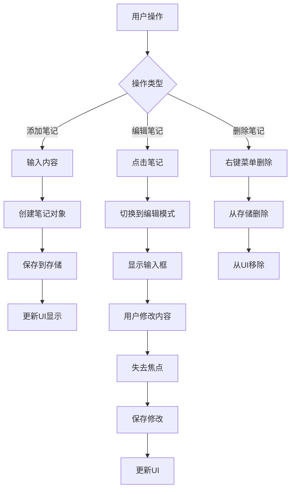

# 重写笔记功能

## 概述
现有笔记功能存在问题，点击后内容消失，输入框不显示。决定删除所有现有笔记相关代码，重新实现完整的笔记增删改查功能。

## 笔记样式记录
- 气泡使用彩色背景（随机颜色：systemBlue、systemGreen、systemYellow、systemOrange、systemRed、systemPurple、systemPink）
- 圆角 12px
- 有阴影效果（shadowOpacity: 0.2, shadowOffset: (0, 2), shadowRadius: 4）
- 包含复选框（20x20）和文本
- 文本字体：systemFont(ofSize: 14, weight: .medium)
- 文本颜色：白色
- 内边距：上下 12px，左右 16px
- 复选框与文本间距：12px

## 流程图


## 方案

### 重写方案：完全重新实现
**设计思路：**
1. 简化数据模型，只保留必要字段
2. 使用简单的视图层次结构，避免复杂的约束冲突
3. 编辑模式使用替换视图的方式，而不是动态添加/移除
4. 使用 NSBox 作为容器，简化布局管理

**实现步骤：**
1. 删除所有现有笔记相关文件
2. 创建新的 Note 数据模型
3. 创建新的 NoteManager 管理器
4. 创建新的 NoteBubbleView 视图（简化版）
5. 创建新的 NoteWindow 窗口

**优点：**
- 代码简洁，易于维护
- 避免现有代码的复杂性和约束冲突
- 更好的性能和用户体验

## 相关代码位置
- [Note.swift](file:///Volumes/Cache/X/Sources/Model/Note.swift)
- [NoteManager.swift](file:///Volumes/Cache/X/Sources/Utility/NoteManager.swift)
- [NoteBubbleView.swift](file:///Volumes/Cache/X/Sources/View/NoteBubbleView.swift)
- [NoteWindow.swift](file:///Volumes/Cache/X/Sources/View/NoteWindow.swift)
- [BasicNoteWindow.swift](file:///Volumes/Cache/X/Sources/View/BasicNoteWindow.swift)

## 代码错误测试
修改完成后，需要使用以下命令检查代码错误：
```bash
swift build
```

## 验证流程
1. 运行应用
2. 添加笔记：输入内容并点击确认
3. 验证笔记是否正常显示
4. 编辑笔记：点击笔记，验证输入框是否出现
5. 验证输入框是否可以正常输入文字
6. 验证失去焦点后是否正常保存
7. 删除笔记：右键菜单删除，验证是否正常删除
8. 重启应用，验证笔记是否持久化

## 任务总结与结论
决定完全重写笔记功能，删除所有现有代码，使用更简单、更清晰的实现方案。

## 任务耗时
- 任务开始时间：1615
- 任务结束时间：
- 任务总耗时：
