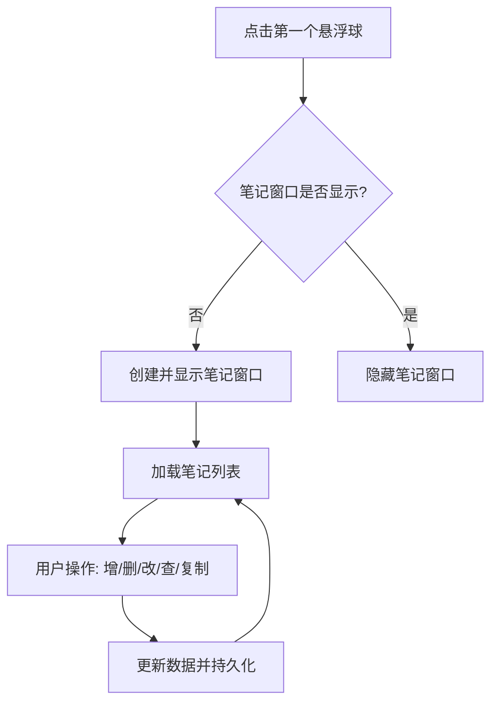

# 笔记功能开发

## 概述
在现有悬浮球应用的基础上，开发笔记功能。点击第一个悬浮球时，显示笔记列表窗口。笔记功能支持增删改查（CRUD）、勾选完成状态以及内容复制到剪切板。

## 流程图

## 方案
1. **数据模型 (Model)**:
    - 创建 `Note` 结构体，包含 `id`, `content`, `isCompleted`, `createdAt` 等字段。
    - 实现 `Codable` 以支持持久化。

2. **数据管理 (Manager)**:
    - 创建 `NoteManager` 单例，负责笔记的加载、保存、增加、删除和修改。
    - 使用 `UserDefaults` 或本地 JSON 文件存储数据。

3. **界面开发 (View)**:
    - `NoteWindow`: 继承自 `NSWindow`，作为笔记列表的容器。设置为无边框、圆角、毛玻璃效果。
    - `NoteListView`: 使用 `NSTableView` 或 `NSStackView` 展示笔记列表。
    - `NoteItemView`: 自定义视图，展示单条笔记，包含勾选框、文本内容、删除按钮等。
    - 顶部工具栏：包含添加按钮、搜索框等。

4. **交互逻辑**:
    - 在 `AppDelegate` 中监听 `FloatingButtonView.floatingButtonClickedNotification`。
    - 判断点击的是否为第一个悬浮球（`floatingWindow1`）。
    - 实现笔记内容的复制功能（使用 `NSPasteboard`）。

## 相关代码位置
- [AppDelegate.swift](vscode://file//Volumes/Cache/X/Sources/App/AppDelegate.swift:1)
- [FloatingButtonView.swift](vscode://file//Volumes/Cache/X/Sources/View/FloatingButtonView.swift:1)
- [FloatingWindow.swift](vscode://file//Volumes/Cache/X/Sources/View/FloatingWindow.swift:1)

## 代码错误测试
在代码修改完以后，必须使用 `swift build` 或相关 lint 工具检查代码错误，并修复。

## 验证流程
1. 运行程序，点击屏幕左侧的第一个悬浮球。
2. 验证笔记窗口是否弹出。
3. 在笔记窗口中尝试添加新笔记。
4. 尝试勾选笔记、修改笔记内容、删除笔记。
5. 点击笔记内容，验证是否成功复制到剪切板。
6. 再次点击悬浮球，验证窗口是否隐藏。

## 任务总结与结论
待开发完成后补充。

## 任务耗时
- 任务开始时间：16:41
- 任务结束时间：待定
- 任务总耗时：待定
