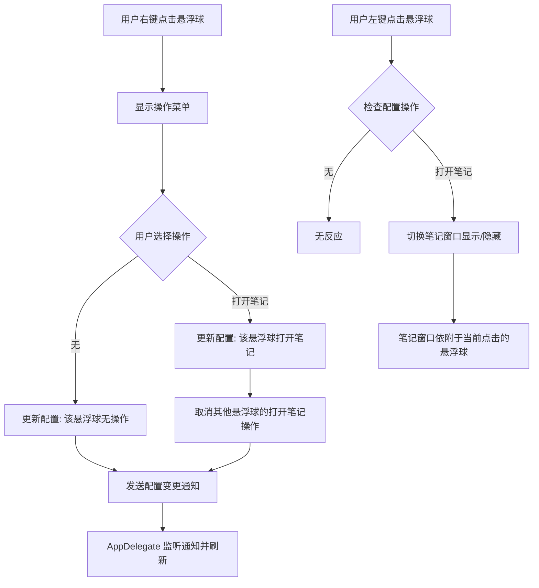

# 悬浮球操作配置功能开发

## 概述
为悬浮球添加可配置的操作功能。目前支持“无”和“打开笔记”两种操作。默认情况下，所有悬浮球均无操作。用户可以通过右键点击悬浮球来设置其触发的操作。系统确保同时只有一个悬浮球可以被设置为“打开笔记”。

## 流程图

## 方案
1.  **模型层 (`FloatingButtonConfig`)**:
    *   添加 `ButtonAction` 枚举，包含 `none` 和 `openNote`。
    *   在 `FloatingButtonConfig` 中添加 `buttonActions: [Int: ButtonAction]` 字典，存储每个索引对应的操作。
    *   在 `FloatingButtonConfigManager` 中添加 `updateButtonAction` 方法，处理互斥逻辑（只有一个能打开笔记）。
2.  **视图层 (`FloatingButtonView`)**:
    *   添加 `buttonIndex` 属性以区分不同的悬浮球。
    *   重写 `rightMouseDown` 方法，弹出 `NSMenu` 供用户选择操作。
    *   点击菜单项时调用 `FloatingButtonConfigManager` 更新配置。
3.  **应用层 (`AppDelegate`)**:
    *   在创建悬浮球时设置其 `buttonIndex`。
    *   修改 `handleFloatingButtonClicked`，根据配置的操作执行相应逻辑。
    *   引入 `attachedWindow` 变量，记录笔记窗口当前依附的悬浮球，确保笔记窗口跟随正确的球移动。
    *   在 `refreshAllWindows` 中处理依附窗口隐藏时笔记窗口的自动隐藏。

## 相关代码位置
- [FloatingButtonConfig.swift](vscode://file//Volumes/Cache/X/Sources/Model/FloatingButtonConfig.swift:1)
- [FloatingButtonView.swift](vscode://file//Volumes/Cache/X/Sources/View/FloatingButtonView.swift:1)
- [AppDelegate.swift](vscode://file//Volumes/Cache/X/Sources/App/AppDelegate.swift:1)

## 代码错误测试
- 已使用 `swift build` 检查代码，修复了冗余类型转换和枚举歧义警告。

## 验证流程
1.  运行程序，默认悬浮球点击应无反应。
2.  右键点击悬浮球，选择“打开笔记”。
3.  再次左键点击该悬浮球，应弹出笔记窗口。
4.  如果开启了两个悬浮球，将第二个设置为“打开笔记”，第一个应自动变为“无”。
5.  拖动设置了“打开笔记”的悬浮球，笔记窗口应跟随移动。

## 任务总结与结论
1. **功能实现**：成功实现了悬浮球操作的动态配置，支持右键菜单切换“无”和“打开笔记”操作。
2. **交互优化**：
    - 实现了操作互斥逻辑，确保全局只有一个悬浮球能触发笔记功能，避免 UI 冲突。
    - 引入了 `attachedWindow` 机制，使笔记窗口能智能识别并跟随当前具有权限的悬浮球，解决了多球环境下的定位难题。
3. **健壮性**：
    - 增加了配置变更的实时监听，确保菜单状态和窗口可见性在配置修改后立即同步。
    - 修复了 `swift build` 过程中的类型转换警告和枚举歧义问题，提升了代码质量。
4. **默认行为**：遵循用户需求，将默认操作设为“无”，赋予用户完全的控制权。

## 任务耗时
- 任务开始时间：17:10
- 任务结束时间：17:30
- 任务总耗时：20 分钟
