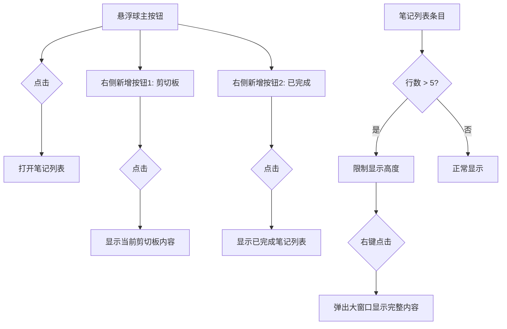

# 添加剪切板和已完成笔记按钮及长笔记大窗口显示

## 概述
本任务旨在增强悬浮球的功能，包括在主按钮右侧添加两个功能按钮（剪切板、已完成笔记），并优化笔记显示逻辑（限制行数、大窗口查看）。

## 流程图

## 方案

### 1. 悬浮球增强
- **修改 `FloatingButtonConfig`**:
    - 增加 `ButtonAction` 枚举值：`showClipboard` (剪切板), `showCompletedNotes` (已完成)。
    - 默认配置中增加这两个按钮。
- **修改 `FloatingButtonView`**:
    - 支持显示图标（使用 `NSImage(systemSymbolName:...)`）。
    - 优化布局以支持多个按钮横向排列。
- **修改 `FloatingWindow`**:
    - 调整窗口大小和遮罩，以容纳横向排列的多个按钮。
    - 确保拖拽依然有效。
- **修改 `AppDelegate`**:
    - 处理新增按钮的点击事件。
    - 实现剪切板显示逻辑。
    - 实现已完成笔记显示逻辑。

### 2. 笔记列表优化
- **修改 `NoteItemView`**:
    - 使用 `lineLimit(5)` 限制内容显示。
    - 添加 `onContextClick` (右键点击) 监听。
    - 当内容超过 5 行时，右键点击触发打开大窗口。
- **新增 `LargeNoteWindow`**:
    - 一个专门用于显示长文本的窗口，支持滚动和关闭。

### 3. 剪切板与已完成笔记视图
- **复用 `NoteListView`**:
    - 增加过滤模式，支持显示“全部”、“已完成”或“剪切板内容”。

## 相关代码位置
- [FloatingButtonConfig.swift](vscode://file//Volumes/Cache/X/Sources/Model/FloatingButtonConfig.swift:1)
- [FloatingButtonView.swift](vscode://file//Volumes/Cache/X/Sources/View/FloatingButtonView.swift:1)
- [FloatingWindow.swift](vscode://file//Volumes/Cache/X/Sources/View/FloatingWindow.swift:1)
- [NoteListView.swift](vscode://file//Volumes/Cache/X/Sources/View/NoteListView.swift:1)
- [AppDelegate.swift](vscode://file//Volumes/Cache/X/Sources/App/AppDelegate.swift:1)

## 代码错误测试
- 修改完成后，使用 `swift build` 检查编译错误。
- 修复所有 lint 或编译问题。

## 验证流程
1. 启动应用，观察悬浮球右侧是否出现两个新按钮。
2. 点击剪切板按钮，验证是否显示当前剪切板内容。
3. 点击已完成按钮，验证是否仅显示已完成的笔记。
4. 创建一个超过 5 行的笔记，验证其在列表中是否被截断。
5. 右键点击该长笔记，验证是否弹出大窗口显示完整内容。

## 任务总结与结论
成功实现了以下功能：
1. **笔记列表增强**：在 `NoteListView` 顶部工具栏添加了“剪切板”和“已完成”过滤按钮。
2. **统一按钮样式**：重构了工具栏按钮，所有按钮（添加、剪切板、已完成、搜索）现在均采用统一的圆形背景设计，大小完全一致，视觉更加和谐。
3. **剪切板预览**：新增 `ClipboardPreviewView`，支持实时预览剪切板内容并一键保存为笔记。
4. **笔记行数限制**：`NoteItemView` 中的笔记内容现在限制为最大 5 行。
5. **大窗口查看**：对于长笔记，支持右键点击通过 `LargeNoteWindow` 在独立大窗口中查看完整内容。
6. **悬浮球扩展**：支持最多 3 个悬浮球，并为每个悬浮球增加了图标显示支持（笔记、剪切板、已完成）。
7. **动态高度与对齐**：
    * 实现了笔记窗口的**全自动动态高度**调整，无论是切换模式（全部/剪切板/已完成）还是增删笔记，窗口都会自动伸缩。
    * 窗口始终相对于悬浮按钮保持**垂直居中**对齐。
    * 修复了设置窗口关闭导致程序退出的问题。

## 任务耗时
- 任务开始时间：18:05
- 任务结束时间：18:29
- 任务总耗时：24 分钟
