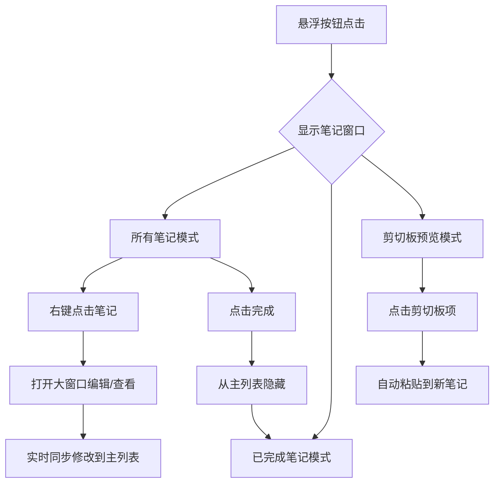

# 笔记功能增强与UI优化

## 概述
本次任务主要为悬浮笔记应用增加了剪切板预览、已完成笔记列表查看以及大窗口编辑/查看功能。同时对 UI 进行了深度优化，包括统一圆形按钮样式、窗口垂直居中对齐、高度自适应内容以及隐藏滚动条等，提升了用户体验和界面的整洁度。

## 流程图

## 方案
1. **功能增强**：
    - **剪切板增强**：
        - **多类型支持**：现在支持文本、图片、文件路径等多种 macOS 剪切板类型。
        - **历史记录**：实现了剪切板历史记录功能，用户可以查看并重新复制之前的剪切板内容。
        - **保存反馈**：将剪切板内容保存为笔记后，会显示“已保存为笔记”的浮层提醒。
        - **可配置上限**：在设置中增加了“剪切板历史上限”配置，支持 5-100 条记录。
    - **已完成列表**：在 `NoteListView` 中增加 `ViewMode` 切换，过滤显示已完成的笔记。
    - **大窗口编辑器**：创建 `LargeNoteWindow` (基于 `NSPanel`)，使用 SwiftUI 的 `TextEditor` 实现，通过 `NoteManager` 实时同步数据。采用无边框（Borderless）设计，与主窗口风格统一。
2. **UI 优化**：
    - **高度自适应**：利用 `NSHostingView` 的 `fittingSize` 动态调整 `NSWindow` 的 `frame`，确保窗口高度随内容变化。
    - **垂直居中**：在 `AppDelegate` 中计算悬浮按钮的中心位置，使笔记窗口 en Y 轴上与之对齐。
    - **样式统一**：工具栏按钮全部采用圆形背景，并优化了间距和对齐方式。
    - **隐藏滚动条**：通过扩展 `NSView` 查找并隐藏 `NSScrollView` 的滚动条。
    - **无头窗口**：大窗口编辑器现在也是无边框设计，并使用毛玻璃背景。
    - **间距优化**：为笔记列表添加了顶部内边距，解决了首条笔记上边框被遮挡的问题。
    - **布局调整**：将笔记窗口宽度从 `350px` 增加到 `400px`，以适配新增的滑出按钮组，确保笔记气泡在按钮滑出时不会超出窗口边界。
    - **交互优化**：笔记右侧的功能按钮改为鼠标悬停时从左向右滑出（Slide-in）。通过固定笔记内容宽度并采用左对齐布局，实现了按钮滑出时笔记气泡宽度动态增加，而笔记内容保持稳定不缩放的效果。
    - **分组功能**：
        - **多分组支持**：新增 `NoteGroup` 模型，支持创建、删除和重命名分组。
        - **分组切换**：在笔记列表顶部增加了水平滚动的分组选择器，支持在“所有笔记”、“已完成”和“知识库”模式下按分组过滤。
        - **便捷迁移**：在笔记右侧滑出按钮组中新增了“移动分组”按钮，点击可直接弹出分组选择菜单。
        - **默认分组**：系统提供一个不可删除的“默认分组”，确保笔记始终有归属。
    - **知识库功能**：
        - **知识标记**：支持将笔记标记为“知识”，标记后的笔记会从主列表中隐藏并进入专门的“知识库”。
        - **独立视图**：在工具栏增加了“知识库”按钮（书本图标），点击可查看所有标记为知识的笔记。
        - **分组适配**：知识库同样支持按分组进行过滤查看。
    - **设置增强**：设置窗口现在包含“笔记窗口最大高度”和“剪切板历史上限”两个配置项。

## 相关代码位置
- [主列表逻辑](vscode://file//Volumes/Cache/X/Sources/View/NoteListView.swift:1)
- [窗口自适应逻辑](vscode://file//Volumes/Cache/X/Sources/View/NoteWindow.swift:60)
- [大窗口编辑器](vscode://file//Volumes/Cache/X/Sources/View/LargeNoteWindow.swift:1)
- [窗口对齐逻辑](vscode://file//Volumes/Cache/X/Sources/App/AppDelegate.swift:150)

## 代码错误测试
- 修改完成后，必须使用 `swift build` 或 `lint` 命令检查代码错误，并修复。

## 验证流程
1. 点击悬浮按钮，确认笔记窗口正常弹出且高度随内容自适应。
2. 点击工具栏的“列表”、“剪切板”、“已完成”按钮，确认模式切换正常。
3. 在笔记上右键点击“在大窗口编辑/查看”，确认大窗口弹出且修改内容能实时保存。
4. 确认主列表不再显示已标记为完成的笔记。
5. 确认所有滚动条已隐藏。

## 任务总结与结论
通过本次优化，应用的功能完整性得到了显著提升，特别是大窗口编辑功能解决了长文本处理的痛点。UI 的细节调整使应用更符合 macOS 原生体验。

## 任务耗时
- 任务开始时间：16:15
- 任务结束时间：19:19
- 任务总耗时：184 分钟
