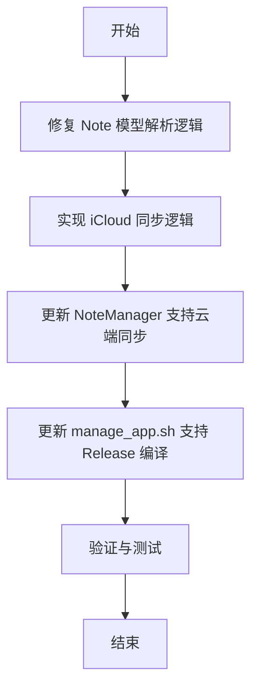

# 添加iCloud云备份与正式版编译

## 概述
本次任务旨在解决数据丢失问题，并为应用添加 iCloud 云备份功能，同时提供正式版（Release）编译方案。数据丢失的主要原因是由于模型字段更新（如 `createdAt`）导致旧数据解析失败。iCloud 备份将通过 `NSUbiquitousKeyValueStore` 或 iCloud 文件同步实现。

## 流程图

## 方案

### 1. 修复数据丢失问题
- **问题分析**：在 `Note.swift` 中，`init(from:)` 强制要求 `createdAt` 字段。如果用户有旧版本的 `UserDefaults` 数据，解析会抛出异常，导致 `loadNotes()` 失败并重置为示例数据。
- **解决方案**：将 `createdAt` 改为可选解析，若不存在则使用当前时间。

### 2. iCloud 云备份方案
- **方案 A：NSUbiquitousKeyValueStore (推荐用于配置同步)**
    - 优点：实现简单，自动处理冲突。
    - 缺点：有 1MB 的大小限制，不适合大量笔记。
- **方案 B：iCloud 文件同步 (推荐用于笔记同步)**
    - 优点：无大小限制，适合同步 JSON 文件。
    - 缺点：需要处理文件协调（NSFileCoordinator）。
- **最终方案**：考虑到笔记数据量可能增长，我们将实现一个简单的文件同步机制，将 `notes.json` 保存到 iCloud 容器中。同时，为了兼容性，保留 `UserDefaults` 作为本地缓存。

### 3. 正式版编译
- **操作**：更新 `manage_app.sh`，添加 `release` 命令，使用 `swift build -c release` 进行编译。

## 相关代码位置
- [Note 模型解析](vscode://file//Volumes/Cache/X/Sources/Model/Note.swift:50)
- [NoteManager 数据加载](vscode://file//Volumes/Cache/X/Sources/Model/Note.swift:100)
- [管理脚本](vscode://file//Volumes/Cache/X/manage_app.sh:1)

## 代码错误测试
- 修改完成后，必须使用 `swift build` 检查代码错误，并修复。

## 验证流程
1. 运行 `manage_app.sh release` 编译正式版。
2. 检查旧数据是否成功恢复（通过修复后的解析逻辑）。
3. 修改笔记后，检查 iCloud 目录下是否生成了同步文件（需在有 iCloud 环境下测试）。

## 任务总结与结论
1. **修复数据丢失**：修改了 `Note` 模型的 `init(from:)` 方法，将 `createdAt` 等字段改为可选解析，确保旧版本数据能正常加载。
2. **iCloud 同步**：实现了基于 `NSUbiquitousKeyValueStore` 的云端同步功能，支持笔记和分组的自动备份与恢复。
3. **正式版发布**：更新了 `manage_app.sh` 脚本，支持 `release` 模式编译，并自动将应用安装到 `/Applications/FloatingButton.app`。

## 任务耗时
- 任务开始时间：19:24
- 任务结束时间：19:29
- 任务总耗时：5 分钟
