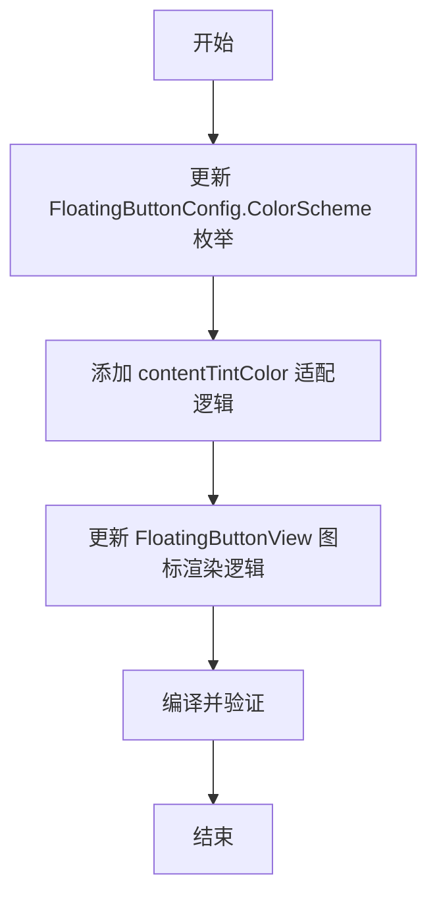

# 添加黑白颜色主题

## 概述
为悬浮按钮添加“简约白”和“深邃黑”两种颜色主题，并优化图标颜色适配逻辑，确保在浅色背景下图标依然清晰。

## 流程图

## 方案
1. **模型更新**：在 `FloatingButtonConfig.swift` 中增加 `pureWhite` 和 `pureBlack` 案例，并定义对应的渐变起始/结束颜色。
2. **图标适配**：新增 `contentTintColor` 属性，当选择“简约白”时，图标颜色设为深灰色（#333333），其余主题保持白色。
3. **UI 同步**：在 `FloatingButtonView` 中应用 `contentTintColor`。

## 相关代码位置
- [颜色配置定义](vscode://file//Volumes/Cache/X/Sources/Model/FloatingButtonConfig.swift:35)
- [图标颜色应用](vscode://file//Volumes/Cache/X/Sources/View/FloatingButtonView.swift:85)

## 代码错误测试
- 修改完成后，使用 `swift build` 检查编译情况。

## 验证流程
1. 运行应用。
2. 通过状态栏菜单切换至“简约白”，观察按钮背景变为浅灰/白渐变，图标变为深色。
3. 切换至“深邃黑”，观察按钮背景变为黑色，图标保持白色。

## 任务总结与结论
成功添加了两种经典配色，提升了应用的视觉多样性。

## 任务耗时
- 任务开始时间：19:35
- 任务结束时间：19:44
- 任务总耗时：9 分钟
