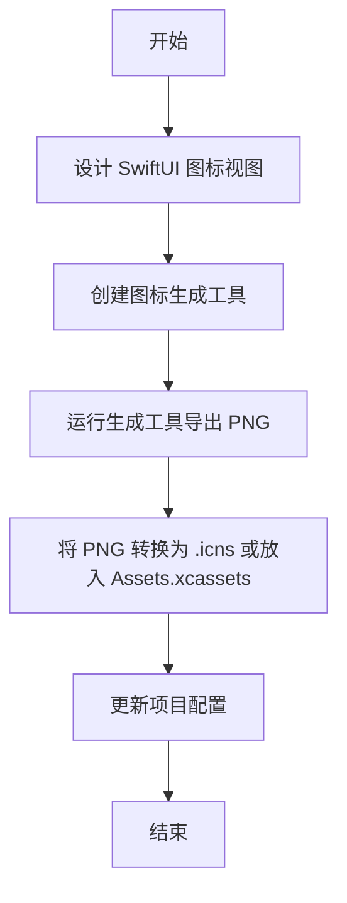

# 20260103-1946-生成应用图标

## 概述
为 FloatingButton 应用程序创建一个现代、美观的图标。图标设计将采用 SwiftUI 编写，并提供一种将其导出为 PNG 资源的方法，以便在 macOS 应用程序中使用。

## 流程图

## 方案
1. **设计方案**：
   - **极简主义**：采用纯白色背景，追求极致的简洁感。
   - **核心元素**：中心放置三个嵌套的圆环，线条由内向外逐渐变细，颜色采用蓝紫渐变，象征着核心功能的层层递进。
   - **环绕文字**：在圆环下方，使用极小的灰色字体环绕排列 "XavierChen"，增加设计的精致感和个人品牌属性。

2. **实现方案**：
   - 更新 `Sources/View/AppIconView.swift`，实现嵌套圆环和字符旋转环绕效果。
   - 使用 `manage_app.sh icon` 重新生成。

## 相关代码位置
- [AppIconView.swift](vscode://file//Volumes/Cache/X/Sources/View/AppIconView.swift:1)
- [IconGenerator.swift](vscode://file//Volumes/Cache/X/Sources/Utility/IconGenerator.swift:1)

## 代码错误测试
在修改完成后，将使用 `swift build` 检查是否存在编译错误。

## 验证流程
1. 运行 `./manage_app.sh icon`。
2. 检查 `Resources/AppIcon.png` 是否生成。
3. 编译并运行程序，观察 Dock 栏（如果未隐藏）或关于窗口中的图标。

## 任务总结与结论
根据用户对简约风格的追求，完成了第三版图标设计。
- **极简白底**：切换为纯白背景，视觉上更加清爽、现代。
- **嵌套圆环**：设计了三个粗细不一的蓝紫渐变圆环，作为应用的核心视觉符号。
- **精致环绕文字**：在圆环底部实现了 "XavierChen" 的弧形环绕效果，字体小巧精致。
- **产物**：最终图标已保存至 `Resources/AppIcon.png`。

## 任务耗时
- 任务开始时间：19:46
- 任务结束时间：19:48
- 任务总耗时：2 分钟
