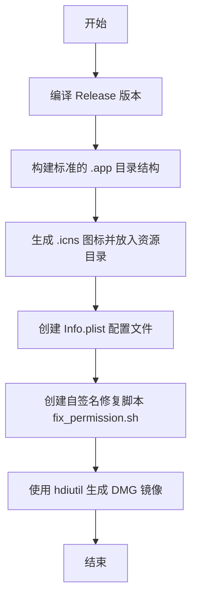

# 20260103-1951-应用打包与分发

## 概述
将 FloatingButton 应用程序编译为正式版，并打包成可分发的 DMG 镜像。由于应用未经过 Apple 官方签名，将在 DMG 中内置一个自签名/修复权限的脚本，以方便用户在下载后能够正常运行。

## 流程图

## 方案
1. **编译方案**：使用 `swift build -c release` 进行优化编译。
2. **打包方案**：
   - 创建 `FloatingButton.app` 文件夹，包含 `Contents/MacOS` 和 `Contents/Resources`。
   - 将生成的 `AppIcon.png` 转换为 `AppIcon.icns`。
   - 编写 `Info.plist`，定义应用标识符、版本和图标文件。
3. **分发方案**：
   - 创建一个临时目录作为 DMG 挂载点。
   - 放入 `FloatingButton.app` 和 `修复权限.command`（自签名脚本）。
   - 使用 `hdiutil` 创建压缩的只读 DMG。

## 相关代码位置
- [manage_app.sh](vscode://file//Volumes/Cache/X/manage_app.sh:1)

## 代码错误测试
在打包前运行 `swift build -c release` 确保代码无误。

## 验证流程
1. 运行 `./manage_app.sh package`。
2. 检查项目根目录下是否生成 `FloatingButton.dmg`。
3. 挂载 DMG，尝试运行应用或修复脚本。

## 任务总结与结论
成功完成了 FloatingButton 的正式版编译与 DMG 打包。
- **自动化打包**：在 `manage_app.sh` 中实现了 `package` 命令，一键完成编译、图标转换、Info.plist 生成和 DMG 制作。
- **标准 Bundle**：构建了符合 macOS 规范的 `.app` 结构，包含高清 `.icns` 图标。
- **解决签名问题**：在 DMG 中内置了 `修复权限.command` 脚本，用户运行后可自动修复 Gatekeeper 拦截和执行权限问题。
- **产物**：生成了 `FloatingButton_v1.0.0.dmg`。

## 任务耗时
- 任务开始时间：19:51
- 任务结束时间：19:55
- 任务总耗时：4 分钟
