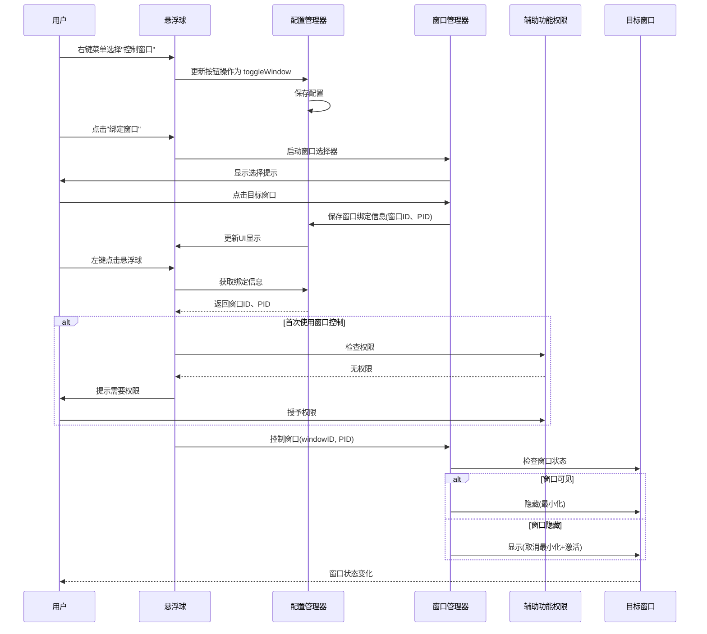

# 删除控制窗口并重新实现

## 概述
用户要求删除所有控制窗口的代码（包括权限请求），然后重新实现该功能。本任务将彻底清理现有的窗口控制实现，并设计一个更简洁、可靠的新方案。

## 流程图



## 方案

### 删除的代码
1. **FloatingButtonConfig.swift**
   - 删除 `ButtonAction.focusWindow` 枚举值
   - 删除 `targetWindowIDs`, `targetWindowTitles`, `targetAppNames`, `targetPIDs` 字段
   - 删除 `updateTargetWindow` 方法

2. **AppDelegate.swift**
   - 删除 `checkAccessibilityPermissions` 方法（启动时调用）
   - 删除 `handleFocusWindowAction` 方法
   - 删除 `isWindowExists`, `findRunningApp`, `findWindowByTitle` 方法
   - 删除 `ensureWindowVisible` 方法
   - 删除 `startWindowSelection` 方法
   - 删除 `WindowSelectorDelegate` 实现
   - 删除 `windowSelector` 和 `selectingButtonIndex` 属性

3. **WindowSelector.swift**
   - 删除整个文件（148 行）

4. **FloatingButtonView.swift**
   - 删除右键菜单中 `focusWindow` 相关的判断
   - 删除 `clearWindowBinding` 方法

### 新的实现方案

#### 1. 新增操作类型
在 `FloatingButtonConfig.ButtonAction` 中添加：
```swift
case toggleWindow = "控制窗口"
```
图标使用 `"rectangle.inset.filled.and.person.filled"` 或 `"macwindow.badge.plus"`

#### 2. 新增配置字段
在 `FloatingButtonConfig` 中添加：
```swift
var boundWindows: [Int: BoundWindow] = [:] // 绑定的窗口信息

struct BoundWindow: Codable {
    let windowID: UInt32
    let pid: Int32
    let appName: String
    let windowTitle: String
}
```

#### 3. 窗口管理器（新建文件）
创建 `WindowManager.swift` 文件，实现：
- 窗口选择器（简化版，使用覆盖层 + 鼠标点击）
- 窗口显隐控制（最小化/取消最小化）
- 权限检查（仅在首次使用时检查）
- 窗口状态检测

#### 4. UI 更新
- 右键菜单添加"控制窗口"选项
- 选择后弹出窗口选择界面
- 绑定成功后在悬浮球附近显示提示

## 相关代码位置

### 需要删除的代码

#### FloatingButtonConfig.swift
1. [删除 focusWindow 枚举值](vscode://file//Volumes/Cache/X/Sources/Model/FloatingButtonConfig.swift:30)
2. [删除窗口配置字段](vscode://file//Volumes/Cache/X/Sources/Model/FloatingButtonConfig.swift:14-17)
3. [删除 updateTargetWindow 方法](vscode://file//Volumes/Cache/X/Sources/Model/FloatingButtonConfig.swift:220-233)

#### AppDelegate.swift
1. [删除启动时权限检查调用](vscode://file//Volumes/Cache/X/Sources/App/AppDelegate.swift:25)
2. [删除 checkAccessibilityPermissions 方法](vscode://file//Volumes/Cache/X/Sources/App/AppDelegate.swift:53-112)
3. [删除 handleFocusWindowAction 方法](vscode://file//Volumes/Cache/X/Sources/App/AppDelegate.swift:131-159)
4. [删除 isWindowExists 方法](vscode://file//Volumes/Cache/X/Sources/App/AppDelegate.swift:161-164)
5. [删除 findRunningApp 方法](vscode://file//Volumes/Cache/X/Sources/App/AppDelegate.swift:166-168)
6. [删除 findWindowByTitle 方法](vscode://file//Volumes/Cache/X/Sources/App/AppDelegate.swift:170-183)
7. [删除 ensureWindowVisible 方法](vscode://file//Volumes/Cache/X/Sources/App/AppDelegate.swift:185-242)
8. [删除 startWindowSelection 方法](vscode://file//Volumes/Cache/X/Sources/App/AppDelegate.swift:244-250)
9. [删除 WindowSelectorDelegate 方法](vscode://file//Volumes/Cache/X/Sources/App/AppDelegate.swift:252-259)
10. [删除 windowSelector 和 selectingButtonIndex 属性](vscode://file//Volumes/Cache/X/Sources/App/AppDelegate.swift:18-19)

#### WindowSelector.swift
[删除整个文件](vscode://file//Volumes/Cache/X/Sources/Utility/WindowSelector.swift:1)

#### FloatingButtonView.swift
1. [删除 focusWindow 相关菜单判断](vscode://file//Volumes/Cache/X/Sources/View/FloatingButtonView.swift:260-267)
2. [删除 clearWindowBinding 方法](vscode://file//Volumes/Cache/X/Sources/View/FloatingButtonView.swift:274-276)

### 需要新增的代码

#### 1. WindowManager.swift（新文件）
位置：`/Volumes/Cache/X/Sources/Utility/WindowManager.swift`
功能：
- 窗口选择器界面
- 窗口显隐控制
- 辅助功能权限检查（延迟到首次使用）

#### 2. FloatingButtonConfig.swift（修改）
- 添加 `toggleWindow` 枚举值
- 添加 `BoundWindow` 结构体
- 添加 `boundWindows` 字段
- 添加 `bindWindow` 和 `unbindWindow` 方法

#### 3. AppDelegate.swift（修改）
- 在 `handleFloatingButtonClicked` 中添加 `toggleWindow` 处理
- 添加窗口管理器调用逻辑

#### 4. FloatingButtonView.swift（修改）
- 更新右键菜单，添加"控制窗口"选项
- 绑定窗口后显示提示

## 代码错误测试
代码修改完成后，使用 `swift build` 命令检查编译错误，确保代码无误。

## 验证流程
1. 编译通过后，运行应用
2. 右键点击悬浮球，选择"控制窗口"
3. 点击悬浮球，弹出窗口选择界面
4. 点击某个窗口完成绑定
5. 再次左键点击悬浮球，验证窗口能正常显示/隐藏
6. 测试边界情况：
   - 目标窗口被关闭后的行为
   - 目标应用被退出后的行为
   - 没有辅助功能权限时的提示

## 任务总结与结论
通过删除现有复杂的窗口控制代码，重新实现一个更简洁、易用的窗口显隐控制功能，提升用户体验和代码可维护性。

## 任务耗时
- 任务开始时间：15:43
- 任务结束时间：（待完成）
- 任务总耗时：（待计算）
