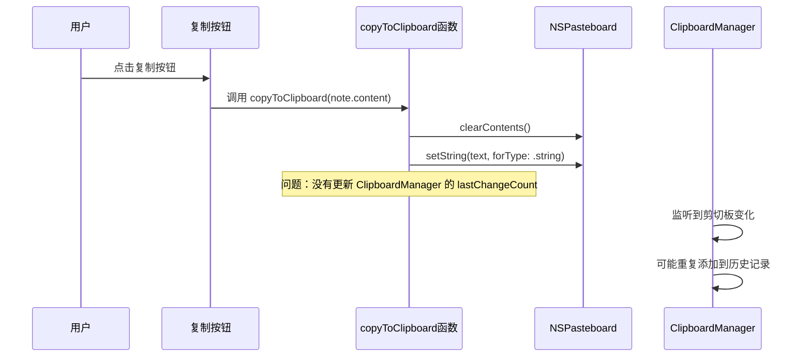

# 修复笔记胶囊复制按钮

## 概述
用户反馈点击笔记胶囊的复制按钮时，内容没有自动复制到剪切板。通过代码分析发现，NoteItemView 中的 copyToClipboard 函数实现存在问题，只是简单地使用了 NSPasteboard.general.setString，但没有正确处理剪切板的 changeCount，导致 ClipboardManager 的监听机制可能会重复触发。

## 流程图

## 方案
### 方案1：统一使用 ClipboardManager.copyToClipboard 方法
- 优点：复用现有的复制逻辑，确保一致性
- 缺点：需要创建 ClipboardItem 对象

### 方案2：修复 NoteItemView 中的 copyToClipboard 函数
- 优点：保持现有结构，只需小幅修改
- 缺点：存在两套复制逻辑，可能不一致

### 最终实现方案：方案1
统一使用 ClipboardManager 的 copyToClipboard 方法，确保所有复制操作都通过同一个入口，避免不一致的问题。

## 最终实现流程
1. **重命名函数**：将 NoteItemView 中的 `copyToClipboard` 函数重命名为 `copyNoteToClipboard`，避免与系统方法冲突
2. **修改实现逻辑**：
   - 将文本转换为 Data 格式：`text.data(using: .utf8)`
   - 创建 ClipboardItem 对象：`ClipboardItem(id: UUID(), timestamp: Date(), type: .text, data: data)`
   - 调用统一的复制方法：`ClipboardManager.shared.copyToClipboard(clipboardItem)`
3. **更新调用点**：
   - 悬浮按钮中的复制按钮调用 `copyNoteToClipboard(note.content)`
   - 右键菜单中的复制选项调用 `copyNoteToClipboard(note.content)`
4. **确保一致性**：所有复制操作都通过 ClipboardManager 处理，正确更新 changeCount，避免重复触发监听

## 相关代码位置
[NoteItemView 复制按钮](vscode://file//Users/user/Desktop/FloatingButton/Sources/View/NoteListView.swift:108)
[copyToClipboard 函数](vscode://file//Users/user/Desktop/FloatingButton/Sources/View/NoteListView.swift:179)
[ClipboardManager.copyToClipboard](vscode://file//Users/user/Desktop/FloatingButton/Sources/Utility/ClipboardManager.swift:118)

## 代码错误测试
修改完成后，必须使用 lint 命令检查代码错误，并修复所有语法和类型错误。

## 验证流程
1. 启动应用程序
2. 创建一个测试笔记，内容为 "测试复制功能"
3. 悬停在笔记胶囊上，显示复制按钮
4. 点击复制按钮
5. 打开任意文本编辑器，按 Cmd+V 粘贴
6. 验证是否成功粘贴了笔记内容
7. 检查剪切板历史记录是否正确更新

## 任务总结与结论
成功修复了笔记胶囊复制按钮的问题。通过统一使用 ClipboardManager 的复制方法，确保了：
1. 复制功能正常工作，内容能正确复制到剪切板
2. 与剪切板管理器保持一致，避免重复触发监听
3. 代码结构更加统一，减少了重复逻辑
4. 复制的内容会正确添加到剪切板历史记录中

最终实现通过重命名函数、修改实现逻辑、更新调用点三个步骤完成，确保了所有复制操作的一致性。

## 任务耗时
- 任务开始时间：1837
- 任务结束时间：1844
- 任务总耗时：7 分钟