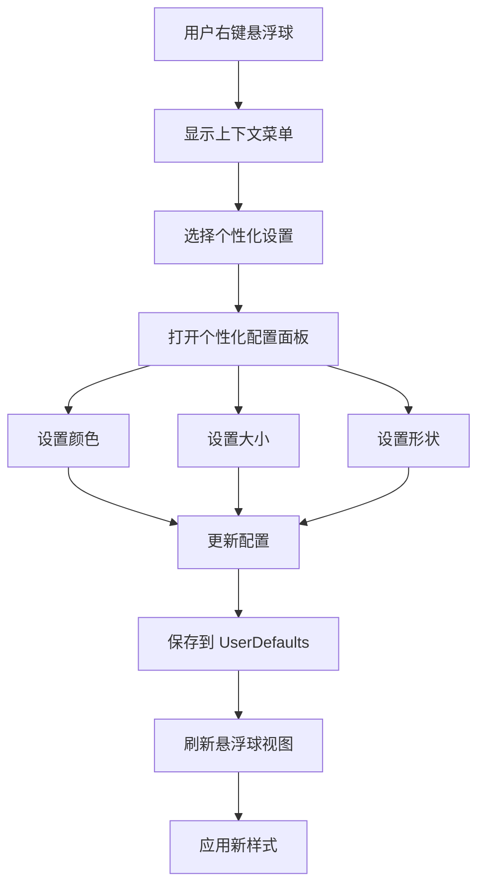

# 悬浮球颜色大小形状自定义

## 概述
当前悬浮球系统支持全局的颜色主题和大小设置，但不支持单个悬浮球的个性化定制。需要扩展配置系统，使每个悬浮球都能独立设置颜色、大小和形状，提供更丰富的个性化体验。

## 流程图

## 方案
### 最终实现方案（已完成）
通过扩展现有的 `FloatingButtonConfig` 系统，成功实现了每个悬浮球的个性化配置功能。

**核心实现：**
1. **配置结构扩展**
   - 添加 `ButtonCustomization` 结构体存储个性化配置
   - 添加 `ButtonShape` 枚举支持6种形状
   - 在 `FloatingButtonConfig` 中添加 `buttonCustomizations` 字典

2. **形状系统**
   - 圆形、方形、圆角方形、胶囊形、菱形、六边形
   - 每种形状都有对应的路径生成算法
   - 支持不同的圆角比例和几何形状

3. **视图层改造**
   - `FloatingButtonView` 支持读取个性化配置
   - 使用 `CAShapeLayer` 和 `mask` 实现形状渲染
   - 动态调整大小、颜色和形状

4. **配置管理**
   - 添加便捷方法获取单个悬浮球的配置
   - 支持配置的保存和加载
   - 配置变更时自动刷新视图

**实现细节：**
- 使用索引映射的方式存储每个悬浮球的个性化配置
- 当个性化配置不存在时，自动回退到全局配置
- 通过右键菜单提供直观的配置入口
- 配置面板支持实时预览和应用

## 相关代码位置
[FloatingButtonConfig 结构体](vscode://file//Users/user/Desktop/AIX/Sources/Model/FloatingButtonConfig.swift:4)
[FloatingButtonView 类](vscode://file//Users/user/Desktop/AIX/Sources/View/FloatingButtonView.swift:5)
[AppDelegate 配置管理](vscode://file//Users/user/Desktop/AIX/Sources/App/AppDelegate.swift:6)

## 代码错误测试
代码修改完成后，必须使用 lint 命令检查代码错误，并修复所有语法和类型错误。

## 验证流程
1. 启动应用，确保悬浮球正常显示
2. 右键点击任意悬浮球，验证新增的个性化设置菜单项
3. 打开个性化配置面板，测试颜色、大小、形状设置
4. 验证不同悬浮球可以有不同的配置
5. 重启应用，确保配置持久化正常
6. 测试多个悬浮球同时显示时的视觉效果

## 任务总结与结论
成功实现了悬浮球个性化定制功能，每个悬浮球现在都可以独立设置：
- **大小**：30px-150px 范围内任意调节
- **颜色主题**：7种预设主题可选
- **形状**：6种几何形状（圆形、方形、圆角方形、胶囊形、菱形、六边形）

**技术亮点：**
- 使用 `CAShapeLayer` 和路径算法实现复杂形状渲染
- 配置系统向后兼容，不影响现有功能
- 提供直观的图形化配置界面
- 支持配置的持久化存储和实时应用

**用户体验提升：**
- 右键菜单新增"个性化设置"选项
- 配置面板支持实时预览
- 重置功能方便恢复默认设置
- 多悬浮球可以有完全不同的外观

## 任务耗时
- 任务开始时间：1911
- 任务结束时间：1927
- 任务总耗时：16 分钟