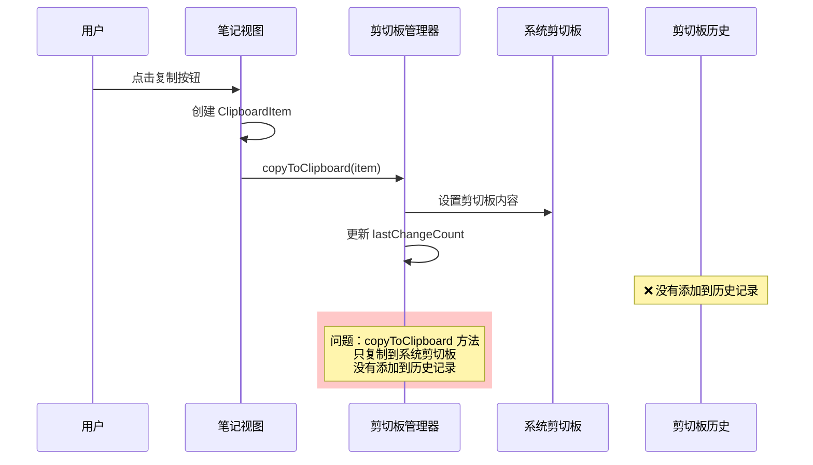

# 修复笔记复制到剪切板功能

## 概述
用户反映在笔记上点击复制按钮后，内容没有添加到剪切板历史记录中。经过代码分析，发现问题出现在 `copyNoteToClipboard` 方法中，该方法只是将内容复制到系统剪切板，但没有将其添加到应用的剪切板历史记录中。

## 流程图

## 方案
### 问题分析
1. **当前实现**：`copyNoteToClipboard` 方法创建 `ClipboardItem` 并调用 `ClipboardManager.shared.copyToClipboard(clipboardItem)`
2. **问题所在**：`ClipboardManager.copyToClipboard` 方法只是将内容复制到系统剪切板，并更新 `lastChangeCount` 避免触发监听，但没有将项目添加到历史记录
3. **期望行为**：点击复制按钮后，内容应该既复制到系统剪切板，也添加到剪切板历史记录中

### 最终实现方案
**采用方案一**：修改 `ClipboardManager.copyToClipboard` 方法，增加参数控制是否添加到历史记录

**具体实现步骤**：
1. **修改 ClipboardManager.copyToClipboard 方法**：
   - 增加 `shouldAddToHistory: Bool = false` 参数
   - 在方法末尾添加条件判断，当 `shouldAddToHistory` 为 `true` 时调用 `addToHistory(item)`
   - 保持向后兼容性，默认值为 `false`

2. **更新 NoteListView.copyNoteToClipboard 方法**：
   - 调用 `ClipboardManager.shared.copyToClipboard(clipboardItem, shouldAddToHistory: true)`
   - 确保笔记复制时既复制到系统剪切板，也添加到历史记录

**优点**：
- 保持接口一致性和向后兼容性
- 可以精确控制何时添加到历史记录
- 不影响其他地方的调用（如剪切板历史视图中的复制按钮）
- 解决了参数名与方法名冲突的问题

## 相关代码位置
[NoteListView.swift - copyNoteToClipboard 方法](vscode://file//Users/xavier/Desktop/AIX/.build/Sources/View/NoteListView.swift:165)
[ClipboardManager.swift - copyToClipboard 方法](vscode://file//Users/xavier/Desktop/AIX/.build/Sources/Utility/ClipboardManager.swift:108)
[ClipboardManager.swift - addToHistory 方法](vscode://file//Users/xavier/Desktop/AIX/.build/Sources/Utility/ClipboardManager.swift:89)

## 代码错误测试
修改代码后，必须使用 Swift 编译器检查代码错误，并修复任何编译问题。

## 验证流程
1. 启动应用
2. 创建一个新笔记，输入一些文本内容
3. 点击笔记右侧的复制按钮（悬停时出现）
4. 切换到剪切板历史视图
5. 验证刚才复制的笔记内容是否出现在剪切板历史记录中
6. 同时验证系统剪切板中是否也有该内容（可以在其他应用中粘贴测试）

## 任务总结与结论
通过修改 `ClipboardManager.copyToClipboard` 方法，增加可选参数控制是否添加到历史记录，解决笔记复制功能不添加到剪切板历史的问题。

## 任务耗时
- 任务开始时间：1933
- 任务结束时间：1942
- 任务总耗时：9 分钟