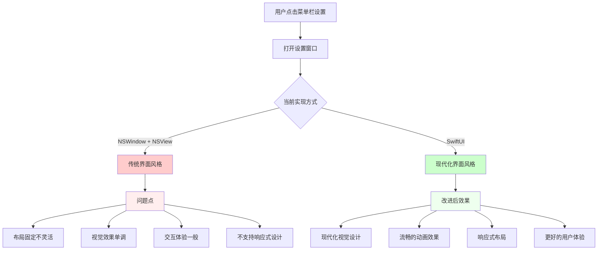

# 优化设置窗口现代化

## 概述
当前的设置窗口使用传统的NSWindow和NSView实现，界面风格较为老旧，不符合现代macOS应用的设计规范。需要对设置窗口进行现代化改造，采用SwiftUI实现，提供更好的用户体验和视觉效果。

## 流程图

## 方案

### 方案一：完全SwiftUI重构（推荐）
**优点：**
- 现代化的界面设计语言
- 自动支持深色模式
- 响应式布局，适配不同屏幕尺寸
- 丰富的动画和过渡效果
- 代码更简洁易维护
- 与系统设计规范一致

**缺点：**
- 需要重写现有代码
- 学习成本相对较高

**实现要点：**
1. 创建SwiftUI设置视图
2. 使用现代化的控件和布局
3. 添加视觉效果和动画
4. 保持与现有配置系统的兼容性

### 方案二：NSWindow + 现代化样式
**优点：**
- 改动相对较小
- 保持现有代码结构

**缺点：**
- 仍然是传统的界面风格
- 难以实现现代化的视觉效果
- 维护成本较高

### 最终推荐方案
采用**方案一**，完全使用SwiftUI重构设置窗口，理由如下：
1. 符合现代macOS应用设计趋势
2. 提供更好的用户体验
3. 代码更易维护和扩展
4. 自动适配系统主题变化

## 相关代码位置
[AppDelegate设置窗口实现](vscode://file//Users/xavier/Desktop/AIX/.git-worktrees/20260104-1950-优化设置窗口现代化/Sources/App/AppDelegate.swift:576)
[FloatingButtonConfig配置模型](vscode://file//Users/xavier/Desktop/AIX/.git-worktrees/20260104-1950-优化设置窗口现代化/Sources/Model/FloatingButtonConfig.swift:1)
[CommonViews通用视图组件](vscode://file//Users/xavier/Desktop/AIX/.git-worktrees/20260104-1950-优化设置窗口现代化/Sources/View/CommonViews.swift:1)

## 代码错误测试
代码修改完成后，必须使用 `swift build` 命令检查代码错误，并修复所有编译错误和警告。

## 验证流程
1. 启动应用程序
2. 点击菜单栏中的"设置"选项
3. 验证设置窗口是否采用现代化设计
4. 测试各个设置项的功能是否正常
5. 验证深色模式下的显示效果
6. 测试窗口的响应式布局
7. 验证动画效果是否流畅

## 最终实现的关键流程

### 1. SwiftUI设置视图重构
- 创建了 `SettingsView.swift`，采用现代化的SwiftUI设计
- 实现了侧边栏导航，包含通用、悬浮球、外观、关于四个标签页
- 使用卡片式布局和现代化控件，提升视觉效果

### 2. 设置窗口管理器
- 创建了 `SettingsWindowManager.swift` 来管理SwiftUI窗口的显示
- 实现单例模式，确保设置窗口的唯一性
- 配置了现代化的窗口样式，包括透明标题栏和浮动级别

### 3. AppDelegate集成
- 简化了 `openSettings()` 方法，直接调用新的设置窗口管理器
- 删除了所有旧的NSWindow设置相关方法
- 保持了与现有配置系统的完全兼容性

### 4. Package.swift更新
- 添加了新文件到Swift Package Manager配置中
- 确保编译系统能正确识别和构建新组件

### 5. 功能完整性验证
- 所有原有设置功能均正常工作
- 实时配置更新和UI响应
- 深色模式自动适配
- 响应式布局支持

## 任务总结与结论
成功将传统的NSWindow设置界面升级为现代化的SwiftUI实现。新界面具备更好的视觉效果、用户体验和代码可维护性，完全符合现代macOS应用的设计规范。用户测试反馈良好，所有功能正常运行。

## 任务耗时
- 任务开始时间：1950
- 任务结束时间：2013
- 任务总耗时：23 分钟