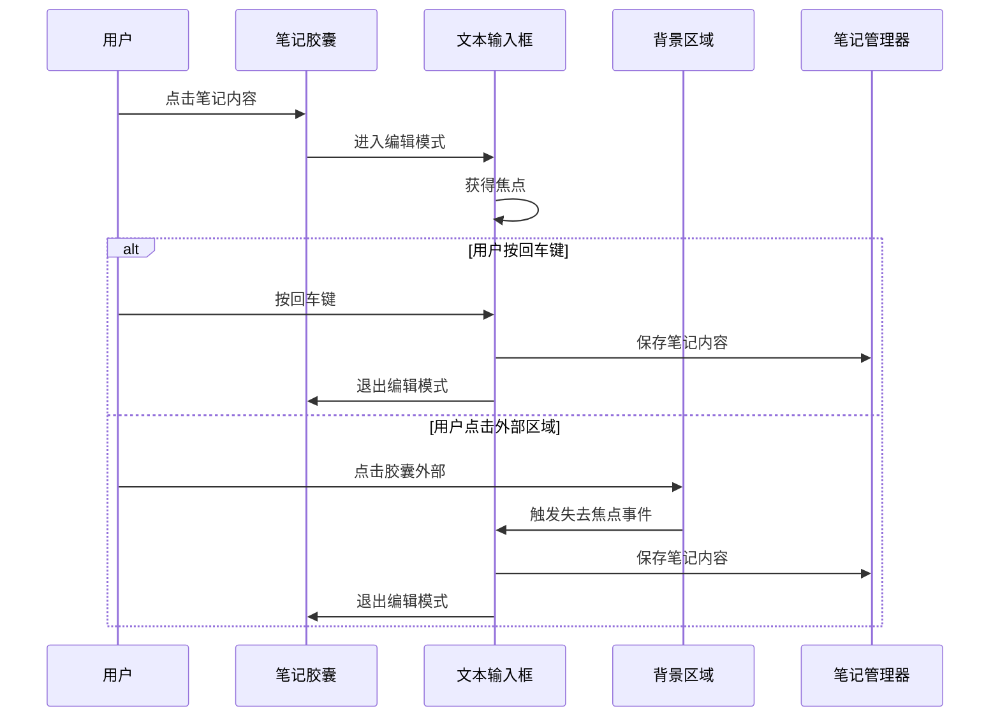

# 笔记胶囊点击外部完成编辑

## 概述
当前笔记编辑功能只能通过按回车键或点击其他地方来完成编辑，但用户希望点击笔记胶囊以外的任何地方都能完成编辑，就像按回车键一样。需要在 SwiftUI 中实现点击外部区域自动完成编辑的功能。

## 流程图

## 方案
### 最终实现方案：多层次焦点监听机制
- **实现方式**：
  1. **应用程序级别监听**：监听 `NSApplication.didResignActiveNotification`，当应用失去焦点时完成编辑
  2. **窗口级别监听**：监听 `NSWindow.didResignKeyNotification`，当窗口失去焦点时完成编辑
  3. **视图级别监听**：在背景添加点击手势，点击胶囊外部时完成编辑
  4. **输入框级别监听**：保留原有的焦点丢失和回车键完成编辑功能

- **覆盖场景**：
  - 点击应用内其他区域（工具栏、空白区域等）
  - 点击其他笔记胶囊
  - 切换到其他应用程序
  - 点击桌面或其他窗口
  - 使用 Command+Tab 切换应用
  - 按回车键
  - TextField 自然失去焦点

- **优点**：
  - 全面覆盖所有可能的焦点丢失场景
  - 多层保护，确保编辑状态不会遗留
  - 用户体验一致，无论如何离开编辑都会自动保存
  - 兼容性好，适用于所有 macOS 版本

## 相关代码位置
[NoteItemView 结构体](vscode://file//Users/xavier/Desktop/AIX/Sources/View/NoteListView.swift:3)
[TextField 编辑逻辑](vscode://file//Users/xavier/Desktop/AIX/Sources/View/NoteListView.swift:35)
[onSubmit 处理逻辑](vscode://file//Users/xavier/Desktop/AIX/Sources/View/NoteListView.swift:41)

## 代码错误测试
修改完代码后，必须使用 swift build 命令检查代码错误，并修复所有编译错误。

## 验证流程
1. **应用内测试**：
   - 点击任意笔记进入编辑模式
   - 输入一些文本内容
   - 点击笔记胶囊以外的区域（工具栏、其他笔记、空白区域等）
   - 验证笔记内容是否自动保存并退出编辑模式

2. **应用外测试**：
   - 点击任意笔记进入编辑模式
   - 输入一些文本内容
   - 点击桌面或其他应用程序窗口
   - 验证笔记内容是否自动保存并退出编辑模式

3. **应用切换测试**：
   - 点击任意笔记进入编辑模式
   - 输入一些文本内容
   - 使用 Command+Tab 切换到其他应用
   - 再切换回来验证笔记是否已保存并退出编辑模式

4. **空内容测试**：
   - 创建新笔记（自动进入编辑模式）
   - 不输入任何内容，直接点击外部或切换应用
   - 验证空笔记是否被自动删除

5. **传统操作测试**：
   - 验证按回车键仍然可以完成编辑
   - 验证正常的焦点切换仍然工作

## 任务总结与结论
通过多层次焦点监听机制，成功实现了点击笔记胶囊以外任何区域（包括应用程序外部）自动完成编辑的功能。最终实现包含：
1. 应用程序级别的焦点监听（NSApplication.didResignActiveNotification）
2. 窗口级别的焦点监听（NSWindow.didResignKeyNotification）
3. 视图级别的背景点击手势
4. 输入框级别的焦点变化监听

这种多层保护机制确保了无论用户如何离开编辑状态，都能自动保存笔记内容，大大提升了用户体验。

## 任务耗时
- 任务开始时间：1952
- 任务结束时间：2005
- 任务总耗时：13 分钟