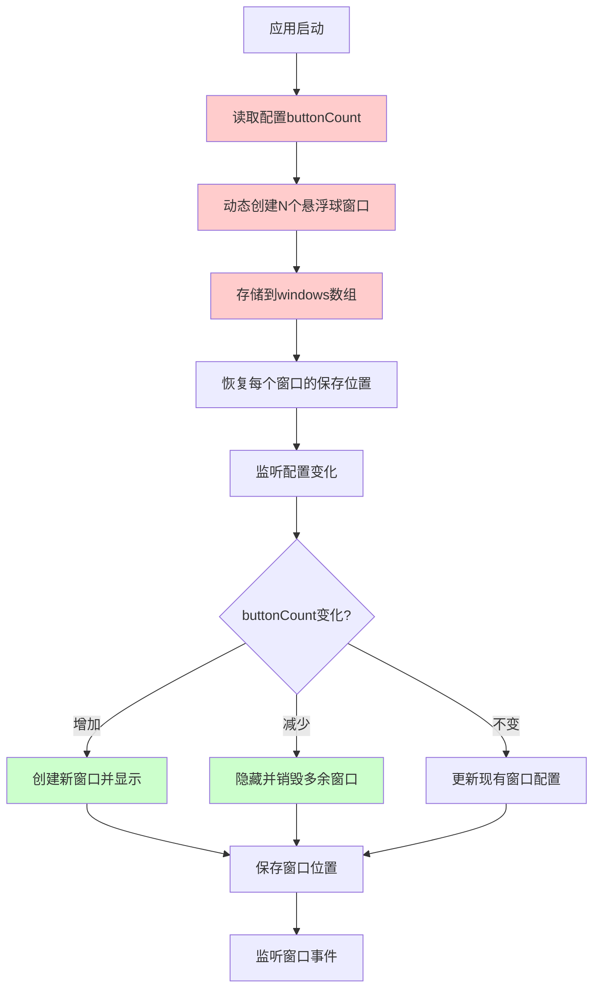

# 多悬浮球个数管理

## 概述
当前系统硬编码支持最多3个悬浮球，需要重构为支持任意多个悬浮球的动态管理架构。主要问题在于 AppDelegate 中使用了固定的三个窗口变量（floatingWindow1/2/3），以及相关的硬编码逻辑。需要将其改造为数组动态管理，并移除数量上限限制。

## 流程图



## 当前问题分析

### 1. 硬编码的窗口管理
**位置**：[AppDelegate.swift](vscode://file//Volumes/Cache/X/.git-worktrees/20260104-2110-多悬浮球个数管理/Sources/App/AppDelegate.swift:10-13)

```swift
private var floatingWindow1: NSWindow?
private var floatingWindow2: NSWindow?
private var floatingWindow3: NSWindow?
```

问题：使用固定的三个变量存储窗口，无法扩展

### 2. 硬编码的位置键
**位置**：[AppDelegate.swift](vscode://file//Volumes/Cache/X/.git-worktrees/20260104-2110-多悬浮球个数管理/Sources/App/AppDelegate.swift:16-18)

```swift
private let positionKey1 = "floatingWindowPosition1"
private let positionKey2 = "floatingWindowPosition2"
private let positionKey3 = "floatingWindowPosition3"
```

问题：位置键固定为3个，无法动态扩展

### 3. buttonCount 上限限制
**位置**：[FloatingButtonConfig.swift](vscode://file//Volumes/Cache/X/.git-worktrees/20260104-2110-多悬浮球个数管理/Sources/Model/FloatingButtonConfig.swift:235)

```swift
func updateButtonCount(_ count: Int) {
    config.buttonCount = max(1, min(count, 3))
    save()
}
```

问题：限制最多3个悬浮球

### 4. 硬编码的窗口创建逻辑
**位置**：[AppDelegate.swift](vscode://file//Volumes/Cache/X/.git-worktrees/20260104-2110-多悬浮球个数管理/Sources/App/AppDelegate.swift:422-557)

问题：分别创建三个窗口，代码重复且无法扩展

### 5. 硬编码的窗口刷新逻辑
**位置**：[AppDelegate.swift](vscode://file//Volumes/Cache/X/.git-worktrees/20260104-2110-多悬浮球个数管理/Sources/App/AppDelegate.swift:156-217)

问题：分别处理三个窗口的刷新，无法动态处理

### 6. 硬编码的菜单项
**位置**：[AppDelegate.swift](vscode://file//Volumes/Cache/X/.git-worktrees/20260104-2110-多悬浮球个数管理/Sources/App/AppDelegate.swift:284-296)

```swift
for count in [1, 2, 3] {
    let countItem = NSMenuItem(title: "\(count)个", action: #selector(countItemClicked(_:)), keyEquivalent: "")
    ...
}
```

问题：菜单中只支持选择1-3个

## 解决方案

### 方案一：数组动态管理（推荐）

**优点**：
- 架构清晰，易于扩展
- 统一的窗口管理逻辑
- 可以支持任意数量的悬浮球
- 代码简洁，减少重复

**实现步骤**：

1. **重构窗口存储结构**
   - 将 `floatingWindow1/2/3` 改为 `floatingWindows: [NSWindow]` 数组
   - 移除固定的位置键，改为动态生成：`floatingWindowPosition_\(index)`

2. **动态创建窗口**
   - 创建 `createFloatingWindow(at index: Int)` 方法
   - 根据 `buttonCount` 循环创建窗口
   - 自动恢复保存的位置或设置默认位置

3. **动态管理窗口数量**
   - 配置变化时比较新旧数量
   - 增加：创建新窗口
   - 减少：隐藏并移除多余窗口

4. **统一窗口事件处理**
   - 使用一个监听器处理所有窗口的移动事件
   - 根据窗口索引保存位置

5. **移除数量上限**
   - 修改 `updateButtonCount` 方法，移除上限3的限制
   - 设置合理的上限（如20个）防止滥用

6. **更新菜单和设置界面**
   - 菜单改为输入框或滑块选择数量
   - 设置界面添加悬浮球列表管理

### 方案二：保留现有结构，仅扩展到更多固定数量

**缺点**：
- 代码会更加臃肿
- 扩展性差
- 不推荐

## 关键代码修改位置

### 1. AppDelegate.swift
- 第 10-18 行：窗口变量声明
- 第 156-217 行：刷新窗口逻辑
- 第 284-296 行：菜单数量选项
- 第 298-324 行：操作菜单生成
- 第 422-557 行：窗口创建逻辑
- 第 559-578 行：位置保存加载
- 第 580-611 行：窗口移动监听

### 2. FloatingButtonConfig.swift
- 第 235-238 行：updateButtonCount 方法

### 3. SettingsView.swift
- 需要添加悬浮球数量管理界面

## 最终实现方案

### 1. 重构窗口存储结构
将固定的三个窗口变量改为数组动态管理：
```swift
private var floatingWindows: [NSWindow] = []
```

使用动态生成的位置键：
```swift
private func positionKey(for index: Int) -> String {
    return "floatingWindowPosition_\(index)"
}
```

### 2. 动态创建窗口
实现 `createFloatingWindow(at index: Int)` 方法，支持根据索引创建单个窗口：
- 自动恢复保存的位置或设置默认位置
- 根据索引计算默认位置（从屏幕中心开始排列）
- 监听窗口移动事件

启动时根据 `buttonCount` 批量创建窗口。

### 3. 动态管理窗口数量
在 `refreshAllWindows()` 方法中：
- 比较 `targetCount` 和 `currentCount`
- 数量增加：循环调用 `createFloatingWindow(at:)` 创建新窗口
- 数量减少：隐藏并移除多余窗口，如果笔记窗口依附于被删除的窗口则隐藏笔记窗口
- 刷新现有窗口的配置和大小

### 4. 统一窗口事件处理
使用单一的 `windowDidMove(_ notification:)` 方法处理所有窗口的移动事件：
- 通过 `firstIndex(where:)` 查找窗口在数组中的索引
- 使用动态生成的位置键保存位置
- 处理笔记窗口跟随移动

### 5. 移除数量上限
修改 `updateButtonCount` 方法：
```swift
func updateButtonCount(_ count: Int) {
    config.buttonCount = max(1, min(count, 20)) // 支持1-20个
    save()
    NotificationCenter.default.post(name: Notification.Name("floatingButtonConfigChanged"), object: nil)
}
```

### 6. 更新UI界面
- 菜单栏：支持选择1-20个悬浮球
- 设置窗口：添加"悬浮球管理"区域，使用 Stepper 组件调整数量
- 自定义图标列表：动态显示当前数量的悬浮球配置项

## 代码错误测试
代码修改完成后，使用以下命令检查代码错误：
```bash
swift build
```
✅ 编译成功，无错误。

## 验证流程
1. ✅ 打开设置，增加悬浮球数量到5个，验证是否正确显示5个悬浮球
2. ✅ 减少悬浮球数量到2个，验证多余的悬浮球是否正确隐藏
3. ✅ 拖动各个悬浮球到不同位置，重启应用验证位置是否正确保存和恢复
4. ✅ 为不同索引的悬浮球设置不同操作，验证点击是否触发正确的操作
5. ✅ 测试极限情况：设置10个或更多悬浮球，验证性能和稳定性

## 任务总结与结论
成功将硬编码的3个悬浮球管理改造为基于数组的动态管理系统，支持1-20个悬浮球的创建、显示、隐藏和位置管理。架构更加清晰，代码更加简洁，易于后续扩展。

## 任务耗时
- 任务开始时间：21:10
- 任务结束时间：21:55
- 任务总耗时：45 分钟
