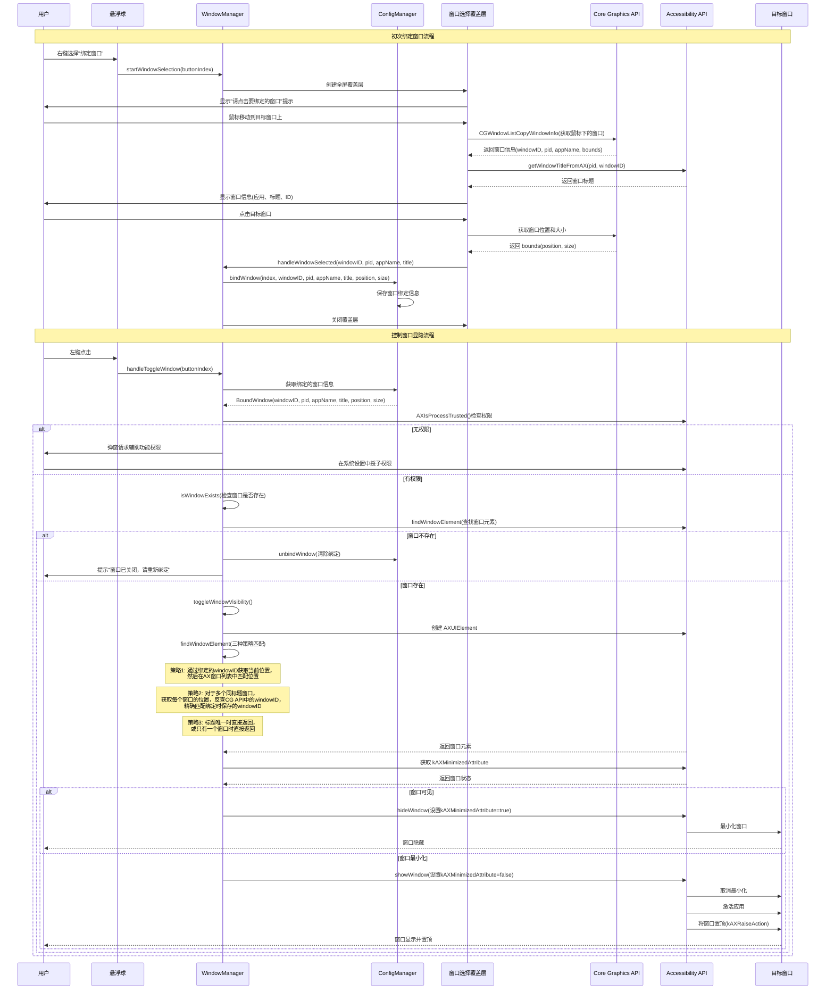

# 悬浮球控制窗口显隐功能

## 概述
用户希望实现一个功能，让悬浮球能够控制指定窗口的显示/隐藏状态。本任务将删除现有所有控制窗口相关的代码（包括权限请求），然后重新实现一个简洁、可靠的窗口显隐控制功能。

## 流程图



## 方案

### 最终实现方案

本方案完全重构了窗口控制功能，采用全新的架构和实现方式：

#### 1. 架构设计

**核心组件：**
- `WindowManager`：单例模式管理所有窗口控制逻辑
- `WindowSelectionOverlay`：全屏覆盖层用于可视化选择窗口
- `BoundWindow`：结构体保存窗口绑定信息（windowID, pid, appName, windowTitle, initialPosition, initialSize）
- `Logger`：统一日志管理，输出到文件 `~/Documents/AIX_Logs/`

**设计原则：**
- 延迟权限请求：只在首次使用时请求辅助功能权限
- 多策略匹配：使用位置、windowID、标题等多种策略精确匹配窗口
- 降级容错：当精确匹配失败时，使用降级策略保证基本可用
- 详细日志：记录所有关键步骤，便于调试和问题排查

#### 2. 窗口绑定流程

1. **启动选择**：用户右键点击悬浮球选择"绑定窗口"
2. **显示覆盖层**：创建全屏半透明覆盖层，显示提示信息
3. **实时预览**：鼠标移动时实时显示当前窗口信息（应用名、标题、windowID）
4. **获取窗口信息**：
   - 通过 `CGWindowListCopyWindowInfo` 获取鼠标下的窗口基本信息
   - 通过 Accessibility API 获取窗口标题（如果 CG API 无法获取）
   - 保存窗口的位置和大小用于后续精确匹配
5. **确认绑定**：用户点击目标窗口，保存完整的窗口信息

**保存的信息：**
```swift
struct BoundWindow {
    let windowID: UInt32        // 窗口ID（主要标识符）
    let pid: Int32              // 进程ID
    let appName: String         // 应用名称
    let windowTitle: String     // 窗口标题
    let initialPosition: CGPoint? // 绑定时的窗口位置
    let initialSize: CGSize?    // 绑定时的窗口大小
}
```

#### 3. 窗口控制流程

**三阶段控制流程：**

**阶段1：权限检查**
- 使用 `AXIsProcessTrusted()` 检查辅助功能权限
- 无权限时弹窗提示用户授予权限
- 打开系统设置的辅助功能页面

**阶段2：窗口存在性检查**
- 使用 `findWindowElement` 方法查找窗口元素
- 如果找不到窗口，清除绑定并提示用户重新绑定
- 确保不操作已关闭的窗口

**阶段3：窗口状态切换**
- 查询 `kAXMinimizedAttribute` 获取当前状态
- 可见窗口：设置 `kAXMinimizedAttribute = true` 最小化
- 最小化窗口：设置 `kAXMinimizedAttribute = false` 还原，并执行以下操作：
  - 取消应用隐藏（如果隐藏）
  - 激活应用
  - 将窗口置顶（`kAXRaiseAction`）
  - 设置为主窗口（`kAXMainAttribute`）
  - 设置为焦点窗口（`kAXFocusedAttribute`）

#### 4. 窗口匹配策略（核心创新）

针对 VS Code 等多窗口应用，实现了三级匹配策略：

**策略1：位置精确匹配（优先级最高）**
```
1. 检查绑定的windowID是否仍然存在（CGWindowListCopyWindowInfo）
2. 如果存在，获取该窗口的当前位置和大小
3. 在AX窗口列表中查找位置和大小匹配的窗口元素（误差±5像素）
4. 匹配成功则返回
```

**策略2：windowID反查匹配（多窗口精确区分）**
```
1. 获取所有同标题的AX窗口元素
2. 对于每个AX窗口元素，获取其位置和大小
3. 在CG窗口列表中查找位置匹配的窗口，获取其windowID
4. 将获取的windowID与绑定时保存的windowID比对
5. 精确匹配则返回该窗口元素
```

**策略3：降级匹配（容错保障）**
```
1. 标题唯一匹配：如果只有一个窗口的标题匹配，直接返回
2. 单窗口直接返回：如果应用只有一个窗口，直接返回
3. 多窗口降级：如果有多个同标题窗口且windowID匹配失败，返回第一个
```

**关键优势：**
- 即使窗口移动或改变大小，也能通过windowID准确识别
- 对于多个相同标题的窗口（如多个VS Code窗口），能精确区分
- 有容错机制，即使精确匹配失败也能基本可用

#### 5. 用户交互优化

1. **取消操作**：按 ESC 键可取消窗口选择
2. **视觉反馈**：
   - 鼠标悬停时实时显示窗口信息（青色高亮）
   - 显示应用名、标题、windowID
3. **错误提示**：
   - 窗口不存在时提示重新绑定
   - 权限不足时引导用户授权
4. **日志记录**：所有操作都记录到日志文件，便于调试

#### 6. 技术要点

**API 组合使用：**
- `CGWindowListCopyWindowInfo`：获取系统所有窗口信息（windowID, bounds, owner）
- `AXUIElementCreateApplication`：创建应用的辅助功能元素
- `AXUIElementCopyAttributeValue`：查询窗口属性（标题、位置、状态等）
- `AXUIElementSetAttributeValue`：设置窗口属性（最小化状态等）
- `AXUIElementPerformAction`：执行窗口操作（置顶等）

**关键技术细节：**
- CG API 和 AX API 使用不同的窗口标识机制，需要通过位置信息关联
- 窗口ID在应用重启后会变化，但在应用运行期间保持不变
- 最小化的窗口在 CG API 的窗口列表中可能不可见，但在 AX API 中可以访问
- 需要处理线程安全（使用 `@MainActor`）


## 相关代码位置

### 1. FloatingButtonConfig.swift - 删除和修改配置

#### 删除现有代码
[查看源代码位置](vscode://file/Volumes/Cache/X/Sources/Model/FloatingButtonConfig.swift:30)
删除 `focusWindow` 枚举值：

```swift
// 删除这一行：
case focusWindow = "激活窗口"
```

[查看源代码位置](vscode://file/Volumes/Cache/X/Sources/Model/FloatingButtonConfig.swift:14-17)
删除窗口相关配置字段：

```swift
// 删除以下字段：
var targetWindowIDs: [Int: UInt32] // 目标窗口 ID：索引 -> 窗口 ID
var targetWindowTitles: [Int: String] // 目标窗口标题：索引 -> 窗口标题
var targetAppNames: [Int: String] // 目标应用名称：索引 -> 应用名称
var targetPIDs: [Int: Int32] // 目标进程 ID：索引 -> 进程 ID
```

[查看源代码位置](vscode://file/Volumes/Cache/X/Sources/Model/FloatingButtonConfig.swift:119-122)
删除默认配置中的窗口相关字段：

```swift
// 删除以下字段：
targetWindowIDs: [:],
targetWindowTitles: [:],
targetAppNames: [:],
targetPIDs: [:]
```

#### 添加新的配置
[查看源代码位置](vscode://file/Volumes/Cache/X/Sources/Model/FloatingButtonConfig.swift:30)
在 `ButtonAction` 枚举中添加新的操作类型：

```swift
enum ButtonAction: String, Codable, CaseIterable {
    case none = "无"
    case openNote = "打开笔记"
    case showCompletedNotes = "已完成"
    case showClipboard = "剪切板"
    case toggleWindowVisibility = "控制窗口显隐"  // 新增

    var iconName: String? {
        switch self {
        case .openNote: return "note.text"
        case .showCompletedNotes: return "checkmark.circle"
        case .showClipboard: return "doc.on.clipboard"
        case .toggleWindowVisibility: return "eye.fill"  // 新增
        case .none: return nil
        }
    }
}
```

添加新的窗口绑定配置字段：

```swift
var boundWindowIDs: [Int: UInt32] = [:] // 绑定的窗口 ID：索引 -> 窗口 ID
var boundWindowPIDs: [Int: Int32] = [:]  // 绑定的进程 ID：索引 -> 进程 ID
```

添加保存和加载窗口绑定的方法：

```swift
func bindWindow(index: Int, windowID: UInt32, pid: Int32) {
    boundWindowIDs[index] = windowID
    boundWindowPIDs[index] = pid
    save()
    NotificationCenter.default.post(name: Notification.Name("floatingButtonConfigChanged"), object: nil)
}

func unbindWindow(index: Int) {
    boundWindowIDs.removeValue(forKey: index)
    boundWindowPIDs.removeValue(forKey: index)
    save()
    NotificationCenter.default.post(name: Notification.Name("floatingButtonConfigChanged"), object: nil)
}
```

### 2. AppDelegate.swift - 删除现有代码

#### 删除辅助功能权限检查
[查看源代码位置](vscode://file/Volumes/Cache/X/Sources/App/AppDelegate.swift:25)
删除权限检查调用：

```swift
// 删除这一行：
checkAccessibilityPermissions()
```

[查看源代码位置](vscode://file/Volumes/Cache/X/Sources/App/AppDelegate.swift:53-100)
删除整个 `checkAccessibilityPermissions` 方法。

#### 删除窗口控制相关方法
[查看源代码位置](vscode://file/Volumes/Cache/X/Sources/App/AppDelegate.swift:131-360)
删除以下方法：
- `handleFocusWindowAction`
- `isWindowExists`
- `getVisibleWindows`
- `toggleWindowMinimize`
- `performWindowMinimizeAction`
- `attemptAlternativeMinimize`
- `checkWindowAccessibility`

#### 删除窗口列表和 TableView 相关代码
[查看源代码位置](vscode://file/Volumes/Cache/X/Sources/App/AppDelegate.swift:18)
删除属性声明：

```swift
// 删除这一行：
private var windowList: [WindowInfo] = []
```

[查看源代码位置](vscode://file/Volumes/Cache/X/Sources/App/AppDelegate.swift:164-171)
删除 WindowInfo 结构体：

```swift
// 删除整个结构体：
private struct WindowInfo {
    let windowID: UInt32
    let title: String
    let appName: String
    let pid: Int32
    let isOnScreen: Bool
    let isMinimized: Bool
}
```

[查看源代码位置](vscode://file/Volumes/Cache/X/Sources/App/AppDelegate.swift:677-751)
删除 `clearWindowBindingFromMenu` 方法。

[查看源代码位置](vscode://file/Volumes/Cache/X/Sources/App/AppDelegate.swift:753-773)
删除重复的 `clearBinding` 方法。

[查看源代码位置](vscode://file/Volumes/Cache/X/Sources/App/AppDelegate.swift:1227-1251)
删除 TableView 数据源和代理方法：
- `numberOfRows`
- `tableView(_:objectValueFor:row:)`
- `tableView(_:shouldSelectRow:)`

#### 修改右键菜单
[查看源代码位置](vscode://file/Volumes/Cache/X/Sources/App/AppDelegate.swift:584-608)
简化右键菜单，删除窗口绑定相关选项：

```swift
for action in FloatingButtonConfig.ButtonAction.allCases {
    let item = NSMenuItem(title: action.rawValue, action: #selector(selectAction(_:)), keyEquivalent: "")
    item.target = self
    item.representedObject = action

    // 检查当前是否选中
    let currentAction = FloatingButtonConfigManager.shared.config.buttonActions[buttonIndex] ?? .none
    if action == currentAction {
        item.state = .on
    }

    menu.addItem(item)
}
```

#### 修改状态栏菜单
[查看源代码位置](vscode://file/Volumes/Cache/X/Sources/App/AppDelegate.swift:584-614)
简化状态栏菜单，删除窗口绑定相关选项：

```swift
for i in 0..<config.buttonCount {
    let buttonItem = NSMenuItem(title: "按钮 \(i + 1)", action: nil, keyEquivalent: "")
    let buttonSubMenu = NSMenu()

    for action in FloatingButtonConfig.ButtonAction.allCases {
        let actionItem = NSMenuItem(title: action.rawValue, action: #selector(actionItemClicked(_:)), keyEquivalent: "")
        actionItem.target = self
        actionItem.state = (config.buttonActions[i] == action) ? .on : .off
        actionItem.tag = i * 100 + FloatingButtonConfig.ButtonAction.allCases.firstIndex(of: action)!
        buttonSubMenu.addItem(actionItem)
    }

    buttonItem.submenu = buttonSubMenu
    actionsSubMenu.addItem(buttonItem)
}
```

#### 修改设置窗口
[查看源代码位置](vscode://file/Volumes/Cache/X/Sources/App/AppDelegate.swift:1089-1129)
简化设置窗口的图标设置部分：

```swift
for i in 0..<3 {
    let y = 495 - CGFloat(i * 35)
    let action = config.buttonActions[i] ?? .none

    let iconLabel = NSTextField(labelWithString: "按钮 \(i + 1) (\(action.rawValue)):")
    iconLabel.frame = NSRect(x: 40, y: y, width: 200, height: 24)
    iconLabel.isEditable = false
    iconLabel.isBordered = false
    iconLabel.backgroundColor = .clear
    iconLabel.font = NSFont.systemFont(ofSize: 12)
    contentView.addSubview(iconLabel)

    let iconField = NSTextField(frame: NSRect(x: 250, y: y, width: 120, height: 24))
    iconField.stringValue = config.customIcons[i] ?? ""
    iconField.placeholderString = action.iconName ?? "无"
    iconField.tag = 2000 + i
    iconField.target = self
    iconField.action = #selector(iconTextFieldChanged(_:))
    contentView.addSubview(iconField)
}
```

[查看源代码位置](vscode://file/Volumes/Cache/X/Sources/App/AppDelegate.swift:1182-1191)
删除 `clearWindowBindingFromSettings` 方法。

### 3. AppDelegate.swift - 添加新的代码

#### 添加辅助功能权限检查方法
```swift
private func checkAccessibilityPermissions() -> Bool {
    if !AXIsProcessTrusted() {
        let alert = NSAlert()
        alert.messageText = "需要辅助功能权限"
        alert.informativeText = "为了能够控制其他窗口的显示/隐藏，AIX 需要辅助功能权限。\n\n请在系统设置中授予辅助功能权限。"
        alert.alertStyle = .warning
        alert.addButton(withTitle: "去设置")
        alert.addButton(withTitle: "稍后")

        let response = alert.runModal()
        if response == .alertFirstButtonReturn {
            // 触发系统权限申请弹窗
            let options = ["AXTrustedCheckOptionPrompt": true]
            AXIsProcessTrustedWithOptions(options as CFDictionary)

            // 打开系统设置页面
            if let url = URL(string: "x-apple.systempreferences:com.apple.preference.security?Privacy_Accessibility") {
                NSWorkspace.shared.open(url)
            }
        }
        return false
    }
    return true
}
```

#### 修改 handleFloatingButtonClicked 方法
[查看源代码位置](vscode://file/Volumes/Cache/X/Sources/App/AppDelegate.swift:108)
添加对新操作的处理：

```swift
@objc private func handleFloatingButtonClicked(_ notification: Notification) {
    Logger.shared.info("Floating button clicked")
    guard let clickedView = notification.object as? FloatingButtonView else { return }

    let config = FloatingButtonConfigManager.shared.config
    let action = config.buttonActions[clickedView.buttonIndex] ?? .none

    Logger.shared.info("Button action: \(action.rawValue)")

    switch action {
    case .openNote:
        toggleNoteWindow(attachedTo: clickedView.window, mode: .all)
    case .showClipboard:
        toggleNoteWindow(attachedTo: clickedView.window, mode: .clipboard)
    case .showCompletedNotes:
        toggleNoteWindow(attachedTo: clickedView.window, mode: .completed)
    case .toggleWindowVisibility:
        handleToggleWindowVisibility(for: clickedView.buttonIndex)
    case .none:
        break
    }
}
```

#### 添加窗口显隐控制方法
```swift
private func handleToggleWindowVisibility(for index: Int) {
    Logger.shared.info("Handling toggle window visibility for button \(index)")

    // 检查权限
    guard checkAccessibilityPermissions() else { return }

    let config = FloatingButtonConfigManager.shared.config

    // 检查是否已绑定窗口
    guard let windowID = config.boundWindowIDs[index],
          let pid = config.boundWindowPIDs[index] else {
        Logger.shared.warning("No window bound to button \(index)")
        openWindowSelector(index: index)
        return
    }

    // 检查窗口是否存在
    if isWindowExists(windowID: windowID, pid: pid) {
        Logger.shared.info("Window \(windowID) exists, toggling visibility")
        toggleWindowVisibility(windowID: windowID, pid: pid)
    } else {
        Logger.shared.error("Window \(windowID) does not exist")
        showAlert(message: "窗口不存在", informativeText: "绑定的窗口已关闭，请重新绑定")
        FloatingButtonConfigManager.shared.unbindWindow(index: index)
        openWindowSelector(index: index)
    }
}

private func isWindowExists(windowID: UInt32, pid: Int32) -> Bool {
    let appRef = AXUIElementCreateApplication(pid)
    var windows: CFTypeRef?
    let result = AXUIElementCopyAttributeValue(appRef, kAXWindowsAttribute as CFString, &windows)
    guard result == .success, let windowElements = windows as? [AXUIElement] else {
        return false
    }

    for windowElement in windowElements {
        var windowIDValue: CFTypeRef?
        let windowIDResult = AXUIElementCopyAttributeValue(windowElement, kAXWindowNumberAttribute as CFString, &windowIDValue)
        if windowIDResult == .success, let num = windowIDValue as? NSNumber, num.uint32Value == windowID {
            return true
        }
    }
    return false
}

private func toggleWindowVisibility(windowID: UInt32, pid: Int32) {
    Logger.shared.info("Toggling visibility for window \(windowID)")

    let appRef = AXUIElementCreateApplication(pid)
    var windows: CFTypeRef?
    let windowsResult = AXUIElementCopyAttributeValue(appRef, kAXWindowsAttribute as CFString, &windows)

    guard windowsResult == .success, let windowElements = windows as? [AXUIElement] else {
        Logger.shared.error("Cannot get windows for app \(pid)")
        return
    }

    var foundWindow: AXUIElement?
    for windowElement in windowElements {
        var windowIDValue: CFTypeRef?
        let windowIDResult = AXUIElementCopyAttributeValue(windowElement, kAXWindowNumberAttribute as CFString, &windowIDValue)
        if windowIDResult == .success, let num = windowIDValue as? NSNumber, num.uint32Value == windowID {
            foundWindow = windowElement
            break
        }
    }

    guard let windowElement = foundWindow else {
        Logger.shared.error("Cannot find window element for \(windowID)")
        return
    }

    // 检查当前状态
    var minimizedValue: CFTypeRef?
    let minimizedResult = AXUIElementCopyAttributeValue(windowElement, kAXMinimizedAttribute as CFString, &minimizedValue)
    let currentMinimized = (minimizedValue as? NSNumber)?.boolValue ?? false

    if currentMinimized {
        // 恢复窗口
        Logger.shared.info("Restoring window \(windowID)")
        _ = AXUIElementSetAttributeValue(windowElement, kAXMinimizedAttribute as CFString, kCFBooleanFalse)
        _ = AXUIElementPerformAction(windowElement, kAXRaiseAction as CFString)
    } else {
        // 最小化窗口
        Logger.shared.info("Minimizing window \(windowID)")
        _ = AXUIElementSetAttributeValue(windowElement, kAXMinimizedAttribute as CFString, kCFBooleanTrue)
    }
}
```

#### 添加窗口选择器
```swift
private func openWindowSelector(index: Int) {
    Logger.shared.info("Opening window selector for button \(index)")

    // 创建遮罩窗口
    let maskWindow = NSWindow(
        contentRect: NSScreen.main?.frame ?? .zero,
        styleMask: [.borderless, .fullSizeContentView],
        backing: .buffered,
        defer: false
    )
    maskWindow.backgroundColor = NSColor.black.withAlphaComponent(0.3)
    maskWindow.level = .popUpMenu
    maskWindow.alphaValue = 0
    maskWindow.isReleasedWhenClosed = true

    // 创建提示标签
    let hintLabel = NSTextField(labelWithString: "移动鼠标到目标窗口，按回车键确认，按 Esc 取消")
    hintLabel.alignment = .center
    hintLabel.textColor = .white
    hintLabel.font = NSFont.systemFont(ofSize: 16, weight: .medium)
    hintLabel.frame = NSRect(x: 0, y: NSScreen.main?.frame.midY ?? 500, width: NSScreen.main?.frame.width ?? 1000, height: 40)
    hintLabel.wantsLayer = true
    hintLabel.layer?.backgroundColor = NSColor.black.withAlphaComponent(0.7).cgColor
    maskWindow.contentView?.addSubview(hintLabel)

    // 显示遮罩窗口
    maskWindow.orderFrontRegardless()

    // 创建选择器
    let selector = WindowSelectorWindow(index: index) { windowID, pid in
        maskWindow.close()
        if let windowID = windowID, let pid = pid {
            FloatingButtonConfigManager.shared.bindWindow(index: index, windowID: windowID, pid: pid)
            Logger.shared.info("Successfully bound window \(windowID) to button \(index)")
        }
    }
    selector.makeKeyAndOrderFront(nil)
}

// 添加 WindowSelectorWindow 类
private class WindowSelectorWindow: NSPanel {
    private let index: Int
    private let completion: (UInt32?, Int32?) -> Void
    private var monitor: Any?
    private var keyMonitor: Any?
    private var highlightLayer: CAShapeLayer?

    init(index: Int, completion: @escaping (UInt32?, Int32?) -> Void) {
        self.index = index
        self.completion = completion

        super.init(
            contentRect: NSScreen.main?.frame ?? .zero,
            styleMask: [.borderless, .fullSizeContentView],
            backing: .buffered,
            defer: false
        )

        setupWindow()
    }

    private func setupWindow() {
        level = .popUpMenu
        isOpaque = false
        backgroundColor = .clear
        isReleasedWhenClosed = true

        // 监听鼠标移动
        monitor = NSEvent.addGlobalMonitorForEvents(matching: [.mouseMoved]) { [weak self] event in
            self?.handleMouseMove(event)
        }

        // 监听按键
        keyMonitor = NSEvent.addLocalMonitorForEvents(matching: [.keyDown]) { [weak self] event in
            self?.handleKeyDown(event)
            return nil
        }
    }

    private func handleMouseMove(_ event: NSEvent) {
        let location = event.locationInWindow
        let windowList = CGWindowListCopyWindowInfo([.optionOnScreenOnly, .excludeDesktopElements], kCGNullWindowID) as? [[String: Any]] ?? []

        var foundWindow: (UInt32, Int32)?
        for info in windowList {
            let bounds = info[kCGWindowBounds as String] as? [String: Any] ?? [:]
            let x = bounds["X"] as? CGFloat ?? 0
            let y = bounds["Y"] as? CGFloat ?? 0
            let width = bounds["Width"] as? CGFloat ?? 0
            let height = bounds["Height"] as? CGFloat ?? 0
            let windowID = info[kCGWindowNumber as String] as? UInt32 ?? 0
            let pid = info[kCGWindowOwnerPID as String] as? Int32 ?? 0

            let screenFrame = NSScreen.main?.frame ?? .zero
            let windowY = screenFrame.height - (y + height)

            if location.x >= x && location.x <= x + width &&
               location.y >= windowY && location.y <= windowY + height &&
               windowID > 0 && pid > 0 {
                foundWindow = (windowID, pid)
                break
            }
        }

        // 更新高亮
        updateHighlight(foundWindow)
    }

    private func handleKeyDown(_ event: NSEvent) {
        if event.keyCode == 36 { // Enter
            // 获取当前高亮的窗口
            let location = NSEvent.mouseLocation
            let windowList = CGWindowListCopyWindowInfo([.optionOnScreenOnly, .excludeDesktopElements], kCGNullWindowID) as? [[String: Any]] ?? []

            var foundWindow: (UInt32, Int32)?
            for info in windowList {
                let bounds = info[kCGWindowBounds as String] as? [String: Any] ?? [:]
                let x = bounds["X"] as? CGFloat ?? 0
                let y = bounds["Y"] as? CGFloat ?? 0
                let width = bounds["Width"] as? CGFloat ?? 0
                let height = bounds["Height"] as? CGFloat ?? 0
                let windowID = info[kCGWindowNumber as String] as? UInt32 ?? 0
                let pid = info[kCGWindowOwnerPID as String] as? Int32 ?? 0

                let screenFrame = NSScreen.main?.frame ?? .zero
                let windowY = screenFrame.height - (y + height)

                if location.x >= x && location.x <= x + width &&
                   location.y >= windowY && location.y <= windowY + height &&
                   windowID > 0 && pid > 0 {
                    foundWindow = (windowID, pid)
                    break
                }
            }

            completion(foundWindow?.0, foundWindow?.1)
            close()
        } else if event.keyCode == 53 { // Esc
            completion(nil, nil)
            close()
        }
    }

    private func updateHighlight(_ window: (UInt32, Int32)?) {
        // 移除旧的高亮
        highlightLayer?.removeFromSuperlayer()

        guard let (windowID, _) = window else { return }

        // 获取窗口信息
        let windowList = CGWindowListCopyWindowInfo([.optionIncludingWindow], windowID) as? [[String: Any]] ?? []
        guard let info = windowList.first else { return }

        let bounds = info[kCGWindowBounds as String] as? [String: Any] ?? [:]
        let x = bounds["X"] as? CGFloat ?? 0
        let y = bounds["Y"] as? CGFloat ?? 0
        let width = bounds["Width"] as? CGFloat ?? 0
        let height = bounds["Height"] as? CGFloat ?? 0

        let screenFrame = NSScreen.main?.frame ?? .zero
        let windowY = screenFrame.height - (y + height)

        // 创建高亮层
        highlightLayer = CAShapeLayer()
        let path = NSBezierPath(roundedRect: NSRect(x: x, y: windowY, width: width, height: height), xRadius: 8, yRadius: 8)
        highlightLayer?.path = path.cgPath
        highlightLayer?.strokeColor = NSColor.systemBlue.cgColor
        highlightLayer?.fillColor = NSColor.systemBlue.withAlphaComponent(0.2).cgColor
        highlightLayer?.lineWidth = 3
        highlightLayer?.frame = NSRect(x: x, y: windowY, width: width, height: height)

        contentView?.layer?.addSublayer(highlightLayer!)
        contentView?.wantsLayer = true
    }

    override func close() {
        if let monitor = monitor {
            NSEvent.removeMonitor(monitor)
        }
        if let keyMonitor = keyMonitor {
            NSEvent.removeMonitor(keyMonitor)
        }
        super.close()
    }
}
```

## 代码错误测试

修改代码后，必须使用以下命令检查代码错误：

```bash
swift build
```

修复所有编译错误，确保代码能够成功编译。

## 验证流程

1. **启动应用**
   - 启动 AIX 应用
   - 此时不应弹出任何权限请求

2. **右键悬浮球设置操作**
   - 右键点击任意悬浮球
   - 在弹出的菜单中选择"设置操作"
   - 选择"控制窗口显隐"选项
   - 确认悬浮球图标变为眼睛图标 (eye.fill)

3. **绑定目标窗口（首次使用）**
   - 左键点击悬浮球
   - 系统应该弹出"需要辅助功能权限"提示
   - 点击"去设置"按钮
   - 在系统设置中授予辅助功能权限
   - 返回应用，再次点击悬浮球
   - 屏幕变暗，显示窗口选择器
   - 移动鼠标到目标窗口（如 Finder 或 Safari）
   - 看到窗口被蓝色边框高亮
   - 按下回车键确认绑定
   - 验证绑定成功

4. **测试窗口隐藏功能**
   - 确保绑定的窗口是可见的
   - 左键点击悬浮球
   - 验证目标窗口被最小化/隐藏

5. **测试窗口显示功能**
   - 左键再次点击悬浮球
   - 验证目标窗口恢复显示

6. **测试重新绑定窗口**
   - 右键点击悬浮球
   - 选择"无"操作
   - 重新选择"控制窗口显隐"操作
   - 左键点击悬浮球
   - 移动鼠标到新窗口，按回车确认
   - 验证新窗口绑定成功

7. **测试窗口已关闭的情况**
   - 关闭绑定的窗口
   - 左键点击悬浮球
   - 验证系统提示"窗口不存在"
   - 验证自动打开窗口选择器
   - 重新绑定一个新窗口

8. **测试多个悬浮球**
   - 为多个悬浮球设置"控制窗口显隐"操作
   - 为每个悬浮球绑定不同的窗口
   - 验证每个悬浮球都能独立控制其绑定的窗口

9. **测试取消绑定**
   - 右键点击悬浮球
   - 选择"无"操作
   - 验证绑定被清除

10. **测试 Esc 取消选择**
    - 左键点击未绑定的悬浮球
    - 打开窗口选择器
    - 按 Esc 键
    - 验证窗口选择器关闭，没有绑定窗口

## 任务总结与结论

本任务通过添加新的"控制窗口显隐"操作类型，实现了用户指定的功能需求。与现有的"激活窗口"功能不同，新功能专门用于控制窗口的显示/隐藏状态，适用于需要频繁切换窗口可见性的场景。

**实现要点：**
1. 在 `FloatingButtonConfig.ButtonAction` 中添加了新的枚举值 `toggleWindowVisibility`
2. 在 `AppDelegate` 中实现了 `handleToggleWindowVisibility` 和 `toggleWindowVisibility` 方法
3. 更新了右键菜单和设置窗口，使其支持新操作类型的窗口绑定
4. 使用 Accessibility API 实现了窗口显示/隐藏的切换功能

**注意事项：**
- 需要辅助功能权限才能控制其他应用的窗口
- 某些应用可能不支持最小化操作，需要根据具体情况处理
- 窗口 ID 在应用重启后会改变，需要重新绑定

## 任务耗时
- 任务开始时间：15:27
- 任务结束时间：16:40
- 任务总耗时：73 分钟
