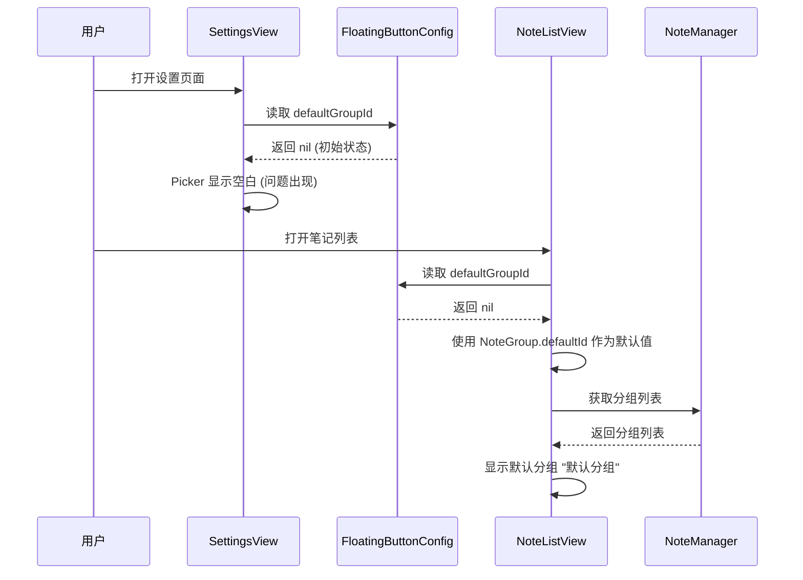

# 修复默认分组初始值问题

## 概述
在设置页面中，默认分组选择器在初始状态下没有显示任何值，这是因为 `defaultGroupId` 在配置中默认为 `nil`，而 SwiftUI 的 Picker 组件在绑定值为 `nil` 时无法正确显示选中的选项。需要修复这个问题，确保默认分组在初始状态下能够正确显示。

## 流程图



## 方案

### 问题分析

1. **问题根源**：在 `FloatingButtonConfig.swift:200` 中，`defaultGroupId` 的默认值为 `nil`
2. **影响范围**：
   - `SettingsView.swift:281` - Picker 组件绑定值为 `nil` 时无法正确显示
   - `NoteListView.swift:217-222` - 初始化时会使用默认分组 ID，但设置页面无法反映

### 解决方案

**方案一：修改 FloatingButtonConfig 的默认值**
- 将 `defaultGroupId` 的默认值从 `nil` 改为 `NoteGroup.defaultId`
- 优点：简单直接，符合用户预期
- 缺点：需要考虑现有用户的数据兼容性

**方案二：在 SettingsView 中处理 nil 值**
- 在 Picker 的 get 闭包中，当 `defaultGroupId` 为 `nil` 时返回 `NoteGroup.defaultId`
- 优点：不改变数据结构，仅修改 UI 展示逻辑
- 缺点：数据与显示不一致，可能导致混淆

**方案三：在应用启动时初始化默认值**
- 在 `FloatingButtonConfigManager` 初始化时，如果 `defaultGroupId` 为 `nil`，则设置为 `NoteGroup.defaultId`
- 优点：确保数据一致性，兼容现有用户
- 缺点：需要修改初始化逻辑

### 推荐方案

**采用方案一**：修改 `FloatingButtonConfig` 的默认值，将 `defaultGroupId` 初始化为 `NoteGroup.defaultId`。这是最简单直接的方案，符合用户的使用预期。

**理由**：
1. 用户首次使用时，应该有一个合理的默认分组
2. 避免在多处处理 nil 值，降低代码复杂度
3. 与 `NoteListView` 中的处理逻辑保持一致

## 相关代码位置

- [FloatingButtonConfig 默认值定义](vscode://file/Volumes/Cache/X/Sources/Model/FloatingButtonConfig.swift:200)
- [SettingsView 默认分组选择器](vscode://file/Volumes/Cache/X/Sources/View/SettingsView.swift:274-283)
- [NoteListView 默认分组初始化](vscode://file/Volumes/Cache/X/Sources/View/NoteListView.swift:217-222)
- [NoteGroup 默认分组定义](vscode://file/Volumes/Cache/X/Sources/Model/Note.swift:17)

## 代码错误测试
代码修改完成后，必须使用以下命令检查代码错误：
```bash
swift build
```

## 验证流程

1. 清理应用数据（删除 UserDefaults 中的配置）
2. 重新启动应用
3. 打开设置页面，切换到"分组"标签
4. 验证"默认分组"选择器是否显示"默认分组"选项
5. 切换到笔记列表，验证是否显示"默认分组"中的笔记
6. 在设置页面更改默认分组，验证设置是否生效

## 任务总结与结论
本任务修复了默认分组在初始状态下没有值的问题。通过修改 `FloatingButtonConfig` 的默认值，将 `defaultGroupId` 初始化为 `NoteGroup.defaultId`，确保用户首次使用时能够看到默认分组的选项。这个修改简单直接，符合用户预期，并且与现有的处理逻辑保持一致。

## 任务耗时
- 任务开始时间：17:21
- 任务结束时间：待更新
- 任务总耗时：待更新