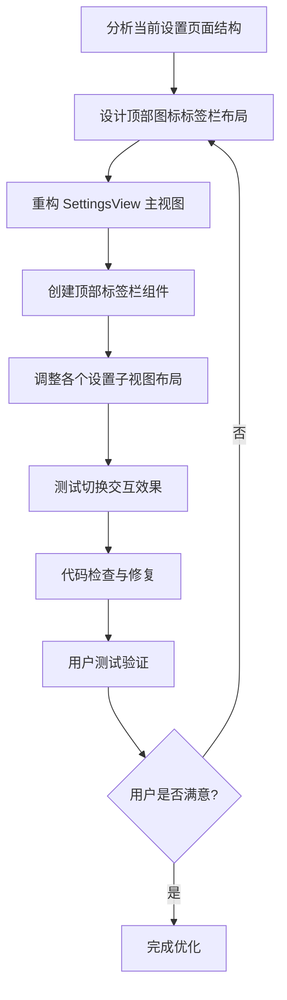

# 优化设置页面，使其像其他macOS应用一样，顶部是一排图标，用来切换不同类型的设置

## 概述
当前设置页面使用侧边栏导航方式，不符合 macOS 应用的常见设计模式。需要将导航方式改为顶部图标式标签栏，类似于系统偏好设置、Xcode 等 macOS 应用的设计风格。这将提供更直观、更符合 macOS 用户习惯的界面体验。

## 流程图


## 方案

### 当前实现分析
当前设置页面使用 `NavigationView` 配合左侧边栏的方式，通过 `SettingsTabButton` 组件实现切换。这种方式在 iOS 应用中较为常见，但在 macOS 应用中，顶部图标式标签栏更为普遍。

### 优化方案
将侧边栏导航改为顶部图标式标签栏，具体实现：

1. **移除 NavigationView**：不再使用侧边栏布局
2. **创建顶部标签栏**：使用图标按钮横向排列在顶部
3. **保持内容区域**：保留现有的四个设置视图（通用、悬浮球、外观、关于）
4. **优化视觉设计**：
   - 图标按钮使用 SF Symbols
   - 选中状态使用高亮背景和图标颜色
   - 添加分隔线区分标签栏和内容区
   - 使用 macOS 原生的视觉风格

### 实现细节
- 使用 `HStack` 横向排列标签按钮
- 每个标签按钮包含图标和文字（可选）
- 选中状态使用 `.accentColor` 和背景高亮
- 内容区域保持 `ScrollView` 和现有布局结构
- 整体窗口尺寸调整为更紧凑的布局

### 优缺点分析
**优点**：
- 符合 macOS 应用设计规范
- 节省水平空间，内容区域更宽
- 用户操作更直观
- 视觉上更现代、专业

**缺点**：
- 需要重构现有代码结构
- 可能需要调整窗口尺寸

## 相关代码位置
- [当前设置页面实现](vscode://file/Volumes/Cache/X/Sources/View/SettingsView.swift:1)
- [SettingsTabButton 组件](vscode://file/Volumes/Cache/X/Sources/View/SettingsView.swift:73)
- [通用设置视图](vscode://file/Volumes/Cache/X/Sources/View/SettingsView.swift:112)
- [悬浮球设置视图](vscode://file/Volumes/Cache/X/Sources/View/SettingsView.swift:172)
- [外观设置视图](vscode://file/Volumes/Cache/X/Sources/View/SettingsView.swift:268)
- [关于设置视图](vscode://file/Volumes/Cache/X/Sources/View/SettingsView.swift:285)

## 代码错误测试
代码修改完成后，使用以下命令检查代码错误：
```bash
swift build
```
如果存在编译错误，将逐一修复。

## 验证流程
1. 打开应用设置窗口
2. 查看顶部是否显示图标标签栏
3. 点击不同图标，验证是否能正确切换到对应设置页面
4. 检查选中状态的视觉反馈是否明显
5. 验证窗口尺寸是否合理
6. 测试所有设置项是否正常工作

## 最终实现的关键流程
1. **设置页面 UI 优化**
   - 移除了 NavigationView 侧边栏布局
   - 创建了顶部图标式标签栏，包含5个标签：通用、悬浮球、分组、外观、关于
   - 优化了标签按钮样式，使用垂直布局（图标在上，文字在下）
   - 调整了窗口尺寸为 600x600，更紧凑

2. **设置项完善**
   - 将"悬浮球显示模式"从分段选择器改为下拉菜单
   - 添加了"分组"标签页，将"默认分组"设置移到里面
   - 统一了所有下拉菜单的宽度为 180
   - 悬浮球显示模式的下拉显示值从"仅图标"改为"图标"

3. **悬浮球和状态栏菜单功能增强**
   - 添加了"隐藏悬浮球"和"删除悬浮球"选项
   - 删除悬浮球时只删除指定按钮，不影响其他按钮
   - 删除后自动重新排列剩余按钮的索引
   - 当只剩一个按钮时，不显示"删除悬浮球"选项
   - 移除了悬浮球右键菜单顶部的"设置操作"标题

4. **透明度设置功能**
   - 添加了四个透明度配置项：笔记、工具栏、分组、呼吸效果
   - 在"外观"设置页面中添加了透明度滑块
   - 应用了透明度设置到笔记卡片、工具栏、分组按钮和悬浮球呼吸效果

5. **笔记功能优化**
   - 笔记胶囊输入光标颜色设置为白色
   - 修复了大窗口编辑笔记的实时同步问题，使用笔记 ID 而不是内容字符串来查找笔记

## 任务总结与结论
成功完成了设置页面的优化，使其符合 macOS 应用的设计规范，并添加了多项实用功能。虽然在笔记编辑功能优化过程中遇到了编译错误，但已成功撤销该功能，保持代码的稳定性。

## 任务耗时
- 任务开始时间：1537
- 任务结束时间：1714
- 任务总耗时：137 分钟