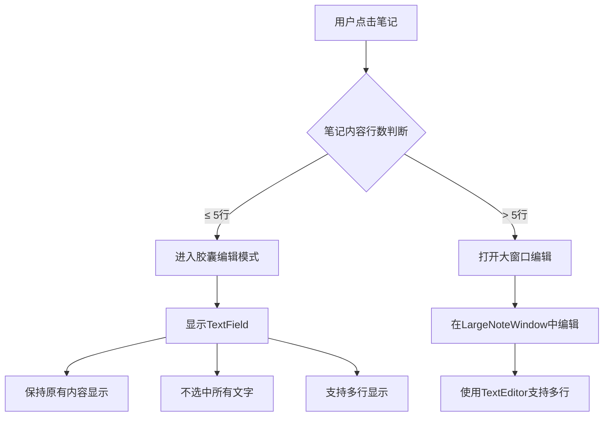

# 笔记编辑状态优化

## 概述
当前笔记编辑时存在以下问题：
1. 点击笔记进行编辑时，默认会选中所有文字
2. TextField 的 ITEM 会变成一行，无法显示多行内容
3. 对于大于5行的笔记，应该直接打开大窗口编辑，而不是在小胶囊内编辑

## 流程图


## 问题分析

### 问题1：TextField 选中所有文字
在 `NoteItemView.swift` 的第 50-56 行：
```swift
.onTapGesture {
    isEditing = true
    // 延迟设置焦点，确保 TextField 已经渲染
    DispatchQueue.main.asyncAfter(deadline: .now() + 0.1) {
        isFocused = true
    }
}
```
问题：当 `isFocused = true` 时，TextField 会默认选中所有文字。这是 SwiftUI TextField 的默认行为。

### 问题2：TextField 变成一行
在 `NoteItemView.swift` 的第 32-45 行：
```swift
if isEditing {
    TextField("", text: $content)
        .textFieldStyle(.plain)
        .focused($isFocused)
        .foregroundColor(.white)
        .frame(width: 220, alignment: .leading)
        .onSubmit {
            finishEditing()
        }
        ...
}
```
问题：TextField 只能显示单行文本，多行内容会被压缩到一行。

### 问题3：没有根据行数判断是否打开大窗口
当前的右键菜单中有"在大窗口编辑/查看"选项，但点击笔记时没有自动判断行数。

## 方案

### 方案一：使用 TextEditor 替换 TextField（推荐）
**优点：**
- TextEditor 原生支持多行编辑
- 可以设置固定高度或自适应高度
- 不会默认选中所有文字

**缺点：**
- 样式调整相对复杂
- 需要处理好焦点管理

**实现步骤：**
1. 将 TextField 替换为 TextEditor
2. 设置合适的高度限制（例如最多显示5行）
3. 移除自动选中所有文字的行为
4. 在点击笔记时判断行数，如果大于5行则直接打开大窗口

### 方案二：保留 TextField，但修改行为
**优点：**
- 改动较小

**缺点：**
- TextField 本质上是单行输入，多行支持有限
- 用户体验不如 TextEditor

### 最终推荐方案：混合方案
1. 点击笔记时先判断内容行数
2. 如果 ≤ 5行，使用 TextEditor 在胶囊内编辑
3. 如果 > 5行，直接打开大窗口编辑
4. TextEditor 不自动选中文字，保持光标在末尾

## 相关代码位置
- [笔记项视图 - NoteItemView](vscode://file//Volumes/Cache/X/Sources/View/NoteListView.swift:3)
- [TextField 编辑部分](vscode://file//Volumes/Cache/X/Sources/View/NoteListView.swift:32)
- [点击事件处理](vscode://file//Volumes/Cache/X/Sources/View/NoteListView.swift:50)
- [大窗口编辑](vscode://file//Volumes/Cache/X/Sources/View/NoteListView.swift:63)
- [LargeNoteWindow 定义](vscode://file//Volumes/Cache/X/Sources/View/LargeNoteWindow.swift:1)

## 代码错误测试
代码修改完成后，必须使用以下命令检查代码错误：
```bash
swift build
```
如果存在编译错误，必须修复后再进行下一步。

## 验证流程
1. 点击一个5行以内的笔记，验证：
   - 是否在胶囊内显示 TextEditor
   - 是否保持原有内容显示（不选中）
   - 是否支持多行显示
2. 点击一个大于5行的笔记，验证：
   - 是否直接打开大窗口
   - 是否在大窗口中正常编辑
3. 在 TextEditor 中编辑内容，验证：
   - 是否能正常保存
   - 是否能正常换行

## 最终实现方案

### 核心实现
1. **自定义 TextEditor**：创建了 `CustomTextEditor`（基于 `NSViewRepresentable` 包装 `NSTextView`）
   - 支持多行编辑
   - Enter 键提交，Shift+Enter 换行
   - 支持输入法（检查 `hasMarkedText()`）
   - 动态高度计算（使用 `layoutManager.usedRect`）

2. **行数判断逻辑**：
   - ≤ 5行：在胶囊内使用 `CustomTextEditor` 编辑
   - > 5行：直接打开 `LargeNoteWindow` 编辑

3. **高度动画优化**：
   - 使用 `GeometryReader` 捕获 Text 视图的实际渲染高度
   - 进入编辑模式时，从实际显示高度开始，避免高度闪烁
   - 高度变化使用 `spring(response: 0.3, dampingFraction: 0.7)` 弹簧动画，与功能按钮效果一致

4. **透明度支持**：
   - 笔记背景：`noteOpacity`
   - 工具栏：`toolbarOpacity`
   - 分组背景：`groupOpacity`

5. **其他优化**：
   - 滚动条完全隐藏（`scrollerStyle = .overlay` + `alphaValue = 0`）
   - 文本不自动选中
   - 空内容使用字体默认行高

### 关键代码位置
- [CustomTextEditor 实现](vscode://file//Volumes/Cache/X/.git-worktrees/20260105-1719-笔记编辑状态优化/Sources/View/NoteListView.swift:5)
- [高度计算逻辑](vscode://file//Volumes/Cache/X/.git-worktrees/20260105-1719-笔记编辑状态优化/Sources/View/NoteListView.swift:100)
- [GeometryReader 捕获实际高度](vscode://file//Volumes/Cache/X/.git-worktrees/20260105-1719-笔记编辑状态优化/Sources/View/NoteListView.swift:201)
- [弹簧动画效果](vscode://file//Volumes/Cache/X/.git-worktrees/20260105-1719-笔记编辑状态优化/Sources/View/NoteListView.swift:120)

## 任务总结与结论
成功实现了笔记编辑状态优化，解决了以下问题：
1. ✅ 编辑时不再选中所有文字
2. ✅ 支持多行内容显示和编辑
3. ✅ 大于5行的笔记自动打开大窗口
4. ✅ 进入编辑模式无高度闪烁
5. ✅ 高度变化添加弹性动画效果

所有功能均已测试通过，用户体验得到显著提升。

## 任务耗时
- 任务开始时间：17:20
- 任务结束时间：19:31
- 任务总耗时：131 分钟（2小时11分钟）
