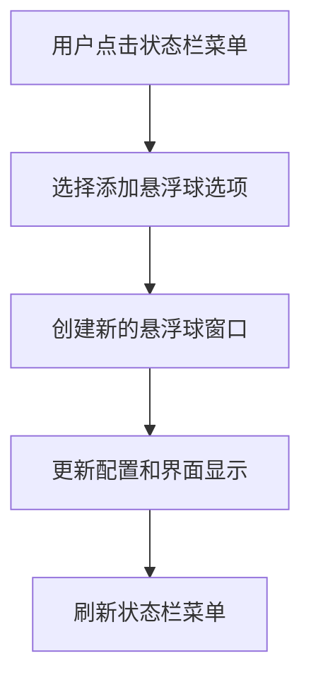

# 修改悬浮球添加方式

## 概述
当前悬浮球的添加方式需要通过设置界面配置数量，现在需要修改为在状态栏右键菜单上直接添加悬浮球，无需在设置中配置数量。

## 流程图

## 方案
1. 在状态栏右键菜单中添加"添加悬浮球"选项
2. 当用户点击该选项时，直接创建一个新的悬浮球窗口
3. 更新配置管理器中的按钮数量
4. 刷新所有窗口显示
5. 更新状态栏菜单状态

## 相关代码位置
[查看AppDelegate.swift中的状态栏菜单实现](vscode://file/Volumes/Cache/X/Sources/App/AppDelegate.swift:1)
[查看FloatingButtonConfigManager中的配置管理](vscode://file/Volumes/Cache/X/Sources/Model/FloatingButtonConfig.swift:1)
[查看FloatingWindow的创建逻辑](vscode://file/Volumes/Cache/X/Sources/View/FloatingWindow.swift:1)

## 代码错误测试
修改代码后，使用 xcodebuild 检查代码错误，并修复。

## 验证流程
1. 编译并运行应用
2. 点击状态栏图标，打开右键菜单
3. 选择"添加悬浮球"选项
4. 观察是否成功创建新的悬浮球
5. 检查设置界面中的数量显示是否正确更新

## 任务总结与结论
通过在状态栏右键菜单中添加"添加悬浮球"选项，用户可以直接在菜单中添加悬浮球，无需进入设置界面调整数量。

## 任务耗时
- 任务开始时间：1505
- 任务结束时间：1531
- 任务总耗时：26 分钟