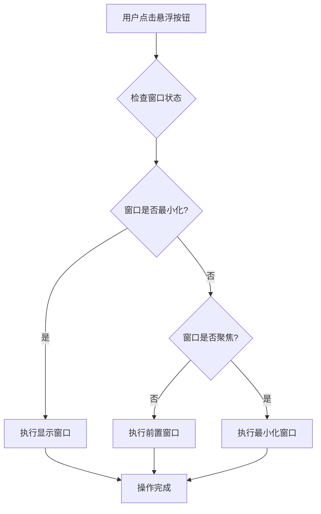

# 优化窗口前置逻辑

## 概述
当前点击悬浮按钮控制窗口时，如果窗口可见（非最小化）但不是前置聚焦状态（其他窗口在它前面），会直接最小化窗口。用户希望优先前置窗口，即：如果窗口非最小化且不是前置状态，点击悬浮按钮应将窗口前置，而不是直接最小化。只有当前窗口已经是前置状态时，才执行最小化操作。

## 流程图



当前问题出现在 **C → G** 的逻辑分支：如果窗口没有最小化，无论是否聚焦，都会最小化窗口。

## 方案

### 方案一：增加窗口聚焦状态判断（推荐）

**实现思路：**
1. 在 `toggleWindowVisibility` 方法中，先检查窗口是否最小化
2. 如果最小化，执行显示操作
3. 如果没有最小化，再检查窗口是否聚焦（使用 `kAXFocusedAttribute`）
4. 如果不聚焦，执行前置窗口操作
5. 如果已经聚焦，执行最小化窗口操作

**优点：**
- 逻辑清晰，符合用户预期
- 操作更加合理：未聚焦时先前置，已聚焦时才最小化
- 实现简单，只需修改一个方法

**缺点：**
- 无明显缺点

### 方案二：使用主窗口属性判断

**实现思路：**
使用 `kAXMainAttribute` 属性来判断窗口是否是主窗口（前置状态）。

**优点：**
- 使用主窗口属性，可能更准确

**缺点：**
- 某些应用可能不正确设置主窗口属性
- 聚焦属性更直接反映用户交互状态

### 方案三：通过应用激活状态判断

**实现思路：**
检查应用是否是当前激活的应用，如果不是则先激活应用。

**优点：**
- 从应用层面处理

**缺点：**
- 即使应用激活，窗口也不一定是前置的
- 逻辑更复杂

**推荐方案：方案一**，使用聚焦属性（`kAXFocusedAttribute`）来判断窗口是否前置，逻辑最直接且准确。

## 相关代码位置

主要修改文件：`/Volumes/Cache/X/Sources/Utility/WindowManager.swift`

需要修改的方法：
- [toggleWindowVisibility](vscode://file/Volumes/Cache/X/Sources/Utility/WindowManager.swift:142) - 切换窗口显隐的核心逻辑

当前实现（第142-175行）：
```swift
private func toggleWindowVisibility(windowID: UInt32, pid: Int32, windowTitle: String?, initialPosition: CGPoint?, initialSize: CGSize?) {
    Logger.shared.log("🔄 切换窗口显隐: windowID=\(windowID), pid=\(pid), title=\(windowTitle ?? "nil")")
    let appRef = AXUIElementCreateApplication(pid)
    
    // 查找窗口元素
    guard let windowElement = findWindowElement(appRef: appRef, windowID: windowID, windowTitle: windowTitle, initialPosition: initialPosition, initialSize: initialSize) else {
        Logger.shared.log("❌ 无法找到窗口元素")
        return
    }
    
    Logger.shared.log("✅ 找到窗口元素")
    
    // 检查窗口是否最小化
    var isMinimized: CFTypeRef?
    if AXUIElementCopyAttributeValue(windowElement, kAXMinimizedAttribute as CFString, &isMinimized) == .success,
       let minimized = isMinimized as? Bool {
        
        Logger.shared.log("📊 窗口状态: 最小化=\(minimized)")
        
        if minimized {
            // 窗口已最小化，显示它
            Logger.shared.log("👁️ 窗口已最小化，执行显示操作")
            showWindow(windowElement: windowElement, pid: pid)
        } else {
            // 窗口可见，隐藏它
            Logger.shared.log("🙈 窗口可见，执行隐藏操作")
            hideWindow(windowElement: windowElement)
        }
    } else {
        Logger.shared.log("⚠️ 无法获取最小化状态，尝试显示窗口")
        // 无法获取最小化状态，尝试切换
        showWindow(windowElement: windowElement, pid: pid)
    }
}
```

## 代码错误测试
代码修改完成后，使用 `swift build` 或 `xcodebuild` 命令检查代码错误并修复。

## 验证流程
1. 运行应用程序
2. 将一个应用窗口（如 Safari）绑定到悬浮按钮
3. 打开多个应用窗口，确保目标窗口（Safari）不是最前面的窗口
4. 点击悬浮按钮
5. 预期结果：Safari 窗口应该前置到最前面，而不是最小化
6. 再次点击悬浮按钮
7. 预期结果：Safari 窗口应该最小化
8. 再次点击悬浮按钮
9. 预期结果：Safari 窗口应该从最小化状态恢复并前置

## 任务总结与结论
通过在 `toggleWindowVisibility` 方法中增加窗口聚焦状态的判断，实现优先前置窗口的逻辑。具体实现：
1. 先检查窗口是否最小化，最小化则显示
2. 检查窗口是否聚焦，不聚焦则前置
3. 只有已聚焦的窗口才最小化

这样的交互逻辑更加符合用户预期，避免意外最小化窗口的情况。

## 任务耗时
- 任务开始时间：1506
- 任务结束时间：待定
- 任务总耗时：待定
