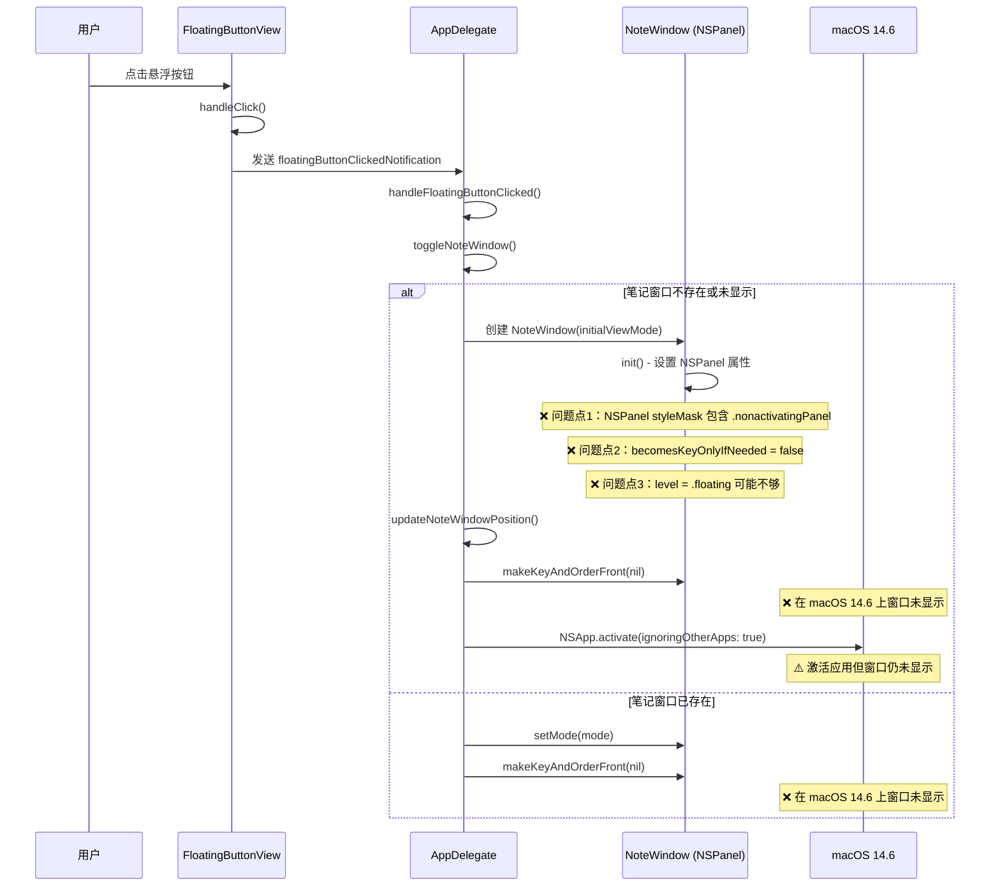

# 修复 macOS 14.6 点击悬浮按钮无法显示笔记窗口

## 概述
在 macOS 14.6 系统上，点击悬浮按钮后笔记窗口无法显示。经过代码分析，发现问题可能出在 NSPanel 窗口在不同 macOS 版本上的行为差异。具体来说：

1. **NoteWindow 继承自 NSPanel**：NSPanel 默认是非激活面板（nonactivatingPanel），在某些 macOS 版本上可能无法正确显示
2. **窗口层级问题**：窗口使用 `.floating` 层级，但在 macOS 14.6 上可能被其他窗口遮挡
3. **窗口激活问题**：使用 `makeKeyAndOrderFront` 可能在旧版本系统上无法生效
4. **becomesKeyOnlyIfNeeded 设置问题**：设置为 false 可能在 macOS 14.6 上导致窗口无法成为关键窗口

## 流程图



## 方案

### 方案1：修改 NSPanel 的 styleMask（推荐）

**原因分析**：
- 当前 NoteWindow 使用 `[.borderless, .nonactivatingPanel]` 作为 styleMask
- `.nonactivatingPanel` 表示这是一个非激活面板，在某些 macOS 版本（特别是 14.6）上，这种窗口可能无法正确响应 `makeKeyAndOrderFront` 调用
- macOS 14.6 可能对非激活面板有更严格的显示限制

**解决方案**：
1. 移除 `.nonactivatingPanel` 标志，改用 `.titled` 或只使用 `.borderless`
2. 保持 `becomesKeyOnlyIfNeeded = false` 确保窗口可以成为关键窗口
3. 提高窗口层级到 `.popUpMenu` 或 `.statusBar` 确保在最上层显示

**优点**：
- 从根源解决问题，让窗口能够正常激活和显示
- 兼容性好，适用于各个 macOS 版本

**缺点**：
- 可能改变窗口的部分行为（如焦点管理）

### 方案2：使用 orderFrontRegardless 代替 makeKeyAndOrderFront

**原因分析**：
- `orderFrontRegardless` 强制将窗口放到最前面，不考虑窗口的激活状态
- 适用于非激活面板的显示

**解决方案**：
1. 在 AppDelegate 的 toggleNoteWindow 中，将 `makeKeyAndOrderFront` 改为 `orderFrontRegardless`
2. 保持其他设置不变

**优点**：
- 改动小，只需要修改一行代码
- 不改变窗口的基本属性

**缺点**：
- 可能无法完全解决问题，因为 orderFrontRegardless 也可能在某些情况下失效
- 窗口可能无法正确接收键盘输入

### 方案3：组合使用多种显示方法（最终推荐）

**原因分析**：
- 不同 macOS 版本对窗口显示的处理方式不同
- 使用多种方法组合，确保在各个版本上都能正常显示

**解决方案**：
1. 移除 `.nonactivatingPanel` 标志
2. 设置更高的窗口层级（如 `.statusBar`）
3. 使用 `orderFront(nil)` 先显示窗口
4. 然后使用 `makeKeyAndOrderFront(nil)` 激活窗口
5. 最后调用 `NSApp.activate(ignoringOtherApps: true)` 激活应用
6. 添加 `collectionBehavior` 设置，确保窗口可以在所有空间显示

**优点**：
- 综合多种方案的优点
- 兼容性最好，适用于各个 macOS 版本
- 可以确保窗口正常显示并接收输入

**缺点**：
- 改动较多

## 最终推荐方案

采用 **方案3：组合使用多种显示方法**，具体修改如下：

### 1. 修改 NoteWindow 初始化（NoteWindow.swift）

```swift
super.init(
    contentRect: windowRect,
    styleMask: [.borderless],  // 移除 .nonactivatingPanel
    backing: .buffered,
    defer: false
)

self.isMovableByWindowBackground = false
self.backgroundColor = .clear
self.hasShadow = false
self.level = .statusBar  // 提高层级从 .floating 到 .statusBar
self.collectionBehavior = [.canJoinAllSpaces, .fullScreenAuxiliary]  // 添加

// 设置圆角和透明
self.isOpaque = false
self.backgroundColor = .clear
self.contentView = hostingView

// ...其他代码...

// 确保 NSPanel 可以接收输入
self.becomesKeyOnlyIfNeeded = false
```

### 2. 修改 AppDelegate 的 toggleNoteWindow 方法

```swift
private func toggleNoteWindow(attachedTo window: NSWindow?, mode: NoteListView.ViewMode = .all) {
    if let noteWin = noteWindow, noteWin.isVisible {
        if attachedWindow == window && currentNoteMode == mode {
            // 如果点击的是同一个悬浮球，且模式相同，则隐藏
            noteWin.orderOut(nil)
            return
        }
        
        // 否则更新模式和依附窗口
        currentNoteMode = mode
        attachedWindow = window
        noteWin.setMode(mode)
    } else {
        // 窗口未显示，创建或显示
        currentNoteMode = mode
        attachedWindow = window
        if noteWindow == nil {
            noteWindow = NoteWindow(initialViewMode: mode)
        } else {
            noteWindow?.setMode(mode)
        }
    }
    
    noteWindow?.updateHeightToFit()
    updateNoteWindowPosition()
    
    // 修改显示逻辑：组合使用多种方法
    guard let noteWin = noteWindow else { return }
    
    // 1. 先 orderFront 确保窗口在前面
    noteWin.orderFront(nil)
    
    // 2. 延迟一点再激活窗口，确保布局完成
    DispatchQueue.main.asyncAfter(deadline: .now() + 0.05) {
        // 3. makeKey 让窗口成为关键窗口
        noteWin.makeKeyAndOrderFront(nil)
        
        // 4. 激活应用
        NSApp.activate(ignoringOtherApps: true)
    }
}
```

## 相关代码位置

- NoteWindow 初始化：[查看源代码位置](vscode://file//Volumes/Cache/X/Sources/View/NoteWindow.swift:5)
- AppDelegate toggleNoteWindow：[查看源代码位置](vscode://file//Volumes/Cache/X/Sources/App/AppDelegate.swift:184)
- FloatingButtonView 点击处理：[查看源代码位置](vscode://file//Volumes/Cache/X/Sources/View/FloatingButtonView.swift:273)
- handleFloatingButtonClicked：[查看源代码位置](vscode://file//Volumes/Cache/X/Sources/App/AppDelegate.swift:147)

## 代码错误测试

修改代码完成后，必须使用以下命令检查代码错误：
```bash
swift build
```

如果存在编译错误，立即修复。

## 验证流程

### 手动验证步骤：

1. **编译应用**：运行 `swift build` 确保代码无编译错误
2. **启动应用**：运行应用并确保悬浮球正常显示
3. **点击测试**：
   - 点击配置为"打开笔记"的悬浮球
   - 检查笔记窗口是否显示在悬浮球旁边
   - 再次点击同一个悬浮球，检查窗口是否隐藏
   - 点击不同的悬浮球，检查窗口是否正确切换依附对象
4. **功能测试**：
   - 在笔记窗口中添加新笔记
   - 编辑现有笔记
   - 删除笔记
   - 切换到剪切板模式和已完成笔记模式
5. **多版本测试**（如果可能）：
   - 在 macOS 14.6 上测试（主要目标）
   - 在当前版本（macOS 15.x）上测试兼容性

### 预期结果：

- 点击悬浮球后，笔记窗口应该立即显示在悬浮球旁边
- 窗口应该能够正常接收鼠标和键盘输入
- 窗口层级正确，不会被其他窗口遮挡
- 在所有测试的 macOS 版本上都能正常工作

## 任务总结与结论

本次任务的核心问题是 NSPanel 在 macOS 14.6 上的兼容性问题。通过移除 `.nonactivatingPanel` 标志、提高窗口层级、并组合使用多种窗口显示方法，可以确保笔记窗口在不同 macOS 版本上都能正常显示。

关键修改点：
1. NSPanel styleMask 移除 `.nonactivatingPanel`
2. 窗口层级从 `.floating` 提升到 `.statusBar`
3. 添加 `collectionBehavior` 设置
4. 组合使用 `orderFront` 和 `makeKeyAndOrderFront` 方法
5. 添加延迟激活确保布局完成

## 任务耗时
- 任务开始时间：17:02
- 任务结束时间：（待更新）
- 任务总耗时：（待更新）
