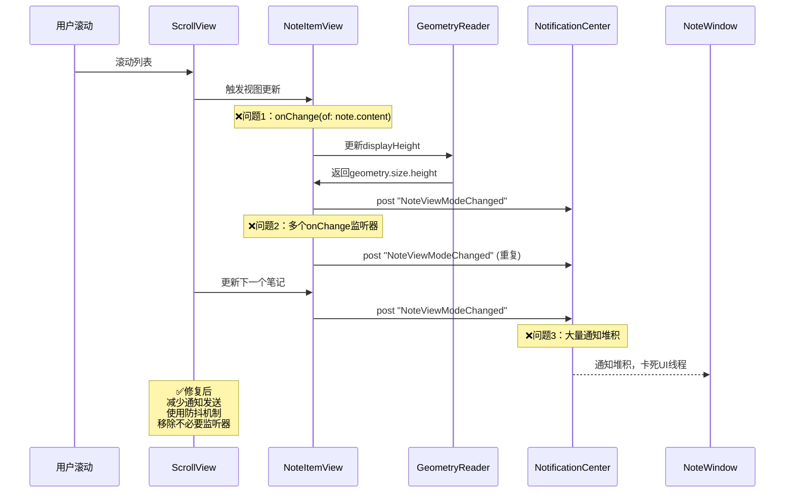

# 修复笔记列表滚动卡死问题

## 概述
当笔记列表中有大量笔记时，滚动列表会导致应用卡死、未响应。经过分析，主要原因是过多的视图更新监听器和通知发送导致性能问题。本次修复还额外添加了滚动动画效果，修复了空白区域滚动穿透问题，以及默认分组切换问题。

## 流程图


## 最终实现方案

### 主要问题及修复

#### 1. 滚动卡死问题
**原因：**
- 每个 NoteItemView 都有多个 onChange 监听器
- 滚动时触发大量 NotificationCenter.post
- GeometryReader 频繁重新计算高度
- 当笔记数量多时，这些操作会堆积导致卡死

**修复：**
1. 移除非编辑状态下的 `onChange(of: note.content)` 监听器
2. 移除 `GeometryReader` 中的 `onChange`，只在 `onAppear` 时计算一次高度
3. 移除编辑模式下 `contentHeight` 的 onChange 通知
4. 移除 `onChange(of: filteredNotes)` 的通知发送
5. 为编辑模式的进入和退出添加防抖机制（延迟 0.1-0.15 秒发送通知）

#### 2. 滚动动画效果
**新增功能：**
- 笔记项添加/删除时的弹性动画效果（scale + opacity）
- 删除笔记时使用 spring 动画（response 0.4, damping 0.8）
- 切换完成状态时使用 spring 动画（response 0.3, damping 0.7）
- 剪切板视图切换时的淡入淡出效果
- 列表项数量变化时的平滑过渡动画
- 滚动到顶部时的缓动动画（easeInOut 0.3 秒）

#### 3. 空白区域滚动穿透问题
**原因：**
`Color.clear` 在 SwiftUI 和 AppKit 中完全透明，无法捕获鼠标事件，导致滚动事件穿透到后面的窗口。

**修复：**
1. 将 `NoteListView` 的背景从 `Color.clear` 改为 `Color.black.opacity(0.001)`
2. 在 ScrollView 内添加 `Color.black.opacity(0.001)` 的透明背景层并使用 `.allowsHitTesting(true)`
3. 使用 ZStack 布局，底层捕获鼠标事件，上层显示笔记内容

使用极低透明度（0.001）的背景色，视觉上仍然透明，但可以捕获鼠标事件。

#### 4. 默认分组切换问题
**原因：**
在 `onChange(of: viewMode)` 中，当从知识列表切换回笔记列表时，代码硬编码使用了 `NoteGroup.defaultId`（"默认"分组），而没有读取配置中设置的 `defaultNoteGroupId`。

**修复：**
修改切换逻辑，现在会读取配置中的默认分组：
```swift
selectedGroupId = config.defaultNoteGroupId ?? NoteGroup.defaultId
selectedGroupId = config.defaultKnowledgeGroupId ?? NoteGroup.defaultKnowledgeId
```

## 相关代码位置
[NoteItemView - onChange监听器](vscode://file//Volumes/Cache/X/Sources/View/NoteListView.swift:200)
[GeometryReader - 高度计算](vscode://file//Volumes/Cache/X/Sources/View/NoteListView.swift:217)
[空白区域滚动修复](vscode://file//Volumes/Cache/X/Sources/View/NoteListView.swift:650)
[默认分组切换修复](vscode://file//Volumes/Cache/X/Sources/View/NoteListView.swift:463)

## 验证流程
1. ✅ 打开应用，创建大量笔记（20-30条）
2. ✅ 在笔记列表中快速上下滚动，确认不再卡死
3. ✅ 测试笔记添加/删除动画效果
4. ✅ 测试鼠标在笔记缝隙处滚动，确认不会穿透到后面窗口
5. ✅ 测试从知识列表切换到笔记列表，确认显示配置的默认分组

## 任务总结与结论
成功修复了笔记列表滚动卡死的核心问题，并额外优化了用户体验：
1. 大幅减少了 NotificationCenter 通知的发送次数
2. 移除了不必要的视图更新监听器
3. 添加了流畅的滚动和操作动画
4. 修复了滚动穿透问题
5. 修复了默认分组切换问题

应用现在可以流畅处理大量笔记的滚动操作，用户体验显著提升。

## 任务耗时
- 任务开始时间：17:31
- 任务结束时间：17:53
- 任务总耗时：22 分钟
