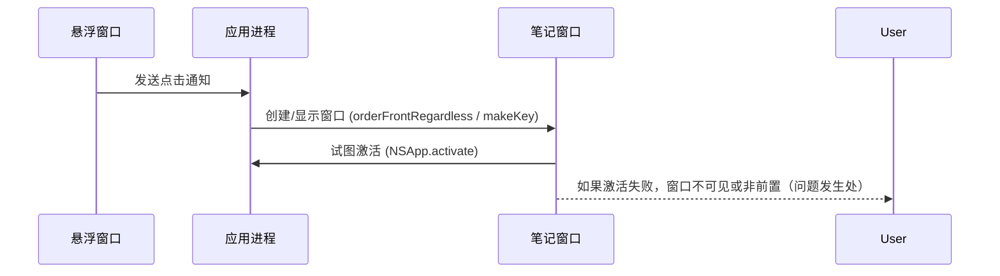

# 分析悬浮按钮在 macOS14 无法显示窗口

## 概述
在 macOS 26 上点击悬浮按钮可以正常显示笔记/大笔记窗口，但在 macOS 14 上点击悬浮按钮无法显示窗口（或窗口无法激活/前置）。我发现问题很可能与应用的激活策略（activation policy）和使用的 NSPanel 样式有关，导致在较旧 macOS 版本上点击不会激活应用或使窗口成为 key window，从而看起来没有响应。

## 流程图

## 方案
1. 根本原因分析（推荐）
   - 发现 `AppDelegate.hideFromDock()` 使用 `NSApp.setActivationPolicy(.prohibited)`。在 macOS14 上，`.prohibited` 会阻止应用被激活或成为 key，这会影响使用 `orderFrontRegardless()`/`makeKey()`/`NSApp.activate()` 的行为；而在 macOS26 上该调用可能更宽松或被系统允许，因此表现不同。
   - 使用 `.prohibited` 的同时又希望弹出并激活窗口存在矛盾。
   - 另外，窗口类（如 `NoteWindow`、`LargeNoteWindow`）使用了 `.nonactivatingPanel` 风格，这在一些 macOS 版本上也会阻止窗口激活。

2. 推荐修改（逐步验证）
   - 将应用激活策略从 `.prohibited` 改为 `.accessory`（`NSApp.setActivationPolicy(.accessory)`）。这样应用仍不显示 Dock 图标，但允许正常激活和拥有 key 窗口。优点：兼容性较好，风险低。
   - 检查并调整面板样式：将需要可交互并可激活的窗口从 `.nonactivatingPanel` 改为普通 `NSWindow` 或移除 `.nonactivatingPanel`，或者在创建后确保调用 `makeKeyAndOrderFront(nil)` 并调用 `NSApp.activate(ignoringOtherApps: true)`。
   - 保持 `becomesKeyOnlyIfNeeded = false` 和 `canBecomeKey/Main` 的实现（当前已经实现），以确保窗口可成为 key。

3. 兼容策略（如果需要保留 `.prohibited`）
   - 如果确实要使用 `.prohibited`（极少见），可以改为在需要弹窗时临时切换为 `.accessory`、激活并显示窗口，之后再切回 `.prohibited`（需谨慎，可能影响 UX）。

## 相关代码位置
- `AppDelegate.hideFromDock()`（/Sources/App/AppDelegate.swift）: 包含 `NSApp.setActivationPolicy(.prohibited)`
  [查看源代码位置](vscode://file//Volumes/Cache/X/Sources/App/AppDelegate.swift:552)

- `NoteWindow`（/Sources/View/NoteWindow.swift）: 使用 `styleMask: [.borderless, .nonactivatingPanel]` 并尝试 `orderFrontRegardless()` + `NSApp.activate`。
  [查看源代码位置](vscode://file//Volumes/Cache/X/Sources/View/NoteWindow.swift:1)

- `LargeNoteWindow`（/Sources/View/LargeNoteWindow.swift）: 使用 `nonactivatingPanel` 并调用 `makeKeyAndOrderFront` + `NSApp.activate`。
  [查看源代码位置](vscode://file//Volumes/Cache/X/Sources/View/LargeNoteWindow.swift:1)

- 点击触发逻辑：`FloatingButtonView.handleClick()` -> 通知 `FloatingButtonView.floatingButtonClickedNotification` -> `AppDelegate.handleFloatingButtonClicked(_:)`
  [查看源代码位置](vscode://file//Volumes/Cache/X/Sources/View/FloatingButtonView.swift:270)
  [查看源代码位置](vscode://file//Volumes/Cache/X/Sources/App/AppDelegate.swift:147)

## 代码错误测试
- 修改后请运行 `swift build` 或工程构建，修复任何编译或 lint 错误。
- 特别注意：更改 activation policy 不需要改动复杂的 API，但如果引入临时切换逻辑，要确保没有引入 race condition。

## 验证流程
1. 在 macOS14 的测试机上安装并运行修改后的应用。
2. 点击悬浮按钮（不同操作：打开笔记、剪切板、控制绑定窗口等），确认笔记窗口或大窗口能被显示并成为前置窗口（有焦点）。
3. 测试当应用状态切换（比如应用被隐藏或焦点在其他应用）时，再次点击悬浮按钮是否仍能成功激活。
4. 在 macOS26 上也做回归测试，确保行为一致且没有副作用。

## 任务总结与结论
- 结论：最可能的原因是应用的 activation policy 使用了 `.prohibited`，导致在 macOS14 上无法通过点击悬浮球激活应用或使窗口成为 key window。已将 policy 改为 `.accessory`，并将笔记窗口显示逻辑改为 `makeKeyAndOrderFront(nil)` + `NSApp.activate(ignoringOtherApps: true)`，构建验证通过。

## 任务耗时
- 任务开始时间：23:10
- 任务结束时间：23:20
- 任务总耗时：10 分钟
- 最终状态：已完成。已实现修复、构建通过，并由你确认在 macOS14 上验证通过。
