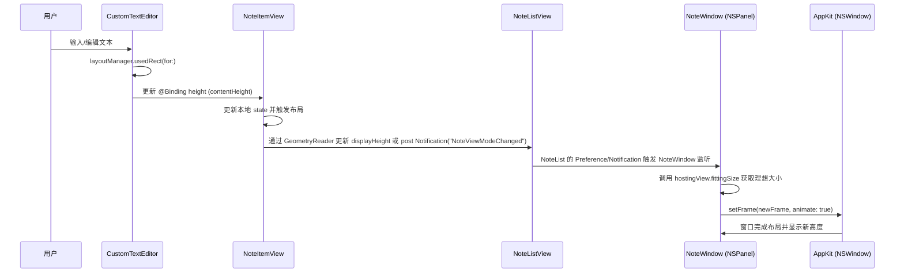
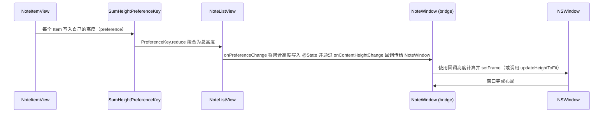

# 笔记高度响应时序图

## 概述
本文档描述当前实现中“笔记高度前后计算”流程的时序，包含当前实现的时序图（基于 NotificationCenter、GeometryReader 与 NSWindow.fittingSize 的链路），以及我推荐的更“天然”响应式替代方案（基于 PreferenceKey 汇总高度并通过回调/绑定传递到窗口层）。文档末尾包含验证方法与相关源代码位置链接，供你审阅后再决定是否开始修改代码。

## 流程时序图（当前实现）

> 说明：当前实现混合使用了两种测量/通知方式：
> - 单个 item 在 `CustomTextEditor.Coordinator.updateHeight()` 中计算并通过绑定更新 `contentHeight`，并在变化时通过 `Notification.Name("NoteViewModeChanged")` 通知窗口；
> - 列表整体则通过 `GeometryReader` 将内部 `geometry.size` 放到 `ViewSizeKey`（PreferenceKey）并在 `onPreferenceChange` 时再次发送 `NoteViewModeChanged`。

## 改进建议（更“天然”的响应式流程）

优点：
- 全部采用 SwiftUI 的 PreferenceKey + @State 链路，避免全局 NotificationCenter；
- 测量在布局阶段自然发生，能减少手动触发与重复测量；
- 类型更安全、可测试性更好，便于未来扩展（例如合并剪切板视图时统一计算）。

## 方案（两选一或渐进式迁移）
1. 渐进式迁移（推荐）：
   - 在 `NoteListView` 中新增 `SumHeightKey: PreferenceKey`（累加每个 item 的高度）；
   - 在每个 `NoteItemView` 中，继续保留 `CustomTextEditor` 的绑定高度用于编辑体验，但同时也在显示/编辑两种模式下通过 `GeometryReader` 将当前显示高度写入 `SumHeightKey`，保证测量来源统一；
   - 在 `NoteListView` 的 `.onPreferenceChange` 中计算最终 contentHeight，并通过一个回调 `onContentHeightChange` 或 `@Binding` 传回 `NoteWindow`；
   - 在 `NoteWindow` 中使用该回调代替 `NotificationCenter` 触发 `updateHeightToFit()`（仍需根据需要调用 `hostingView.fittingSize` 或直接用回调高度计算）。

2. 全部替换（更激进）：
   - 去掉 `Notification.Name("NoteViewModeChanged")` 的发送点，完全使用 PreferenceKey+回调链路；
   - 将 `NoteWindow.updateHeightToFit()` 改为接收明确的 contentHeight 值并据此 setFrame（减少对 fittingSize 的依赖）。

## 相关代码位置（便于定位）
- `CustomTextEditor`（测量逻辑）：
  [查看源代码位置](vscode://file//Volumes/Cache/X/Sources/View/NoteListView.swift:1)

- `NoteItemView`（contentHeight / displayHeight / 通知发送点）：
  [查看源代码位置](vscode://file//Volumes/Cache/X/Sources/View/NoteListView.swift:50)

- `NoteListView`（ViewSizeKey 偏好键及 onPreferenceChange）：
  [查看源代码位置](vscode://file//Volumes/Cache/X/Sources/View/NoteListView.swift:650)

- `NoteWindow`（监听 NoteViewModeChanged 并使用 hostingView.fittingSize）：
  [查看源代码位置](vscode://file//Volumes/Cache/X/Sources/View/NoteWindow.swift:1)

## 代码错误测试
- 修改后请优先运行 lint（项目未集成 lint 时跑 `swift build` 做构建检查）；
- 确认没有编译错误后，在本地运行并手动验证文本输入、添加/删除笔记、切换分组/模式时窗口高度是否仍按预期更新且无抖动；

## 验证流程
1. 打开应用并进入笔记窗口；
2. 编辑一个笔记（从短到多行）并观察窗口高度是否平滑增长（测试上限 30 行或 668px 限制）；
3. 添加/删除笔记，切换分组和视图模式（知识/已完成），确认窗口随之适配高度；
4. 在改造后，验证没有使用 `Notification.Name("NoteViewModeChanged")`（若选择完全替换），并以 `SumHeightKey` 的变化为驱动；

## 任务总结与结论
- 当前实现可靠但混合使用了 Notification + Preference 测量，存在重复触发与全局耦合；
- 推荐采用 PreferenceKey 聚合 + 回调（或 binding）将测量链路完全迁移到 SwiftUI 响应式管道，减少 Notification 依赖并增强类型安全与可维护性；

## 任务耗时
- 文档创建时间：开始 10:25，结束 10:25（已完成）

---

请审阅以上文档与时序图：
1. 是否需要我把该文档改成更详细的实现步骤（包含代码补丁示例）？
2. 是否现在为此创建 git 工作树与分支，并开始实现第 1 个渐进式改造（把 Notification 替换为 PreferenceKey + 回调）？

选项：
1. 需要，创建分支并开始实现改造（请确认）
2. 只需要文档，暂不修改代码（请确认）
3. 需要我先把文档再完善为更详细的 PR 计划（含检验点与回滚策略）

回复数字选项即可。
