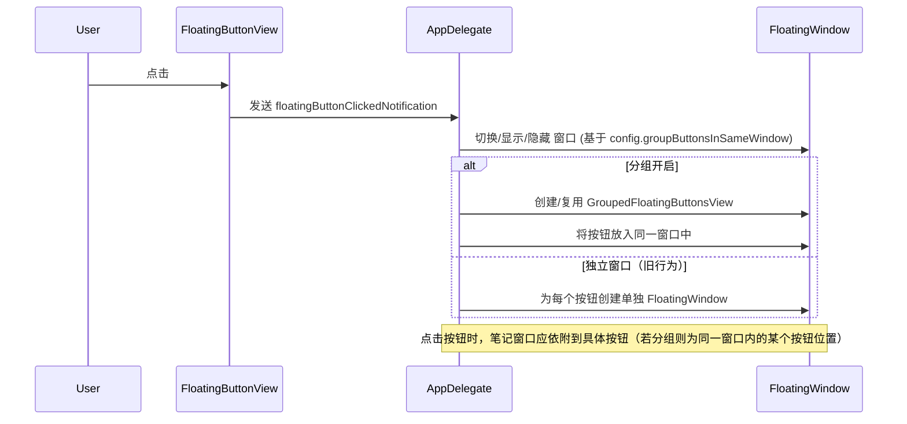

# 悬浮按钮同窗口分组

## 概述
当前需求：当“同窗口分组”功能开启时，多个悬浮按钮不再创建为互相独立的多个窗口，而是创建在同一个窗口（容器）内，并在该容器中进行排列与交互。我的目标是实现配置开关、在设置中暴露该开关、实现分组容器视图与窗口支持、并调整 AppDelegate 与窗口管理逻辑来兼容新行为。

我的下一步是询问是否创建 git 工作树与分支：命名建议为 `20260107-悬浮按钮同窗口分组`，在得到确认后我会在工作树上实现并逐步提交改动。

## 流程图

## 方案
1. 配置层面
   - 在 `FloatingButtonConfig` 中新增字段：`groupButtonsInSameWindow: Bool`（默认 false）。
   - 在 `FloatingButtonConfigManager` 添加更新方法 `updateGroupButtonsInSameWindow(_:)`，并在变更后发送 config 变更通知。

2. UI
   - 在设置页 `SettingsView` 的悬浮球设置里，新增 `同窗口分组` 的 Toggle，绑定到配置管理器。

3. 视图/窗口
   - 新增 `GroupedFloatingButtonsView`：负责在一个容器里创建多个 `FloatingButtonView` 子视图，负责排列、隐藏/显示单个按钮、并能返回某个按钮在屏幕上的绝对 rect（用于笔记窗口定位）。
   - 扩展 `FloatingWindow`：支持承载 `GroupedFloatingButtonsView` 并根据容器计算窗口尺寸（新增 `updateSizeForGrouped(totalWidth:height:)`）。遮罩使用胶囊形状。

4. AppDelegate / Window 管理
   - 在 `createFloatingWindow` / `refreshAllWindows` 时：如果 `groupButtonsInSameWindow` 为 true，则只创建一个 `FloatingWindow`（或一个分组窗口集合，视需要），并在其中放置 `GroupedFloatingButtonsView`。否则保留每个按钮独立窗口的行为。
   - 修改 `handleFloatingButtonClicked` 与 `toggleNoteWindow`：当在分组窗口中点击某个按钮时，需要传递该按钮视图（或其屏幕 rect）以便笔记窗口正确依附并定位。
   - 保存/加载位置逻辑：在分组模式下，保存/加载逻辑需要适配“分组窗口”的 key（例如 `floatingWindowPosition_grouped`），并在窗口移动时保存位置。

5. 兼容性与回退
   - 如果用户切换配置（开启/关闭），在 `handleConfigChanged` 中清理旧窗口并按照新模式重建窗口与视图。

## 相关代码位置
- `FloatingButtonConfig` / `FloatingButtonConfigManager`：/Volumes/Cache/X/Sources/Model/FloatingButtonConfig.swift
- 设置界面：/Volumes/Cache/X/Sources/View/SettingsView.swift
- 悬浮球主视图：/Volumes/Cache/X/Sources/View/FloatingButtonView.swift
- 新增分组视图（将创建）：/Volumes/Cache/X/Sources/View/GroupedFloatingButtonsView.swift
- 窗口：/Volumes/Cache/X/Sources/View/FloatingWindow.swift
- App 入口/窗口管理：/Volumes/Cache/X/Sources/App/AppDelegate.swift
- WindowManager（可能需调整）：/Volumes/Cache/X/Sources/Utility/WindowManager.swift

(点击可以在 VSCode 中打开对应位置: vscode://file//Volumes/Cache/X/Sources/Model/FloatingButtonConfig.swift:1)

## 代码错误测试
- 修改完成后优先运行 lint（若有）或构建：在此 macOS Swift 包项目中，使用 `swift build` 来验证编译错误。
- 修复所有编译错误与类型不匹配。

## 验证流程
1. 在设置中开启/关闭“同窗口分组”，观察窗口创建行为：
   - 开启：仅创建一个或少数分组窗口，多个按钮在同一个窗口内排列。
   - 关闭：恢复为每个按钮独立窗口。
2. 点击分组内某个按钮，打开笔记窗口，笔记窗口应依附到该按钮在屏幕上的位置（而非整个窗口中心）。
3. 移动分组窗口，笔记窗口应随之定位更新。
4. 切换配置并重启应用，位置与行为应保持一致（保存/加载位置）。

## 任务总结与结论
将分步骤实现：添加配置开关 -> 设置界面绑定 -> 新增分组视图与窗口支持 -> 修改 AppDelegate/Window 管理逻辑 -> 逐步测试与修复。优先点是兼容性与最小化对现有行为的破坏。

## 任务耗时
- 任务开始时间：14:40
- 任务结束时间：
- 任务总耗时：
