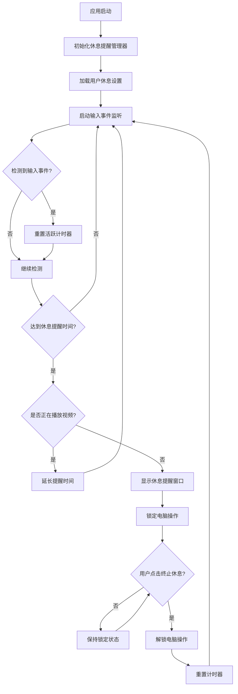

# 开发提醒休息功能

## 概述
本任务旨在为 AIX 应用开发智能提醒休息功能。该功能需要监听用户的输入设备活动（键盘、鼠标），同时考虑视频播放等特殊情况，根据最新的科学建议设计算法智能提醒用户休息。在休息期间，需要锁定电脑操作，只有点击终止休息按钮才能解除锁定。

## 流程图



## 方案

### 1. 休息提醒算法设计

#### 1.1 科学依据
根据世界卫生组织（WHO）和人体工程学研究：
- **20-20-20 规则**：每工作 20 分钟，注视 20 英尺外的物体 20 秒
- **Pomodoro 技术**：25 分钟专注工作 + 5 分钟休息
- **人体工程学建议**：每 60 分钟至少休息 5-10 分钟

#### 1.2 智能算法方案
- **基础休息间隔**：默认 60 分钟（可配置范围：30-120 分钟）
- **休息时长**：默认 5 分钟（可配置范围：1-15 分钟）
- **视频播放检测**：当检测到全屏视频播放时，自动延长提醒时间
- **活动强度调整**：根据用户输入频率动态调整提醒时机

### 2. 输入设备监听实现

#### 2.1 方案选择：使用 CGEventTap
**优点**：
- 系统级别的监听，覆盖所有输入事件
- 不影响正常输入操作
- 可同时监听键盘和鼠标事件

**实现要点**：
```swift
class InputMonitor {
    private var eventTap: CFMachPort?
    private var lastActivityTime: Date = Date()
    
    func startMonitoring() {
        let eventMask = (1 << CGEventType.keyDown.rawValue) |
                        (1 << CGEventType.mouseMoved.rawValue) |
                        (1 << CGEventType.leftMouseDragged.rawValue)
        
        eventTap = CGEvent.tapCreate(
            tap: .cgSessionEventTap,
            place: .headInsertEventTap,
            options: .defaultTap,
            eventsOfInterest: CGEventMask(eventMask),
            callback: { proxy, type, event, refcon in
                InputMonitor.handleEvent(proxy: proxy, type: type, event: event, refcon: refcon)
                return Unmanaged.passUnretained(event)
            },
            userInfo: nil
        )
    }
}
```

### 3. 视频播放检测

#### 3.1 实现方案：使用 NSRunningApplication 和 Accessibility API
**检测逻辑**：
1. 检查当前前台应用是否为视频播放应用（如 QuickTime、VLC、Safari 等）
2. 通过 Accessibility API 检测全屏状态
3. 结合音频输出检测判断是否在播放视频

### 4. 休息窗口设计与实现

#### 4.1 窗口特性
- **全屏覆盖**：使用 `NSWindow.Level.screenSaver` 确保窗口在最上层
- **锁定操作**：禁用除终止按钮外的所有交互
- **美观设计**：显示剩余时间、休息建议、眼部运动指导等

#### 4.2 窗口元素
```swift
class RestWindow: NSWindow {
    // 倒计时显示
    private var countdownLabel: NSTextField!
    
    // 终止休息按钮
    private var stopButton: NSButton!
    
    // 休息建议内容
    private var suggestionLabel: NSTextField!
    
    // 眼部运动动画
    private var eyeExerciseView: NSView!
}
```

### 5. 配置管理

#### 5.1 新增配置项
```swift
struct RestReminderConfig {
    var enabled: Bool = true                    // 是否启用休息提醒
    var workDuration: TimeInterval = 3600       // 工作时长（秒）
    var restDuration: TimeInterval = 300       // 休息时长（秒）
    var videoModeEnabled: Bool = true           // 是否启用视频模式
    var videoModeMultiplier: Double = 2.0      // 视频模式时长倍数
    var adaptiveInterval: Bool = true           // 是否启用自适应间隔
}
```

## 相关代码位置

### 1. 主程序入口
- [AppDelegate.swift](vscode://file/Volumes/Cache/X/Sources/App/AppDelegate.swift:1)
  - 第 19-58 行：应用启动和初始化逻辑
  - 需在此处初始化休息提醒管理器

### 2. 配置管理
- [FloatingButtonConfig.swift](vscode://file/Volumes/Cache/X/Sources/Model/FloatingButtonConfig.swift:1)
  - 第 6-54 行：配置结构定义
  - 需在此处添加休息提醒相关配置

### 3. 窗口管理
- [FloatingWindow.swift](vscode://file/Volumes/Cache/X/Sources/View/FloatingWindow.swift:1)
  - 可参考此文件实现休息窗口的基类

### 4. 设置界面
- [SettingsView.swift](vscode://file/Volumes/Cache/X/Sources/View/SettingsView.swift:1)
  - 需在此文件中添加休息提醒设置界面

## 代码错误测试
1. 编译检查：使用 `swift build` 或 `xcodebuild` 检查编译错误
2. 代码审查：检查 CGEventTap 权限问题
3. 功能测试：验证输入监听、视频检测、窗口锁定等功能
4. 边界测试：测试各种边界情况和异常处理

## 验证流程

### 1. 功能验证步骤
1. 启动应用，进入设置界面，配置休息提醒参数
2. 启用休息提醒功能
3. 进行正常操作，验证计时器是否正常运行
4. 测试输入事件监听：移动鼠标、敲击键盘，观察计时器是否重置
5. 等待达到提醒时间，验证休息窗口是否正确弹出
6. 验证休息窗口是否成功锁定电脑操作
7. 点击终止休息按钮，验证是否能正常解除锁定
8. 测试视频播放场景：播放全屏视频，验证提醒是否被延长
9. 测试不同配置参数，验证功能是否符合预期

### 2. 性能验证
1. 监控内存使用情况
2. 检查 CPU 占用率
3. 验证输入监听对系统性能的影响

### 3. 安全性验证
1. 验证 CGEventTap 权限请求流程
2. 确保用户可以随时终止休息模式
3. 验证不会影响系统正常功能

## 任务总结与结论

### 核心功能点
1. **智能监听**：使用 CGEventTap 实现系统级输入事件监听
2. **自适应算法**：结合输入频率和视频播放状态动态调整提醒时机
3. **安全锁定**：通过高优先级窗口实现操作锁定
4. **友好界面**：提供美观的休息提醒窗口，包含休息建议和眼部运动指导

### 技术要点
- 系统级事件监听需要辅助功能权限
- 视频播放检测需要结合应用识别和全屏状态判断
- 窗口级别设置为 `.screenSaver` 确保在最上层
- 使用定时器和状态机管理休息提醒逻辑

### 预期效果
- 有效提醒用户定时休息，保护视力和身体健康
- 智能识别视频播放场景，避免打断观看体验
- 提供可配置的休息参数，满足不同用户需求
- 美观的界面设计，提升用户体验

## 任务耗时
- 任务开始时间：17:43
- 任务结束时间：待定
- 任务总耗时：待定
