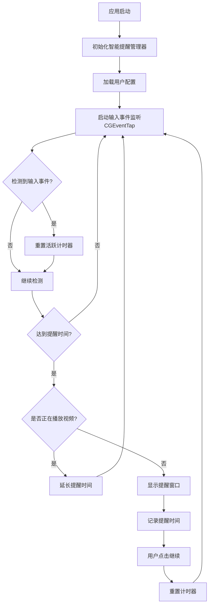

# 智能提醒算法改进

## 概述
在现有提醒界面基础上，改进提醒算法，从固定间隔提醒改为智能提醒。智能算法需要监听用户输入设备活动（键盘、鼠标），根据用户实际活动时间智能提醒休息，同时考虑视频播放等特殊情况。

## 流程图



## 方案

### 当前算法分析
现有的提醒算法采用**固定间隔定时器**方式：
- 优点：简单直观，严格遵循设定间隔
- 缺点：固定间隔不够智能，无法根据用户实际活动调整

### 智能算法方案

#### 1. 核心机制
- **基于活动时间的智能提醒**：不是固定时间间隔，而是累计用户实际活跃时间
- **输入事件监听**：使用CGEventTap监听键盘和鼠标事件
- **自动暂停计时**：当用户停止操作时，暂停计时；重新操作时继续计时
- **视频播放检测**：检测全屏视频播放，延长提醒时间避免打断

#### 2. 算法逻辑

```
初始状态：
  activeDuration = 0  (累计活跃时间)
  workDuration = 3600秒 (设定的工作时长)

监听输入事件：
  当检测到键盘或鼠标事件：
    如果距离上次事件 > 5秒：
      记录活跃时间段
      activeDuration += 事件间隔
    更新lastActivityTime

判断是否提醒：
  if activeDuration >= workDuration:
    检测视频播放状态
    if 正在播放全屏视频:
      延长提醒时间（workDuration * 2）
    else:
      显示提醒窗口
      activeDuration = 0
```

#### 3. 技术实现要点

**输入监听器（InputMonitor）**：
- 使用CGEventTap创建系统级事件监听
- 监听键盘事件：`keyDown`
- 监听鼠标事件：`mouseMoved`, `leftMouseDragged`, `rightMouseDragged`
- 需要辅助功能权限（Accessibility）

**视频播放检测**：
- 检查当前前台应用是否为视频播放应用（QuickTime, VLC, Safari, Chrome等）
- 通过Accessibility API检测窗口全屏状态
- 结合音频输出检测判断是否在播放视频

**智能计时器**：
- 不使用固定间隔定时器
- 使用Timer定期检查累计活跃时间
- 根据输入事件动态更新活跃时间

### 3. 配置参数扩展

在现有 `ReminderConfig` 基础上新增配置：
```swift
struct SmartReminderConfig {
    var isEnabled: Bool = true
    var workDuration: TimeInterval = 3600       // 工作时长（秒），默认60分钟
    var restDuration: TimeInterval = 300        // 休息时长（秒），默认5分钟
    var videoModeEnabled: Bool = true            // 是否启用视频模式
    var videoModeMultiplier: Double = 2.0       // 视频模式时长倍数
    var idleThreshold: TimeInterval = 5         // 空闲阈值（秒），超过此时间不计时
}
```

### 4. 保持现有界面
- ✅ 保留现有的 `ReminderOverlayWindow` 界面
- ✅ 保留现有的提醒窗口显示逻辑
- ✅ 保留现有的用户交互（继续按钮）
- 🔄 只替换背后的提醒算法逻辑

## 相关代码位置

### 现有文件
- [ReminderConfig.swift](vscode://file/Volumes/Cache/X/Sources/Model/ReminderConfig.swift:1)
  - 当前配置结构，需要扩展智能提醒配置项

- [ReminderOverlayWindow.swift](vscode://file/Volumes/Cache/X/Sources/View/ReminderOverlayWindow.swift:1)
  - 现有提醒窗口，保持不变

- [SettingsView.swift](vscode://file/Volumes/Cache/X/Sources/View/SettingsView.swift:1)
  - 设置界面，需要添加智能提醒配置选项

### 新增文件
- **InputMonitor.swift**
  - 输入事件监听器实现
  - 使用CGEventTap监听键盘和鼠标事件

- **SmartReminderManager.swift**
  - 智能提醒管理器
  - 协调输入监听、计时器、视频检测等模块

- **VideoDetector.swift**
  - 视频播放检测器
  - 检测全屏视频播放状态

## 实现步骤

### 第一阶段：输入监听
1. 创建 `InputMonitor.swift`
2. 实现CGEventTap事件监听
3. 监听键盘和鼠标事件
4. 测试辅助功能权限请求流程

### 第二阶段：智能计时
1. 创建 `SmartReminderManager.swift`
2. 实现基于活动时间的累计逻辑
3. 替换原有的固定间隔定时器
4. 测试计时准确性

### 第三阶段：视频检测
1. 创建 `VideoDetector.swift`
2. 实现前台应用检测
3. 实现全屏状态检测
4. 集成到提醒管理器

### 第四阶段：配置扩展
1. 扩展 `ReminderConfig` 结构
2. 在设置界面添加智能提醒配置选项
3. 实现配置持久化

### 第五阶段：集成测试
1. 完整功能测试
2. 性能测试
3. 权限测试
4. 边界情况测试

## 代码错误测试
1. 编译检查：使用 `swift build` 检查编译错误
2. 权限检查：验证CGEventTap辅助功能权限
3. 内存检查：验证事件监听器不会造成内存泄漏
4. 功能测试：验证输入监听、智能计时、视频检测等功能

## 验证流程

### 1. 功能验证步骤
1. 启动应用，授予辅助功能权限
2. 进入设置界面，配置智能提醒参数
3. 启用智能提醒功能
4. 进行正常操作（移动鼠标、敲击键盘）
5. 停止操作一段时间（例如10分钟），然后继续操作
6. 验证计时器是否正确累计实际活跃时间
7. 等待达到提醒时间，验证提醒窗口是否正确弹出
8. 测试视频播放场景：播放全屏视频，验证提醒是否被延长
9. 测试不同配置参数，验证功能是否符合预期

### 2. 性能验证
1. 监控内存使用情况
2. 检查CPU占用率
3. 验证输入监听对系统性能的影响
4. 测试长时间运行稳定性

### 3. 安全性验证
1. 验证辅助功能权限请求流程
2. 确保用户可以随时关闭提醒
3. 验证不会影响系统正常功能
4. 验证数据隐私安全

## 任务总结与结论

### 改进重点
1. **从固定间隔改为智能累计**：累计用户实际活跃时间，而非固定时间间隔
2. **添加输入事件监听**：使用CGEventTap监听键盘和鼠标事件
3. **视频播放检测**：避免打断全屏视频观看
4. **保持现有界面**：不改变用户已习惯的提醒窗口界面

### 技术要点
- CGEventTap需要辅助功能权限
- 智能计时需要处理空闲时间（用户停止操作时）
- 视频检测需要结合应用识别和全屏状态
- 需要保证性能不影响用户体验

### 预期效果
- 更准确的提醒时机，根据用户实际工作时间提醒
- 避免在用户休息时累计时间
- 智能识别视频播放场景
- 保持良好的用户体验

## 任务耗时
- 任务开始时间：18:10
- 任务结束时间：待定
- 任务总耗时：待定
