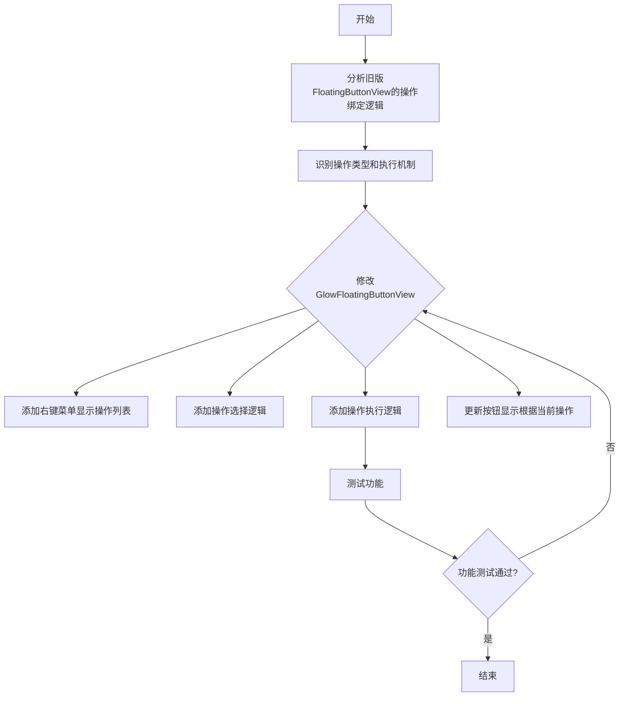

# 将操作功能集成到新版光效按钮

## 概述
将旧版悬浮球(FloatingButtonView)的**操作绑定功能**集成到新版光效按钮(GlowFloatingButtonView)上。

**核心功能点:**
- 右键菜单显示可用的操作列表
- 点击右键菜单选择操作类型
- 点击按钮执行对应的操作
- 保持光效按钮的优秀视觉效果

## 流程图



## 方案

### 技术方案
直接修改 `GlowFloatingButtonView.swift`,添加操作绑定功能:

#### 1. 操作类型定义
参考 FloatingButtonView 中的操作类型枚举:
```swift
enum ButtonAction: String, CaseIterable {
    case none = "none"
    case screenshot = "screenshot"
    case screenRecording = "screenRecording"
    case toggleWindow = "toggleWindow"
    case minimizeWindow = "minimizeWindow"
    case maximizeWindow = "maximizeWindow"
    case closeWindow = "closeWindow"
    // ... 其他操作类型
}
```

#### 2. 右键菜单功能
- 监听右键点击事件
- 显示可用的操作列表菜单
- 菜单项显示操作名称
- 选择操作后更新当前按钮的操作类型

#### 3. 操作执行功能
- 左键点击时执行当前绑定的操作
- 通过委托模式通知 AppDelegate 执行具体操作
- 或者直接调用相应的功能函数

#### 4. 按钮显示更新
- 根据当前操作类型更新按钮图标
- 如果操作有对应图标,显示对应图标
- 保持光效效果不变

### 实现细节

**需要添加的属性:**
```swift
private var currentAction: ButtonAction = .screenshot  // 默认操作
```

**需要添加的方法:**
```swift
// 右键菜单
func showContextMenu(at point: NSPoint)

// 操作执行
func executeCurrentAction()

// 更新显示
func updateButtonForCurrentAction()

// 鼠标事件重写
override func rightMouseDown(_ event: NSEvent)
override func mouseUp(_ event: NSEvent)
```

**操作执行委托:**
```swift
protocol GlowFloatingButtonDelegate: AnyObject {
    func floatingButton(_ button: GlowFloatingButtonView, executeAction action: ButtonAction)
}
```

## 相关代码位置

**需要修改的文件:**

- [GlowFloatingButtonView.swift](vscode://file/Volumes/Cache/X/Sources/View/GlowFloatingButtonView.swift:1) - 需要添加右键菜单和操作执行功能
- [FloatingButtonView.swift](vscode://file/Volumes/Cache/X/Sources/View/FloatingButtonView.swift:1) - 参考其操作类型枚举和菜单实现
- [FloatingButtonConfig.swift](vscode://file/Volumes/Cache/X/Sources/Model/FloatingButtonConfig.swift:6) - 参考操作类型定义

**相关辅助文件(可能需要了解):**
- [AppDelegate.swift](vscode://file/Volumes/Cache/X/Sources/App/AppDelegate.swift:485) - 了解如何执行各种操作

## 代码错误测试

修改完成后,必须执行以下检查:
```bash
# 1. 语法检查
swift build

# 2. Lint 检查(如果可用)
swiftlint

# 3. 构建应用
xcodebuild -project AIX.xcodeproj -scheme AIX -configuration Debug build
```

检查并修复所有编译错误和警告。

## 验证流程

1. **基本光效验证**
   - 启动应用,确认光效按钮显示正常
   - 确认外发光效果可见且流畅
   - 悬停时发光放大效果正常
   - 点击时收缩动画正常

2. **右键菜单验证**
   - 右键点击光效按钮,确认操作菜单显示
   - 确认菜单包含各种操作选项(截图、录屏、窗口控制等)
   - 选择不同操作,确认图标更新

3. **操作执行验证**
   - 左键点击光效按钮
   - 确认执行了当前绑定的操作(如截图、录屏等)
   - 切换操作后,点击确认执行新操作

## 任务总结与结论

本次任务将旧版悬浮球的**操作绑定功能**集成到新版光效按钮上,在保留优秀光效效果的同时,添加右键菜单和操作执行功能。

主要修改:
1. 在 GlowFloatingButtonView 中添加右键菜单,显示可用操作列表
2. 添加操作类型属性,记录当前绑定的操作
3. 左键点击时执行当前绑定的操作
4. 根据操作类型更新按钮图标

完成后,新版光效按钮将同时拥有优秀的光效效果和操作绑定功能,用户可以通过右键菜单切换不同的操作,点击执行相应功能。

## 任务耗时
- 任务开始时间:19:06
- 任务结束时间:待定
- 任务总耗时:待定
