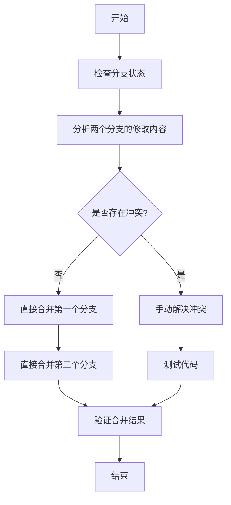

# 合并两个分支到master

## 概述
需要将两个从 master 新增出的分支合并到 master 分支，确保 master 拥有两个分支的最新代码。这两个分支分别是：
1. `202601072110-悬浮球右键菜单添加状态栏设置项` - 为悬浮球右键菜单添加状态栏设置项功能
2. `202601072111-修复悬浮球移动和笔记窗口跟随问题` - 修复悬浮球移动和笔记窗口跟随问题

两个分支都基于 master 的同一个提交（155b9af），修改了不同的功能模块，预计不会产生冲突。

## 流程图

## 方案

### 方案一：顺序合并（推荐）
**步骤：**
1. 切换到 master 分支
2. 合并第一个分支 `202601072110-悬浮球右键菜单添加状态栏设置项`
3. 合并第二个分支 `202601072111-修复悬浮球移动和笔记窗口跟随问题`
4. 如果出现冲突，手动解决
5. 验证合并结果

**优点：**
- 简单直接，易于理解
- Git 会自动处理大部分合并逻辑
- 保留完整的历史记录

**缺点：**
- 如果有冲突，需要手动解决

### 方案二：使用 rebase（不推荐）
**步骤：**
1. 将两个分支 rebase 到 master
2. 切换到 master 分支
3. 使用 fast-forward 合并

**优点：**
- 历史记录更线性

**缺点：**
- 会修改分支历史，可能影响其他开发者
- 操作复杂，风险较高

**推荐方案：方案一（顺序合并）**

## 相关代码位置

### 分支1：202601072110-悬浮球右键菜单添加状态栏设置项
修改文件：
- [Sources/App/AppDelegate.swift](file:///Volumes/Cache/X/Sources/App/AppDelegate.swift)
- [Sources/View/GlowFloatingButtonView.swift](file:///Volumes/Cache/X/Sources/View/GlowFloatingButtonView.swift)

主要改动：
1. 在 AppDelegate 中添加了 `showFloatingButton` 方法，用于显示悬浮球
2. 删除了 `hideFloatingButton` 方法
3. 在 GlowFloatingButtonView 中添加了 `visibilityChangedNotification` 通知
4. 重写了 `rightMouseDown` 方法，添加了完整的右键菜单功能
5. 添加了 `actionItemClicked`、`clearWindowBindingFromMenu`、`deleteFloatingButton` 等方法

### 分支2：202601072111-修复悬浮球移动和笔记窗口跟随问题
修改文件：
- [Sources/View/GlowFloatingButtonView.swift](file:///Volumes/Cache/X/Sources/View/GlowFloatingButtonView.swift)

主要改动：
1. 添加了拖拽相关变量：`isDragging`、`initialMouseLocation`、`initialWindowOrigin`、`dragThreshold`
2. 重写了 `mouseDown` 方法，记录初始位置
3. 添加了 `mouseDragged` 方法，实现拖拽功能
4. 重写了 `mouseUp` 方法，区分点击和拖拽操作

### 冲突分析
两个分支都修改了 `GlowFloatingButtonView.swift` 文件，但修改的是不同的方法：
- 分支1 修改了 `rightMouseDown` 方法
- 分支2 修改了 `mouseDown`、`mouseDragged` 和 `mouseUp` 方法

由于修改的方法不同，预计不会产生冲突。Git 应该能够自动合并这两个分支。

## 代码错误测试
合并完成后，必须执行以下检查：
1. 运行 lint 检查代码错误
2. 如果 lint 不可用，运行 build 检查代码
3. 修复所有编译错误和警告

## 验证流程
1. 切换到 master 分支
2. 合并第一个分支：`git merge 202601072110-悬浮球右键菜单添加状态栏设置项`
3. 合并第二个分支：`git merge 202601072111-修复悬浮球移动和笔记窗口跟随问题`
4. 检查是否有冲突标记（<<<<<<<, =======, >>>>>>>）
5. 如果有冲突，手动解决冲突文件
6. 运行编译检查：`swift build` 或 `xcodebuild`
7. 测试应用功能：
   - 测试悬浮球右键菜单功能
   - 测试悬浮球拖拽功能
   - 测试笔记窗口跟随功能
8. 确认所有功能正常工作

## 任务总结与结论
本次任务需要合并两个功能分支到 master 分支。两个分支都基于同一个 master 提交，修改了不同的功能模块，预计不会产生冲突。采用顺序合并的方式，先合并第一个分支，再合并第二个分支。如果出现冲突，手动解决并测试。合并完成后，需要运行编译检查并测试应用功能。

## 任务耗时
- 任务开始时间：2159
- 任务结束时间：待定
- 任务总耗时：待定
