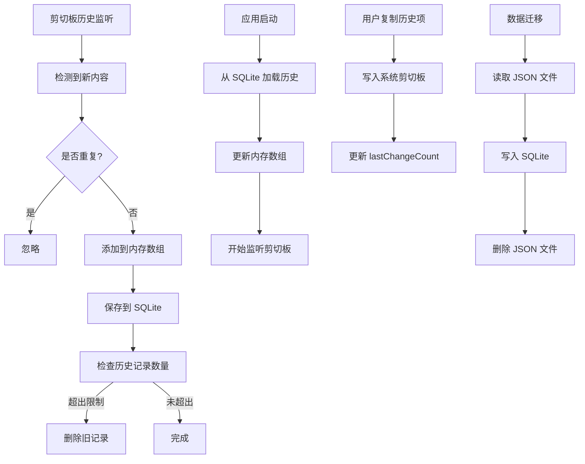

# 剪切板历史SQLite持久化

## 概述
将剪切板历史从 JSON 文件存储迁移到 SQLite 数据库存储，实现所有持久化数据（剪切板历史、设置、分组、笔记）统一使用 SQLite 存储。

## 流程图



## 方案

### 当前状态分析
- ✅ **笔记和分组**：已通过 SQLite 持久化（NoteStore）
- ✅ **设置**：已通过 SQLite 持久化（SettingsStore）
- ❌ **剪切板历史**：目前使用 JSON 文件存储（ClipboardManager）

### 解决方案

#### 方案一：创建 ClipboardStore 类（推荐）

**优点：**
- 与现有的 NoteStore 和 SettingsStore 保持一致的架构
- 代码结构清晰，易于维护
- 可以利用 SQLite 的事务特性，提高数据一致性
- 支持更复杂的查询需求（如按时间范围查询）

**实现步骤：**

1. **创建 ClipboardStore 类**
   - 在 `Sources/Model/` 目录下创建 `ClipboardStore.swift`
   - 实现 `insertItem`、`deleteItem`、`getAllItems`、`deleteOldItems` 等方法
   - 创建 `ClipboardItem` 表，包含字段：id, type, data, timestamp

2. **修改 AppDatabase**
   - 添加 `clipboardStore` 属性
   - 在初始化时创建 ClipboardStore 实例

3. **修改 ClipboardManager**
   - 移除 JSON 文件存储相关代码
   - 使用 ClipboardStore 来保存和加载剪切板历史
   - 添加数据迁移逻辑，将现有的 JSON 数据迁移到 SQLite

4. **数据迁移**
   - 在应用启动时检查是否存在 JSON 文件
   - 如果存在，读取并迁移到 SQLite
   - 迁移完成后删除 JSON 文件

#### 方案二：使用 SettingsStore 存储

**优点：**
- 无需创建新的 Store 类
- 实现简单

**缺点：**
- SettingsStore 设计为存储键值对配置，不适合存储大量数据
- 无法有效管理历史记录数量
- 查询效率低

**结论：** 不推荐此方案

#### 方案三：继续使用 JSON 文件存储

**优点：**
- 无需修改代码

**缺点：**
- 与其他数据存储方式不一致
- 无法利用 SQLite 的事务特性
- 文件读写可能存在并发问题

**结论：** 不推荐此方案

### 最终方案：方案一

## 相关代码位置

- [ClipboardManager.swift](file:///Volumes/Cache/X/Sources/Utility/ClipboardManager.swift) - 当前剪切板历史管理器，使用 JSON 文件存储
- [AppDatabase.swift](file:///Volumes/Cache/X/Sources/Model/AppDatabase.swift) - 数据库管理类
- [NoteStore.swift](file:///Volumes/Cache/X/Sources/Model/NoteStore.swift) - 笔记存储类，可作为参考
- [SettingsStore.swift](file:///Volumes/Cache/X/Sources/Model/SettingsStore.swift) - 设置存储类，可作为参考
- [ClipboardItem.swift](file:///Volumes/Cache/X/Sources/Model/ClipboardItem.swift) - 剪切板项数据模型

## 代码错误测试
代码修改完成后，必须使用以下命令检查代码错误：
```bash
swift build
```

如果存在编译错误，需要修复所有错误后才能继续。

## 验证流程

1. **启动应用**
   - 检查应用是否能正常启动
   - 检查剪切板历史是否能正常加载

2. **剪切板历史功能测试**
   - 复制一些文本、图片、文件到剪切板
   - 检查剪切板历史是否正确记录
   - 检查历史记录数量是否正确限制

3. **数据持久化测试**
   - 关闭应用
   - 重新打开应用
   - 检查剪切板历史是否正确恢复

4. **数据迁移测试**
   - 如果存在旧的 JSON 文件，检查数据是否正确迁移到 SQLite
   - 检查 JSON 文件是否被删除

5. **性能测试**
   - 复制大量内容到剪切板
   - 检查应用是否流畅
   - 检查历史记录查询是否快速

## 任务总结与结论

本任务将剪切板历史从 JSON 文件存储迁移到 SQLite 数据库存储，实现所有持久化数据的统一管理。通过创建 ClipboardStore 类，与现有的 NoteStore 和 SettingsStore 保持一致的架构，提高代码的可维护性和数据一致性。

## 任务耗时
- 任务开始时间：2214
- 任务结束时间：待定
- 任务总耗时：待定
