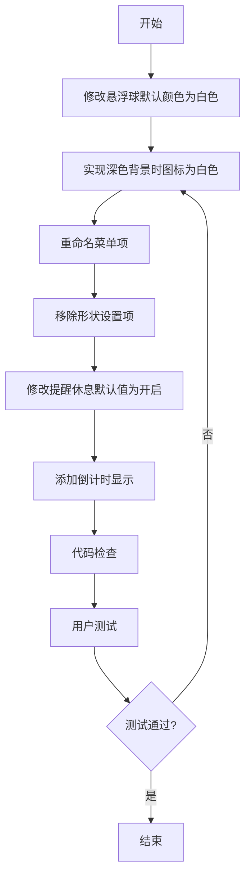

# 悬浮球颜色和设置优化

## 概述
本次任务主要对悬浮球功能进行多项优化,包括修改默认颜色、调整菜单项名称、移除特定设置项、修改默认配置值以及添加倒计时显示功能。这些修改将提升用户体验,使界面更加简洁直观。

## 流程图



## 方案

### 方案一: 修改默认颜色
**位置**: [FloatingButtonConfig.swift](file:///Volumes/Cache/X/Sources/Model/FloatingButtonConfig.swift#L254)
**修改内容**: 将 `colorScheme: .pureBlack` 改为 `colorScheme: .pureWhite`

**优点**: 
- 简单直接,只需修改一行代码
- 不影响现有功能

### 方案二: 实现深色背景时图标为白色
**位置**: [GlowFloatingButtonView.swift](file:///Volumes/Cache/X/Sources/View/GlowFloatingButtonView.swift#L120)
**修改内容**: 在设置图标颜色时,根据背景色深浅自动选择合适的图标颜色

**实现逻辑**:
```swift
let iconColor: CGColor
if colorScheme == .pureBlack {
    iconColor = CGColor(red: 1.0, green: 1.0, blue: 1.0, alpha: 1.0) // 白色
} else {
    iconColor = colorScheme.contentTintColor
}
```

**优点**:
- 自动适配,用户体验好
- 遵循设计规范

### 方案三: 重命名菜单项
**位置**: [GlowFloatingButtonView.swift](file:///Volumes/Cache/X/Sources/View/GlowFloatingButtonView.swift#L392)
**修改内容**:
1. 将 "个性化设置" 改为 "个性化"
2. 将 "关闭悬浮球" 改为 "隐藏"

**优点**:
- 简洁明了
- 符合用户习惯

### 方案四: 移除形状设置项
**位置**: [GlowFloatingButtonView.swift](file:///Volumes/Cache/X/Sources/View/GlowFloatingButtonView.swift#L440-460)
**修改内容**: 在个性化设置面板中移除形状相关的 UI 控件

**优点**:
- 简化界面,减少用户困惑
- 聚焦核心功能

### 方案五: 修改提醒休息默认值
**位置**: [ReminderConfig.swift](file:///Volumes/Cache/X/Sources/Model/ReminderConfig.swift#L24)
**修改内容**: 将 `isEnabled: false` 改为 `isEnabled: true`

**优点**:
- 新用户默认启用提醒功能
- 提升健康意识

### 方案六: 添加倒计时显示
**位置**: [SettingsView.swift](file:///Volumes/Cache/X/Sources/View/SettingsView.swift)
**修改内容**: 在提醒设置页面添加倒计时显示,显示距离下次休息还有多长时间

**实现逻辑**:
1. 计算距离下次提醒的剩余时间
2. 使用 Timer 定时更新显示
3. 格式化显示为 "XX分XX秒"

**优点**:
- 用户可以直观看到剩余时间
- 提升使用体验

## 相关代码位置

### 1. 悬浮球默认配置
[FloatingButtonConfig.swift](file:///Volumes/Cache/X/Sources/Model/FloatingButtonConfig.swift#L254-L272)

### 2. 图标颜色设置
[GlowFloatingButtonView.swift](file:///Volumes/Cache/X/Sources/View/GlowFloatingButtonView.swift#L120-L150)

### 3. 菜单项定义
[GlowFloatingButtonView.swift](file:///Volumes/Cache/X/Sources/View/GlowFloatingButtonView.swift#L392-L410)

### 4. 个性化设置面板
[GlowFloatingButtonView.swift](file:///Volumes/Cache/X/Sources/View/GlowFloatingButtonView.swift#L415-L520)

### 5. 提醒配置默认值
[ReminderConfig.swift](file:///Volumes/Cache/X/Sources/Model/ReminderConfig.swift#L19-L27)

### 6. 提醒设置页面
[SettingsView.swift](file:///Volumes/Cache/X/Sources/View/SettingsView.swift#L800-L950)

## 代码错误测试
代码修改完成后,必须使用以下命令检查代码错误:
```bash
swift build
```
如果发现错误,需要逐一修复并重新构建。

## 验证流程

1. **验证默认颜色**
   - 启动应用,观察悬浮球默认颜色是否为白色
   - 检查配置文件中的默认值

2. **验证图标颜色**
   - 将悬浮球设置为深色背景,观察图标是否为白色
   - 将悬浮球设置为浅色背景,观察图标颜色是否合适

3. **验证菜单项名称**
   - 右键点击悬浮球,检查菜单项名称是否正确
   - "个性化设置" 应显示为 "个性化"
   - "关闭悬浮球" 应显示为 "隐藏"

4. **验证形状设置移除**
   - 右键点击悬浮球,选择"个性化"
   - 检查是否还有形状设置项

5. **验证提醒默认值**
   - 清空应用数据,重新启动
   - 检查提醒休息是否默认开启

6. **验证倒计时显示**
   - 打开设置页面,切换到"提醒"标签
   - 检查是否显示倒计时
   - 观察倒计时是否实时更新

## 任务总结与结论
本次任务通过多个小改动来优化悬浮球功能和设置界面。主要修改点包括:
1. 默认颜色改为白色,使界面更加清爽
2. 自动适配图标颜色,提升视觉体验
3. 简化菜单项名称,使界面更直观
4. 移除不必要的形状设置,简化操作流程
5. 默认开启提醒功能,促进用户健康
6. 添加倒计时显示,提升用户体验

所有修改都遵循最小化原则,确保不影响现有功能。

## 任务耗时
- 任务开始时间:2243
- 任务结束时间:
- 任务总耗时:
