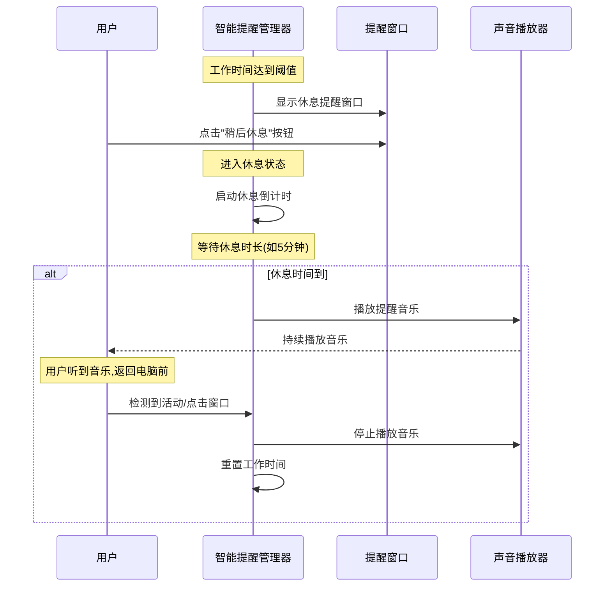

# 添加休息时长和音乐提醒功能

## 概述
用户需要在休息提醒功能中增加:
1. 可配置的休息时长(休息时间长度)
2. 休息时间结束后播放音乐提醒用户返回电脑前

当前智能提醒功能已存在,但缺少休息时长管理和休息结束提醒音乐功能。需要在SmartReminderConfig中添加相关配置,并在SmartReminderManager中实现休息计时和音乐播放逻辑。

## 流程图

## 方案

### 方案一: 在SmartReminderManager中添加休息计时和音乐播放(推荐)

**实现细节:**
1. 在SmartReminderConfig中添加:
   - `restEndSoundName: String` - 休息结束提醒音乐名称
   - `restEndSoundEnabled: Bool` - 是否启用休息结束提醒音乐

2. 在SmartReminderManager中添加:
   - 休息状态管理变量(是否在休息中)
   - 休息计时器
   - 音乐播放器实例
   - 休息结束回调方法

3. 修改ReminderOverlayWindow:
   - 在显示窗口时启动休息计时器
   - 在用户返回时停止计时器并停止音乐

4. 在SmartReminderSettingsView中添加:
   - 休息结束提醒音乐选择器
   - 启用/禁用休息结束提醒音乐的开关

**优点:**
- 功能集中,易于维护
- 不影响现有逻辑
- 用户体验一致

**缺点:**
- SmartReminderManager职责增加

### 方案二: 创建独立的RestTimerManager

**实现细节:**
1. 创建新的RestTimerManager类管理休息计时
2. SmartReminderManager调用RestTimerManager
3. RestTimerManager负责休息计时和音乐播放

**优点:**
- 职责分离,代码更清晰
- 可复用性强

**缺点:**
- 需要额外的类和接口
- 增加代码复杂度

**推荐方案:** 方案一,原因:功能简单,无需过度设计

## 相关代码位置

需要修改的文件:
- [Sources/Model/ReminderConfig.swift](vscode://file/Volumes/Cache/X/Sources/Model/ReminderConfig.swift:33) - SmartReminderConfig定义
- [Sources/Model/SmartReminderManager.swift](vscode://file/Volumes/Cache/X/Sources/Model/SmartReminderManager.swift:5) - 智能提醒管理器
- [Sources/View/ReminderOverlayWindow.swift](vscode://file/Volumes/Cache/X/Sources/View/ReminderOverlayWindow.swift:5) - 提醒窗口
- [Sources/View/SettingsView.swift](vscode://file/Volumes/Cache/X/Sources/View/SettingsView.swift:1021) - 智能提醒设置视图

## 代码错误测试
修改完成后,使用 `swift build` 命令检查代码错误,并修复所有编译错误。

## 验证流程
1. 启动应用,打开设置页面
2. 进入"提醒"标签页
3. 启用智能提醒
4. 设置休息时长(如5分钟)
5. 选择休息结束提醒音乐(如"Glass")
6. 启用休息结束提醒音乐开关
7. 点击测试提醒按钮
8. 看到休息提醒窗口后,点击"稍后休息"
9. 等待休息时长结束
10. 听到音乐播放,检测鼠标/键盘活动
11. 音乐停止,工作计时重置

## 任务总结与结论
本任务将为智能提醒功能添加休息时长管理和休息结束提醒音乐功能。通过在SmartReminderConfig中添加配置项,在SmartReminderManager中实现休息计时和音乐播放逻辑,并在设置界面添加相应的配置选项,完善用户的休息提醒体验。

## 最终实现

### 核心实现流程

1. **SmartReminderConfig配置更新**
   - 添加 `restDuration: TimeInterval` 配置项（休息时长，默认5分钟）
   - 添加 `restEndSoundName: String` 配置项（休息结束提醒声音，默认"Glass"）
   - 设置最小休息时长1分钟，最大休息时长15分钟
   - 配置支持持久化存储到数据库

2. **SmartReminderManager实现**
   - 新增 `restTimer: Timer?` 用于管理休息计时
   - 新增 `isResting: Bool` 用于标识休息状态
   - 新增 `restStartTime: Date?` 记录休息开始时间
   - 实现 `startRestTimer()` 方法：启动休息计时器
   - 实现 `stopRestTimer()` 方法：停止休息计时器并重置状态
   - 实现 `handleRestEnd()` 方法：处理休息结束事件，播放提醒音乐并显示提示窗口
   - 实现 `showRestOverlay()` 方法：显示休息进行中提示，定期更新剩余时间

3. **ReminderManager配置管理**
   - 添加 `updateRestDuration(_ minutes: Int)` 方法：更新休息时长
   - 添加 `updateRestEndSound(_ sound: String)` 方法：更新休息结束提醒声音
   - 配置变更自动保存到数据库

4. **工作流程**
   - 工作时间达到阈值 → 显示休息提醒窗口
   - 用户点击"稍后休息" → 关闭窗口，启动休息计时器
   - 休息计时期间显示"休息中... 剩余 XX:XX"提示
   - 休息时间到 → 播放休息结束提醒音乐
   - 显示"休息时间结束了！可以继续工作了。"窗口
   - 用户返回 → 停止音乐，重置工作计时

### 关键代码位置

- [Sources/Model/ReminderConfig.swift:38-51](vscode://file/Volumes/Cache/X/Sources/Model/ReminderConfig.swift:38) - SmartReminderConfig配置定义
- [Sources/Model/ReminderConfig.swift:206-214](vscode://file/Volumes/Cache/X/Sources/Model/ReminderConfig.swift:206) - updateRestDuration方法
- [Sources/Model/ReminderConfig.swift:246-250](vscode://file/Volumes/Cache/X/Sources/Model/ReminderConfig.swift:246) - updateRestEndSound方法
- [Sources/Model/SmartReminderManager.swift:16-18](vscode://file/Volumes/Cache/X/Sources/Model/SmartReminderManager.swift:16) - 休息计时相关属性
- [Sources/Model/SmartReminderManager.swift:224-239](vscode://file/Volumes/Cache/X/Sources/Model/SmartReminderManager.swift:224) - handleReminderContinue方法
- [Sources/Model/SmartReminderManager.swift:241-262](vscode://file/Volumes/Cache/X/Sources/Model/SmartReminderManager.swift:241) - startRestTimer方法
- [Sources/Model/SmartReminderManager.swift:264-270](vscode://file/Volumes/Cache/X/Sources/Model/SmartReminderManager.swift:264) - stopRestTimer方法
- [Sources/Model/SmartReminderManager.swift:272-287](vscode://file/Volumes/Cache/X/Sources/Model/SmartReminderManager.swift:272) - handleRestEnd方法
- [Sources/Model/SmartReminderManager.swift:289-329](vscode://file/Volumes/Cache/X/Sources/Model/SmartReminderManager.swift:289) - showRestOverlay方法

## 任务耗时
- 任务开始时间:1819
- 任务结束时间:1827
- 任务总耗时:8分钟
