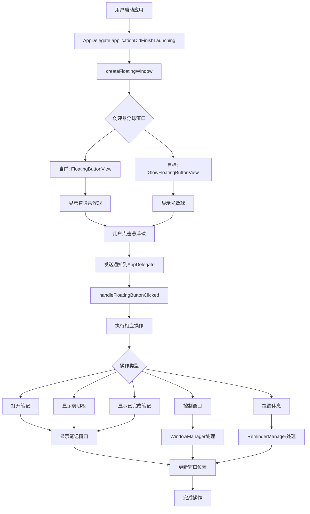

# 用光效悬浮球替代旧悬浮球

## 概述
本任务需要将现有的普通悬浮球（FloatingButtonView）替换为光效球（GlowFloatingButtonView），确保光效球拥有与之前普通悬浮球一样的设置和点击功能。光效球具有更丰富的视觉效果，包括外发光、悬浮放大、点击反馈等动画效果。

## 流程图



## 方案

### 方案一：完全替换 FloatingButtonView 为 GlowFloatingButtonView

**优点**：
- 代码结构清晰，统一使用光效球
- 减少代码维护成本
- 所有悬浮球都拥有统一的视觉效果

**缺点**：
- 需要将 FloatingButtonView 的所有功能迁移到 GlowFloatingButtonView
- 工作量较大
- 可能需要测试所有功能

### 方案二：在 GlowFloatingButtonView 中集成 FloatingButtonView 的功能

**优点**：
- 可以逐步迁移功能
- 保留原有代码作为参考
- 风险较低

**缺点**：
- 代码可能存在冗余
- 需要仔细处理功能迁移

### 推荐方案：方案二

采用方案二，在 GlowFloatingButtonView 中集成 FloatingButtonView 的所有功能，包括：
1. 点击功能（发送通知）
2. 右键菜单（个性化设置、隐藏、删除、绑定窗口等）
3. 配置管理（大小、颜色、形状、图标等）
4. 动画效果（保持光效球的动画效果）

## 相关代码位置

### 普通悬浮球相关代码

- [FloatingButtonView.swift - 主视图类](file:///Volumes/Cache/X/Sources/View/FloatingButtonView.swift#L1-L1125)
- [FloatingButtonView.swift - 点击处理](file:///Volumes/Cache/X/Sources/View/FloatingButtonView.swift#L482-L490)
- [FloatingButtonView.swift - 右键菜单](file:///Volumes/Cache/X/Sources/View/FloatingButtonView.swift#L526-L551)
- [FloatingButtonView.swift - 个性化设置面板](file:///Volumes/Cache/X/Sources/View/FloatingButtonView.swift#L621-L748)
- [FloatingWindow.swift - 窗口类](file:///Volumes/Cache/X/Sources/View/FloatingWindow.swift#L1-L100)

### 光效球相关代码

- [GlowFloatingButtonView.swift - 光效球视图类](file:///Volumes/Cache/X/Sources/View/GlowFloatingButtonView.swift#L1-L162)
- [GlowFloatingButtonView.swift - 层级结构设置](file:///Volumes/Cache/X/Sources/View/GlowFloatingButtonView.swift#L31-L82)
- [GlowFloatingButtonView.swift - 悬浮动画](file:///Volumes/Cache/X/Sources/View/GlowFloatingButtonView.swift#L84-L101)
- [GlowFloatingButtonView.swift - 点击动画](file:///Volumes/Cache/X/Sources/View/GlowFloatingButtonView.swift#L116-L129)

### AppDelegate 相关代码

- [AppDelegate.swift - 创建悬浮球窗口](file:///Volumes/Cache/X/Sources/App/AppDelegate.swift#L476-L535)
- [AppDelegate.swift - 处理悬浮球点击](file:///Volumes/Cache/X/Sources/App/AppDelegate.swift#L145-L175)
- [AppDelegate.swift - 处理配置变化](file:///Volumes/Cache/X/Sources/App/AppDelegate.swift#L242-L299)
- [AppDelegate.swift - 刷新所有窗口](file:///Volumes/Cache/X/Sources/App/AppDelegate.swift#L242-L299)

### 配置管理相关代码

- [FloatingButtonConfig.swift - 配置结构](file:///Volumes/Cache/X/Sources/Model/FloatingButtonConfig.swift#L1-L430)
- [FloatingButtonConfig.swift - 按钮操作枚举](file:///Volumes/Cache/X/Sources/Model/FloatingButtonConfig.swift#L132-L141)

## 代码错误测试

在代码修改完成后，必须使用以下命令检查代码错误并修复：

```bash
# 检查 Swift 代码编译错误
swift build

# 如果有错误，修复后再次检查
swift build
```

## 验证流程

1. **启动应用**：确认应用能够正常启动
2. **检查悬浮球显示**：确认光效球正确显示在屏幕上
3. **测试点击功能**：
   - 点击光效球，确认能够打开笔记
   - 在设置中更改悬浮球操作，再次点击确认功能正常
4. **测试右键菜单**：
   - 右键点击光效球，确认菜单正常显示
   - 测试个性化设置功能
   - 测试隐藏功能
   - 测试删除功能（如果有多个悬浮球）
   - 测试绑定窗口功能
5. **测试配置管理**：
   - 在设置中更改悬浮球大小，确认光效球大小变化
   - 在设置中更改悬浮球颜色，确认光效球颜色变化
   - 在设置中更改悬浮球形状，确认光效球形状变化
6. **测试动画效果**：
   - 鼠标悬浮在光效球上，确认放大发光效果
   - 点击光效球，确认点击反馈动画
   - 确认光效球的动画效果流畅自然
7. **测试多悬浮球**：
   - 在设置中增加悬浮球数量，确认多个光效球正常显示
   - 测试每个光效球的独立功能
8. **测试笔记窗口**：
   - 点击光效球打开笔记窗口
   - 确认笔记窗口位置正确
   - 确认笔记窗口功能正常

## 任务总结与结论

本任务需要将普通悬浮球替换为光效球，确保光效球拥有与之前普通悬浮球一样的设置和点击功能。主要工作包括：

1. 将 FloatingButtonView 的功能迁移到 GlowFloatingButtonView
2. 修改 AppDelegate 中的 createFloatingWindow 方法，使用 GlowFloatingButtonView 替代 FloatingButtonView
3. 确保所有功能正常工作，包括点击、右键菜单、配置管理等
4. 测试所有功能，确保没有遗漏

## 任务耗时
- 任务开始时间：20:23
- 任务结束时间：21:04
- 任务总耗时：41 分钟
