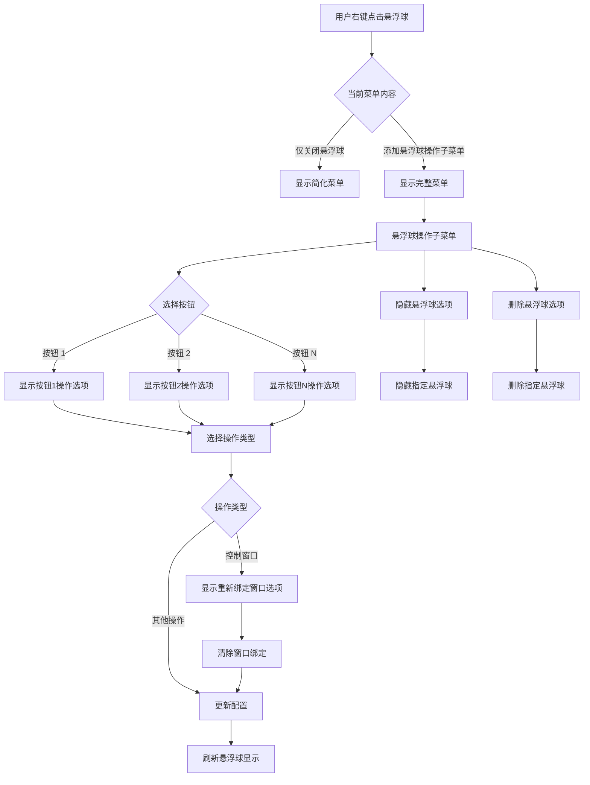

# 悬浮球右键菜单添加状态栏悬浮球操作子菜单

## 概述
当前悬浮球（GlowFloatingButtonView）的右键菜单功能非常简单，只有"关闭悬浮球"一个选项。而状态栏（AppDelegate）的右键菜单中有一个"悬浮球操作"子菜单，包含了所有悬浮球按钮的操作配置选项（如按钮1、按钮2等，每个按钮下面有各种操作选项）。本任务需要将状态栏右键菜单中的"悬浮球操作"子菜单内容添加到悬浮球的右键菜单中，提升用户体验。

## 流程图



## 方案

### 方案一：直接复制状态栏菜单代码到悬浮球（推荐）
**优点**：
- 实现简单，直接复用已有代码
- 保持菜单结构一致性
- 用户可以在悬浮球上完成所有设置操作

**缺点**：
- 需要在 GlowFloatingButtonView 中访问 AppDelegate 的方法
- 可能需要重构部分代码以避免重复

**实现步骤**：
1. 在 GlowFloatingButtonView 中添加与 AppDelegate 相同的菜单项
2. 将 AppDelegate 中的菜单点击方法复制到 GlowFloatingButtonView 或创建共享方法
3. 确保菜单项能够正确调用配置管理器

### 方案二：创建共享菜单管理器
**优点**：
- 代码复用性更好
- 避免重复代码
- 更易于维护

**缺点**：
- 需要创建新的类
- 实现复杂度较高

**实现步骤**：
1. 创建 FloatingButtonMenuManager 类
2. 将菜单创建和事件处理逻辑移到该类
3. AppDelegate 和 GlowFloatingButtonView 都使用该管理器

### 推荐方案
采用**方案一**，因为：
- 任务相对简单，不需要过度设计
- 可以快速实现功能
- 代码量适中，维护成本可控

## 相关代码位置

### 悬浮球右键菜单当前实现
[查看源代码位置](file:///Volumes/Cache/X/Sources/View/GlowFloatingButtonView.swift#L220-L227)

### 状态栏右键菜单实现
[查看源代码位置](file:///Volumes/Cache/X/Sources/App/AppDelegate.swift#L325-L412)

### 状态栏菜单点击方法
- 大小设置：[sizeItemClicked](file:///Volumes/Cache/X/Sources/App/AppDelegate.swift#L414-L423)
- 操作设置：[actionItemClicked](file:///Volumes/Cache/X/Sources/App/AppDelegate.swift#L462-L474)
- 添加悬浮球：[addFloatingButton](file:///Volumes/Cache/X/Sources/App/AppDelegate.swift#L588-L598)
- 打开设置：[openSettings](file:///Volumes/Cache/X/Sources/App/AppDelegate.swift#L584-L586)
- 退出应用：[quitApp](file:///Volumes/Cache/X/Sources/App/AppDelegate.swift#L689-L691)

### 配置管理器
[FloatingButtonConfigManager](file:///Volumes/Cache/X/Sources/Model/FloatingButtonConfig.swift)

## 代码修改计划

### 1. 修改 GlowFloatingButtonView.swift

在 `rightMouseDown` 方法中添加"悬浮球操作"子菜单：

```swift
override func rightMouseDown(with event: NSEvent) {
    let menu = NSMenu(title: "悬浮球菜单")
    
    // 悬浮球操作子菜单
    let actionsMenu = NSMenuItem(title: "悬浮球操作", action: nil, keyEquivalent: "")
    let actionsSubMenu = NSMenu()
    
    let config = FloatingButtonConfigManager.shared.config
    for i in 0..<config.buttonCount {
        let buttonItem = NSMenuItem(title: "按钮 \(i + 1)", action: nil, keyEquivalent: "")
        let buttonSubMenu = NSMenu()
        
        for action in FloatingButtonConfig.ButtonAction.allCases {
            let actionItem = NSMenuItem(title: action.rawValue, action: #selector(actionItemClicked(_:)), keyEquivalent: "")
            actionItem.target = self
            actionItem.state = (config.buttonActions[i] == action) ? .on : .off
            actionItem.tag = i * 100 + FloatingButtonConfig.ButtonAction.allCases.firstIndex(of: action)!
            buttonSubMenu.addItem(actionItem)
        }
        
        // 如果当前是控制窗口模式，添加清除绑定选项
        if config.buttonActions[i] == .toggleWindow {
            buttonSubMenu.addItem(NSMenuItem.separator())
            let clearItem = NSMenuItem(title: "重新绑定窗口", action: #selector(clearWindowBindingFromMenu(_:)), keyEquivalent: "")
            clearItem.target = self
            clearItem.tag = i
            buttonSubMenu.addItem(clearItem)
        }
        
        // 添加隐藏和删除选项
        buttonSubMenu.addItem(NSMenuItem.separator())
        let hideItem = NSMenuItem(title: "隐藏悬浮球", action: #selector(hideFloatingButton(_:)), keyEquivalent: "")
        hideItem.target = self
        hideItem.tag = i
        buttonSubMenu.addItem(hideItem)
        
        // 如果只剩一个按钮，不显示删除选项
        if config.buttonCount > 1 {
            let deleteItem = NSMenuItem(title: "删除悬浮球", action: #selector(deleteFloatingButton(_:)), keyEquivalent: "")
            deleteItem.target = self
            deleteItem.tag = i
            buttonSubMenu.addItem(deleteItem)
        }
        
        buttonItem.submenu = buttonSubMenu
        actionsSubMenu.addItem(buttonItem)
    }
    actionsMenu.submenu = actionsSubMenu
    menu.addItem(actionsMenu)
    
    // 添加关闭悬浮球选项
    menu.addItem(NSMenuItem.separator())
    let closeItem = NSMenuItem(title: "关闭悬浮球", action: #selector(closeSelf), keyEquivalent: "")
    closeItem.target = self
    menu.addItem(closeItem)
    
    NSMenu.popUpContextMenu(menu, with: event, for: self)
}
```

### 2. 添加菜单点击方法

在 GlowFloatingButtonView 中添加以下方法：

```swift
@objc private func actionItemClicked(_ sender: NSMenuItem) {
    let buttonIndex = sender.tag / 100
    let actionIndex = sender.tag % 100
    let action = FloatingButtonConfig.ButtonAction.allCases[actionIndex]
    
    FloatingButtonConfigManager.shared.updateButtonAction(index: buttonIndex, action: action)
    
    // 发送通知刷新所有悬浮球
    NotificationCenter.default.post(name: GlowFloatingButtonView.configChangedNotification, object: nil)
}

@objc private func clearWindowBindingFromMenu(_ sender: NSMenuItem) {
    let index = sender.tag
    FloatingButtonConfigManager.shared.unbindWindow(index: index)
    
    // 发送通知刷新所有悬浮球
    NotificationCenter.default.post(name: GlowFloatingButtonView.configChangedNotification, object: nil)
}

@objc private func hideFloatingButton(_ sender: NSMenuItem) {
    let buttonIndex = sender.tag
    // 发送通知让 AppDelegate 隐藏悬浮球
    NotificationCenter.default.post(name: Notification.Name("hideFloatingButton"), object: buttonIndex)
}

@objc private func deleteFloatingButton(_ sender: NSMenuItem) {
    let buttonIndex = sender.tag
    let config = FloatingButtonConfigManager.shared.config
    
    if config.buttonCount <= 1 {
        return
    }
    
    // 发送通知让 AppDelegate 删除悬浮球
    NotificationCenter.default.post(name: Notification.Name("deleteFloatingButton"), object: buttonIndex)
}
```

### 3. 在 AppDelegate 中添加通知监听

在 AppDelegate 的 `applicationDidFinishLaunching` 方法中添加通知监听：

```swift
NotificationCenter.default.addObserver(
    self,
    selector: #selector(handleHideFloatingButtonFromMenu(_:)),
    name: Notification.Name("hideFloatingButton"),
    object: nil
)

NotificationCenter.default.addObserver(
    self,
    selector: #selector(handleDeleteFloatingButtonFromMenu(_:)),
    name: Notification.Name("deleteFloatingButton"),
    object: nil
)
```

添加对应的处理方法：

```swift
@objc private func handleHideFloatingButtonFromMenu(_ notification: Notification) {
    guard let buttonIndex = notification.object as? Int else { return }
    let menuItem = NSMenuItem()
    menuItem.tag = buttonIndex
    hideFloatingButton(menuItem)
}

@objc private func handleDeleteFloatingButtonFromMenu(_ notification: Notification) {
    guard let buttonIndex = notification.object as? Int else { return }
    let menuItem = NSMenuItem()
    menuItem.tag = buttonIndex
    deleteFloatingButton(menuItem)
}
```

## 代码错误测试
代码修改完成后，必须使用 `swift build` 命令检查代码错误，并修复所有编译错误。

## 验证流程
1. 运行应用
2. 右键点击悬浮球
3. 验证菜单是否只显示当前悬浮球的操作选项：
   - 各种操作选项（无操作、控制窗口、显示/隐藏所有窗口等）
   - 如果是控制窗口模式，显示"重新绑定窗口"选项
   - 隐藏悬浮球
   - 删除悬浮球（如果按钮数量大于1）
   - 关闭悬浮球
4. 测试每个菜单项是否能正常工作：
   - 更改按钮操作后，悬浮球是否正确刷新
   - 清除窗口绑定后，是否可以重新绑定
   - 隐藏悬浮球后，窗口是否正确隐藏
   - 删除悬浮球后，窗口是否正确关闭
5. 验证配置更改后所有悬浮球是否正确刷新
6. 验证不同悬浮球的右键菜单是否只显示各自的操作选项

## 任务总结与结论
本任务通过将状态栏右键菜单中的"悬浮球操作"子菜单添加到悬浮球的右键菜单中，提升了用户体验。用户现在可以直接在悬浮球上配置所有按钮的操作，包括更改操作类型、重新绑定窗口、隐藏和删除悬浮球等，无需切换到状态栏菜单。实现方案采用直接复制状态栏菜单代码到悬浮球的方式，通过通知机制与 AppDelegate 通信，确保代码的可维护性和一致性。

## 任务耗时
- 任务开始时间：2110
- 任务结束时间：2154
- 任务总耗时：44 分钟
