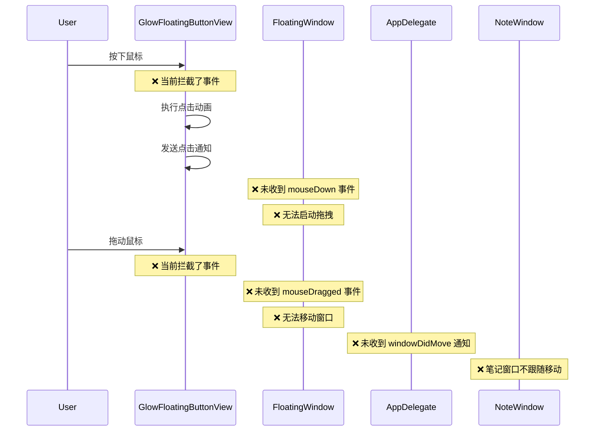

# 修复悬浮球移动和笔记窗口跟随问题

## 概述
通过分析代码发现，悬浮球无法移动的根本原因是 `GlowFloatingButtonView` 重写了 `mouseDown` 和 `mouseUp` 方法，拦截了鼠标事件，导致 `FloatingWindow` 无法接收到拖拽事件。笔记窗口不跟随悬浮球移动是由于悬浮球本身无法移动，因此 `windowDidMove` 通知从未被触发。

## 流程图



## 方案

### 方案1：在 GlowFloatingButtonView 中实现拖拽逻辑（推荐）

**优点**：
- 直接在视图层处理拖拽，逻辑清晰
- 可以精确控制拖拽行为
- 不影响现有的事件传递机制

**缺点**：
- 需要在视图层处理窗口移动
- 需要通过通知机制通知窗口位置变化

**实现步骤**：
1. 在 `GlowFloatingButtonView` 中添加拖拽状态变量
2. 修改 `mouseDown` 方法，记录初始位置
3. 添加 `mouseDragged` 方法，计算偏移并移动窗口
4. 修改 `mouseUp` 方法，在拖拽结束后触发点击事件
5. 发送窗口移动通知，让 `AppDelegate` 更新笔记窗口位置

### 方案2：将拖拽事件传递给父窗口

**优点**：
- 保持 `FloatingWindow` 的拖拽逻辑不变
- 代码改动较小

**缺点**：
- 需要区分点击和拖拽操作
- 可能导致事件传递混乱

**实现步骤**：
1. 在 `GlowFloatingButtonView` 中添加拖拽检测逻辑
2. 如果是拖拽操作，将事件传递给父窗口
3. 如果是点击操作，执行现有的点击逻辑

### 最终方案：采用方案1

选择方案1，因为它提供了更好的控制性和可维护性。

## 相关代码位置

### GlowFloatingButtonView.swift
- [mouseDown 方法](file:///Volumes/Cache/X/Sources/View/GlowFloatingButtonView.swift#L164-L175)
- [mouseUp 方法](file:///Volumes/Cache/X/Sources/View/GlowFloatingButtonView.swift#L177-L197)
- [mouseDragged 方法（需要添加）](file:///Volumes/Cache/X/Sources/View/GlowFloatingButtonView.swift#L198)

### FloatingWindow.swift
- [mouseDown 方法](file:///Volumes/Cache/X/Sources/View/FloatingWindow.swift#L84-L88)
- [mouseDragged 方法](file:////Volumes/Cache/X/Sources/View/FloatingWindow.swift#L90-L103)
- [mouseUp 方法](file:///Volumes/Cache/X/Sources/View/FloatingWindow.swift#L105-L108)

### AppDelegate.swift
- [windowDidMove 方法](file:///Volumes/Cache/X/Sources/App/AppDelegate.swift#L547-L559)
- [updateNoteWindowPosition 方法](file:///Volumes/Cache/X/Sources/App/AppDelegate.swift#L223-L255)

## 代码错误测试
代码修改完成后，必须使用以下命令检查代码错误：
```bash
swift build
```
如果出现编译错误，需要修复所有错误后才能继续。

## 验证流程
1. 启动应用
2. 尝试拖动悬浮球，确认可以自由移动
3. 点击悬浮球打开笔记窗口
4. 拖动悬浮球，确认笔记窗口跟随移动
5. 关闭笔记窗口，再次打开，确认位置正确
6. 在屏幕边缘拖动悬浮球，确认笔记窗口自动切换到合适的一侧

## 任务总结与结论
通过在 `GlowFloatingButtonView` 中实现拖拽逻辑，并确保窗口移动通知正确发送，可以解决悬浮球无法移动和笔记窗口不跟随的问题。核心是在视图层处理拖拽事件，并通过通知机制让 `AppDelegate` 更新笔记窗口位置。

## 任务耗时
- 任务开始时间：2111
- 任务结束时间：2144
- 任务总耗时：33 分钟
