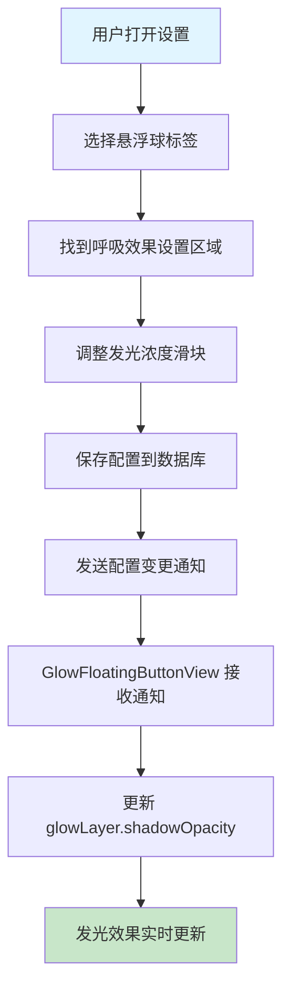

# 悬浮球发光浓度设置

## 概述
本任务旨在为悬浮球添加发光颜色浓度的个性化设置项，允许用户调整悬浮球外发光的明显程度。通过添加一个可调节的参数，用户可以根据个人喜好和屏幕亮度环境，让悬浮球的发光效果更明显或更不明显。

## 流程图



## 方案

### 方案一：使用 shadowOpacity 控制发光浓度（推荐）

**优点：**
- 直接控制 CALayer 的 shadowOpacity 属性，实现简单
- 性能好，不需要额外的计算
- 与现有的呼吸效果配置结构一致

**缺点：**
- 无明显缺点

**实现步骤：**
1. 在 `FloatingButtonConfig` 中添加 `glowIntensity` 字段，范围 0.0-1.0，默认值 0.8
2. 在 `FloatingButtonConfigManager` 中添加 `updateGlowIntensity` 方法
3. 在 `SettingsView.swift` 的呼吸效果设置区域添加发光浓度滑块
4. 在 `GlowFloatingButtonView.swift` 中使用配置值设置 `glowLayer.shadowOpacity`
5. 在配置变更时更新发光效果

### 方案二：使用 shadowRadius 控制发光范围

**优点：**
- 可以同时影响发光的扩散范围

**缺点：**
- shadowRadius 已经用于呼吸效果动画，修改会影响动画
- 不如 shadowOpacity 直观

### 方案三：组合使用 shadowOpacity 和 shadowRadius

**优点：**
- 可以提供更丰富的发光效果控制

**缺点：**
- 增加配置复杂度
- 用户可能难以理解两个参数的关系

**推荐方案：方案一**，因为实现简单、直观，且不会影响现有的呼吸效果动画。

## 相关代码位置

### 1. FloatingButtonConfig.swift
- 配置模型定义位置：[FloatingButtonConfig.swift](file:///Volumes/Cache/X/Sources/Model/FloatingButtonConfig.swift)
- 需要添加的字段位置：第 30 行附近，在 `breathingEffectOpacity` 字段之后添加
- 默认值配置位置：第 350 行附近，在 `breathingEffectOpacity: 0.3` 之后添加

### 2. FloatingButtonConfigManager
- 管理器类位置：[FloatingButtonConfigManager](file:///Volumes/Cache/X/Sources/Model/FloatingButtonConfig.swift#L370)
- 需要添加的方法位置：第 440 行附近，在 `updateBreathingEffectOpacity` 方法之后添加

### 3. SettingsView.swift
- 设置界面位置：[SettingsView.swift](file:///Volumes/Cache/X/Sources/View/SettingsView.swift)
- 呼吸效果设置区域位置：第 260-295 行
- 需要在呼吸速度滑块之后添加发光浓度滑块

### 4. GlowFloatingButtonView.swift
- 悬浮球视图位置：[GlowFloatingButtonView.swift](file:///Volumes/Cache/X/Sources/View/GlowFloatingButtonView.swift)
- 发光层设置位置：第 118-124 行，需要修改 `shadowOpacity` 的值
- 配置变更处理位置：第 345-357 行，`updateBreathingAnimation` 方法中

## 代码修改详情

### 1. FloatingButtonConfig.swift 修改

#### 添加字段
```swift
var glowIntensity: Double // 悬浮球发光浓度
```

#### 更新默认值
```swift
glowIntensity: 0.8,
```

#### 更新解码器
```swift
glowIntensity = try container.decodeIfPresent(Double.self, forKey: .glowIntensity) ?? 0.8
```

### 2. FloatingButtonConfigManager 修改

#### 添加方法
```swift
func updateGlowIntensity(_ intensity: Double) {
    config.glowIntensity = max(0.0, min(1.0, intensity))
    save()
    NotificationCenter.default.post(name: Notification.Name("floatingButtonConfigChanged"), object: nil)
}
```

### 3. SettingsView.swift 修改

在呼吸效果设置区域添加发光浓度滑块：
```swift
SettingsRow(
    title: "发光浓度",
    description: "调整悬浮球外发光的明显程度"
) {
    VStack(alignment: .trailing, spacing: 4) {
        Slider(
            value: Binding(
                get: { configManager.config.glowIntensity },
                set: { configManager.updateGlowIntensity($0) }
            ),
            in: 0.0...1.0,
            step: 0.05
        )
        .frame(width: 200)
        
        Text(String(format: "%.0f%%", configManager.config.glowIntensity * 100))
            .font(.caption)
            .foregroundColor(.secondary)
    }
}
```

### 4. GlowFloatingButtonView.swift 修改

#### 修改发光层设置（第 118-124 行）
```swift
let config = FloatingButtonConfigManager.shared.config
glowLayer.shadowColor = colorScheme.endColor
glowLayer.shadowOpacity = config.glowIntensity
glowLayer.shadowOffset = .zero
glowLayer.shadowRadius = 15
```

#### 添加配置更新方法
```swift
@objc private func handleConfigChanged() {
    updateBreathingAnimation()
    updateGlowIntensity()
}

private func updateGlowIntensity() {
    guard let glowLayer = glowLayer else { return }
    let config = FloatingButtonConfigManager.shared.config
    glowLayer.shadowOpacity = config.glowIntensity
}
```

## 代码错误测试
代码修改完成后，必须使用以下命令检查代码错误：
```bash
swift build
```
如果存在编译错误，需要修复所有错误后才能继续。

## 验证流程

1. **启动应用**
   - 运行应用，确保应用正常启动

2. **打开设置界面**
   - 点击菜单栏的设置图标或使用快捷键打开设置
   - 切换到"悬浮球"标签页

3. **测试发光浓度调节**
   - 找到"呼吸效果"设置区域
   - 调整"发光浓度"滑块
   - 观察悬浮球的发光效果是否实时变化

4. **测试不同浓度值**
   - 将滑块拖到最左边（0%），观察发光效果是否消失
   - 将滑块拖到最右边（100%），观察发光效果是否最明显
   - 将滑块拖到中间位置（50%），观察发光效果是否适中

5. **测试配置持久化**
   - 调整发光浓度到某个值
   - 关闭应用
   - 重新打开应用
   - 检查发光浓度是否保持之前设置的值

6. **测试与呼吸效果的配合**
   - 启用呼吸效果
   - 调整发光浓度
   - 观察呼吸动画是否正常工作
   - 确认发光浓度不会影响呼吸动画

7. **测试个性化设置**
   - 右键点击悬浮球
   - 选择"个性化"
   - 确认个性化设置中是否需要添加发光浓度选项（可选）

## 任务总结与结论

本任务通过添加 `glowIntensity` 配置项，实现了悬浮球发光浓度的可调节功能。用户可以通过设置界面中的滑块，将发光浓度从 0%（无发光）调整到 100%（最明显发光），默认值为 80%。

该功能实现简单，与现有的配置系统完全兼容，不会影响其他功能（如呼吸效果）。配置会自动保存到数据库中，重启应用后依然保持用户的设置。

## 任务耗时
- 任务开始时间：0916
- 任务结束时间：0940
- 任务总耗时：24 分钟
