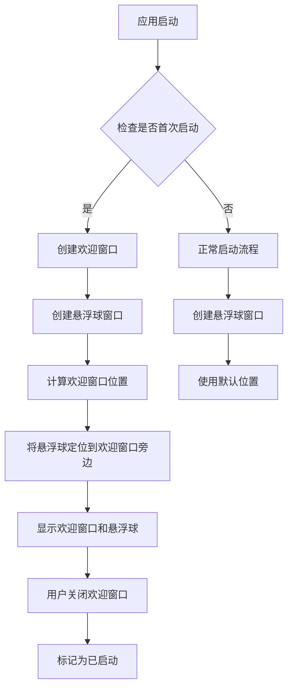

# 欢迎窗口和悬浮球显示

## 概述
实现初次使用应用时显示欢迎窗口，并将悬浮球显示到欢迎窗口旁边的功能。需要检测是否为首次启动，如果是，则显示欢迎窗口，并将悬浮球定位到欢迎窗口旁边。

## 流程图


## 方案

### 方案一：使用 UserDefaults 标记首次启动
**优点**：
- 实现简单，使用系统提供的 UserDefaults
- 不需要额外的存储机制
- 性能开销小

**缺点**：
- 如果用户删除应用数据，会再次显示欢迎窗口
- 无法区分不同版本的首次启动

**实现步骤**：
1. 在 UserDefaults 中添加 `hasLaunched` 键
2. 在 AppDelegate 的 `applicationDidFinishLaunching` 中检查该键
3. 如果不存在或为 false，显示欢迎窗口
4. 将悬浮球定位到欢迎窗口旁边
5. 用户关闭欢迎窗口后，设置 `hasLaunched` 为 true

### 方案二：使用 SettingsStore 存储首次启动状态
**优点**：
- 与现有配置存储机制一致
- 可以存储更多相关信息（如首次启动时间）
- 数据持久化更可靠

**缺点**：
- 需要修改数据库结构
- 实现相对复杂

**实现步骤**：
1. 在 SettingsStore 中添加首次启动相关的键值对
2. 在 AppConfig 表中存储首次启动状态
3. 在启动时检查数据库中的状态
4. 显示欢迎窗口并定位悬浮球
5. 更新数据库状态

### 方案三：结合版本号管理首次启动
**优点**：
- 可以区分不同版本的首次启动
- 支持版本更新时的引导功能
- 更灵活的版本控制

**缺点**：
- 实现最复杂
- 需要维护版本号信息

**实现步骤**：
1. 在配置中添加 `lastLaunchedVersion` 字段
2. 比较当前版本和上次启动版本
3. 如果是新版本，显示欢迎窗口
4. 更新版本号记录

## 推荐方案
**推荐使用方案一（UserDefaults 标记首次启动）**，因为：
1. 实现简单快速
2. 不需要修改现有的数据库结构
3. 满足当前需求即可
4. 后续可以根据需要升级到方案二或方案三

## 相关代码位置

### 主要文件
- [AppDelegate.swift](file:///Volumes/Cache/X/.git-worktrees/20260108-1021-欢迎窗口和悬浮球显示/Sources/App/AppDelegate.swift) - 应用启动逻辑，需要在此添加欢迎窗口检测
- [FloatingButtonConfig.swift](file:///Volumes/Cache/X/.git-worktrees/20260108-1021-欢迎窗口和悬浮球显示/Sources/Model/FloatingButtonConfig.swift) - 配置管理，可能需要添加首次启动相关配置
- [FloatingWindow.swift](file:///Volumes/Cache/X/.git-worktrees/20260108-1021-欢迎窗口和悬浮球显示/Sources/View/FloatingWindow.swift) - 悬浮球窗口，需要添加定位逻辑
- [NoteWindow.swift](file:///Volumes/Cache/X/.git-worktrees/20260108-1021-欢迎窗口和悬浮球显示/Sources/View/NoteWindow.swift) - 可参考此窗口实现欢迎窗口

### 关键方法
- `applicationDidFinishLaunching` (AppDelegate.swift:15) - 应用启动入口
- `createFloatingWindow` (AppDelegate.swift:376) - 创建悬浮球窗口
- `updateNoteWindowPosition` (AppDelegate.swift:165) - 更新窗口位置，可参考此方法实现悬浮球定位

## 代码错误测试
代码修改完成后，必须使用以下命令检查代码错误并修复：
```bash
swift build
```

## 验证流程
1. 首次启动应用，验证欢迎窗口是否显示
2. 验证悬浮球是否显示在欢迎窗口旁边
3. 关闭欢迎窗口，验证应用是否正常工作
4. 重新启动应用，验证欢迎窗口不再显示
5. 清除 UserDefaults 数据，验证欢迎窗口再次显示

## 任务总结与结论
本任务需要实现应用首次启动时的欢迎窗口功能，并将悬浮球定位到欢迎窗口旁边。通过分析代码结构，推荐使用 UserDefaults 来标记首次启动状态，实现简单且高效。主要修改点包括：
1. 在 AppDelegate 中添加首次启动检测逻辑
2. 创建欢迎窗口视图
3. 修改悬浮球定位逻辑，使其能够定位到欢迎窗口旁边
4. 在欢迎窗口关闭时标记应用已启动

## 任务耗时
- 任务开始时间：10:21
- 任务结束时间：10:59
- 任务总耗时：38 分钟
