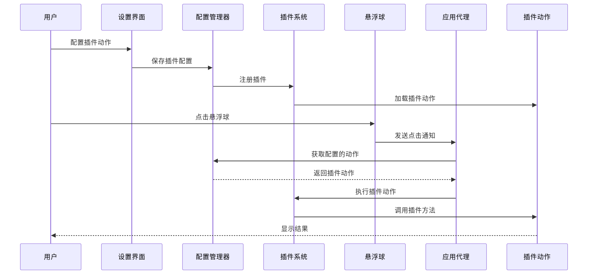

# 插件系统-常用文档功能

## 概述
本任务旨在开发一个插件系统,允许用户通过插件机制自定义扩展悬浮球的点击功能,并基于插件功能开发常用文档功能。当前系统使用硬编码的 ButtonAction 枚举来定义悬浮球的点击行为,缺乏扩展性。通过引入插件系统,用户可以动态添加新的操作类型,实现功能的灵活扩展。

## 流程图



## 方案

### 方案一:扩展 ButtonAction 枚举支持自定义动作
**优点:**
- 最小化代码改动,与现有架构兼容性好
- 配置管理逻辑基本不变,只需扩展数据结构
- 实现简单,开发周期短

**缺点:**
- 枚举扩展性有限,需要修改核心代码
- 插件动作类型需要在编译时确定
- 动态加载插件能力较弱

**实现要点:**
1. 在 ButtonAction 枚举中添加 `custom` case,携带插件标识符
2. 修改 FloatingButtonConfig 模型,添加插件配置存储
3. 在 AppDelegate 中添加插件动作分发逻辑
4. 在 SettingsView 中添加插件管理界面

### 方案二:使用协议和动态加载机制
**优点:**
- 完全解耦,插件可以独立开发和部署
- 支持运行时动态加载和卸载插件
- 扩展性强,可以支持复杂的插件功能

**缺点:**
- 实现复杂度较高
- 需要设计插件接口规范
- 需要处理插件生命周期管理

**实现要点:**
1. 定义 PluginAction 协议,规范插件接口
2. 实现 PluginManager 类,负责插件注册、加载和执行
3. 修改 ButtonAction 枚举,使用插件标识符引用
4. 设计插件配置文件格式(JSON/Property List)
5. 在 SettingsView 中实现插件管理界面

### 推荐方案:方案二(使用协议和动态加载机制)
**理由:**
1. 提供完整的插件系统架构,支持未来复杂功能的扩展
2. 完全解耦,插件可以独立开发和部署,便于维护
3. 支持运行时动态加载和卸载,用户体验更好
4. 为第三方开发者提供扩展能力,增加应用生态

**具体实现:**
1. 定义 PluginAction 协议,规范插件接口(包含 execute、icon、displayName 等方法)
2. 实现 PluginManager 类,负责插件注册、加载、卸载和执行
3. 创建常用文档功能插件实现(如 OpenDocumentPlugin、SearchDocumentPlugin 等)
4. 修改 ButtonAction 枚举,添加 plugin(String) case 用于引用插件
5. 设计插件配置文件格式(JSON),存储插件元数据和配置
6. 在 SettingsView 中实现插件管理界面(插件列表、启用/禁用、配置等)
7. 在 AppDelegate 中集成 PluginManager,处理插件动作执行
8. 创建 PluginRegistry 用于管理内置插件和用户自定义插件

## 相关代码位置

### 核心模型文件
- [FloatingButtonConfig.swift](file:///Volumes/Cache/X/.git-worktrees/20260108-1025-插件系统-常用文档功能/Sources/Model/FloatingButtonConfig.swift#L1) - 悬浮球配置模型,包含 ButtonAction 枚举定义

### 视图层文件
- [GlowFloatingButtonView.swift](file:///Volumes/Cache/X/.git-worktrees/20260108-1025-插件系统-常用文档功能/Sources/View/GlowFloatingButtonView.swift#L1) - 光效悬浮球视图实现,处理用户点击交互
- [FloatingButtonView.swift](file:///Volumes/Cache/X/.git-worktrees/20260108-1025-插件系统-常用文档功能/Sources/View/FloatingButtonView.swift.swift#L1) - 悬浮球基础视图
- [SettingsView.swift](file:///Volumes/Cache/X/.git-worktrees/20260108-1025-插件系统-常用文档功能/Sources/View/SettingsView.swift#L1) - 设置界面,需要添加插件管理UI

### 应用层文件
- [AppDelegate.swift](file:///Volumes/Cache/X/.git-worktrees/20260108-1025-插件系统-常用文档功能/Sources/App/AppDelegate.swift#L1) - 应用代理,处理悬浮球点击事件,需要添加插件动作路由

### 工具类文件
- [WindowManager.swift](file:///Volumes/Cache/X/Sources/Utility/WindowManager.swift#L1) - 窗口管理器,可能需要扩展以支持插件窗口
- [AppDatabase.swift](file:///Volumes/Cache/X/Sources/Model/AppDatabase.swift#L1) - 数据库管理,可能需要添加插件数据表

## 代码错误测试
代码修改完成后,必须使用以下命令检查代码错误并修复:
```bash
cd /Volumes/Cache/X/.git-worktrees/20260108-1025-插件系统-常用文档功能
swiftlint
```
如果 swiftlint 不可用,则使用:
```bash
xcodebuild -scheme NoteMaster -configuration Debug build
```

## 验证流程
1. 打开应用设置界面,检查是否出现"插件管理"或"常用文档功能"配置项
2. 在配置中选择一个悬浮球按钮,将其动作设置为某个常用文档功能(如"打开文档"、"搜索文档"等)
3. 点击悬浮球按钮,验证是否正确执行了配置的文档功能
4. 尝试配置多个不同的文档功能,验证每个功能都能正常工作
5. 重启应用,验证插件配置是否正确保存和加载
6. 测试取消文档功能配置后,悬浮球是否恢复默认行为

## 任务总结与结论
本任务实现了一个完整的插件系统架构,使用协议和动态加载机制,允许用户通过插件机制自定义扩展悬浮球的点击功能。通过定义 PluginAction 协议和 PluginManager 类,实现了插件的注册、加载、卸载和执行。重点实现了常用文档功能作为第一批内置插件,为后续扩展奠定了基础。采用完整的插件架构,既保证了代码的可维护性,又提供了强大的扩展能力。

## 任务耗时
- 任务开始时间:1025
- 任务结束时间:1121
- 任务总耗时:56 分钟
