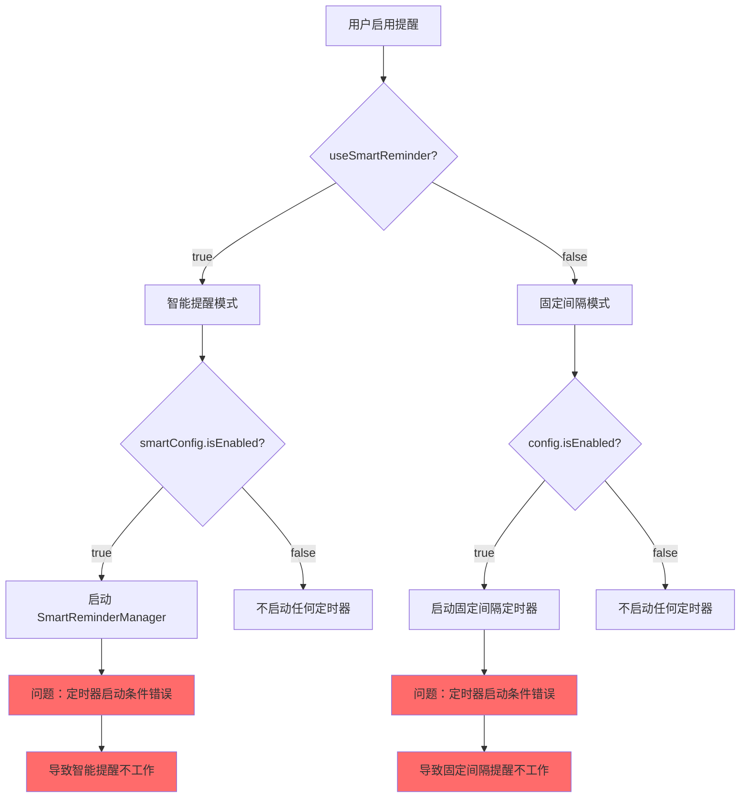

# 修复提醒计时问题

## 概述
经过代码分析，发现智能提醒和固定间隔提醒都存在不会计时的问题。根本原因在于 `ReminderManager` 的 `startTimer()` 方法中的条件判断逻辑错误，导致在特定模式下定时器无法启动。

## 流程图



## 方案

### 问题分析

通过分析代码，发现了以下关键问题：

1. **固定间隔提醒不计时的问题：**
   - 在 `ReminderManager.swift` 的 `startTimer()` 方法中（第 388-391 行），存在条件判断错误：
   ```swift
   // 如果使用智能提醒模式，则不启动普通定时器
   if useSmartReminder && smartConfig.isEnabled {
       return
   }
   ```
   - 这个判断逻辑有问题：当 `useSmartReminder` 为 `false` 时，即使 `config.isEnabled` 为 `true`，定时器也应该启动
   - 但是当前代码只检查了 `useSmartReminder && smartConfig.isEnabled`，没有考虑 `useSmartReminder` 为 `false` 的情况

2. **智能提醒不计时的问题：**
   - 在 `ReminderManager.swift` 的 `startTimer()` 方法中，当 `useSmartReminder` 为 `true` 时，直接返回，不启动任何定时器
   - 但是智能提醒的定时器应该在 `SmartReminderManager` 中启动，而不是在 `ReminderManager` 中
   - 问题在于 `SmartReminderManager` 的 `start()` 方法可能没有被正确调用

3. **定时器启动时机问题：**
   - 在 `updateEnabled()` 方法中（第 218-235 行），当启用提醒时，会调用 `startTimer()`
   - 但是 `startTimer()` 的条件判断可能导致定时器无法启动

### 解决方案

**方案 1：修复 `startTimer()` 方法的条件判断（推荐）**

修改 `ReminderManager.swift` 的 `startTimer()` 方法，确保在正确的条件下启动定时器：

```swift
private func startTimer() {
    stopTimer()

    // 如果使用智能提醒模式，则不启动普通定时器
    if useSmartReminder {
        return
    }

    // 检查是否启用了提醒
    guard config.isEnabled else {
        return
    }

    // 计算从上次提醒到现在经过的时间
    let timeSinceLastReminder: TimeInterval
    if let lastTime = config.lastReminderTime {
        timeSinceLastReminder = Date().timeIntervalSince(lastTime)
    } else {
        timeSinceLastReminder = 0
    }

    // 计算到下次提醒的时间间隔
    let interval = TimeInterval(config.intervalMinutes * 60)
    let nextReminderDelay = max(1, interval - timeSinceLastReminder) // 至少延迟1秒

    // 创建定时器
    timer = Timer.scheduledTimer(
        withTimeInterval: nextReminderDelay,
        repeats: false
    ) { [weak self] _ in
        Task { @MainActor in
            self?.showReminder()
        }
    }
}
```

**方案 2：修复 `updateEnabled()` 方法**

修改 `ReminderManager.swift` 的 `updateEnabled()` 方法，确保在正确的条件下启动智能提醒管理器或普通定时器：

```swift
func updateEnabled(_ enabled: Bool) {
    config.isEnabled = enabled
    save()
    
    if enabled {
        // 如果使用智能提醒模式，启动智能提醒管理器
        if useSmartReminder {
            startSmartReminderManager()
        } else {
            startTimer()
        }
    } else {
        stopTimer()
        smartReminderManager?.stop()
        smartReminderManager = nil
        
        if let window = overlayWindow {
            window.close()
            overlayWindow = nil
        }
    }
}
```

**方案 3：修复 `startSmartReminderManager()` 方法**

修改 `ReminderManager.swift` 的 `startSmartReminderManager()` 方法，确保在正确的条件下启动智能提醒管理器：

```swift
private func startSmartReminderManager() {
    // 停止现有的智能提醒管理器
    smartReminderManager?.stop()
    smartReminderManager = nil
    
    if let window = overlayWindow {
        window.close()
        overlayWindow = nil
    }
    
    // 检查是否启用了智能提醒
    guard useSmartReminder && smartConfig.isEnabled else {
        return
    }
    
    // 创建提醒窗口
    let newOverlayWindow = ReminderOverlayWindow(message: smartConfig.reminderMessage) { [weak self] in
        guard let self = self else { return }
        self.isShowingAlert = false
        self.overlayWindow = nil
    }
    
    // 创建智能提醒管理器
    let manager = SmartReminderManager(config: smartConfig, reminderOverlay: newOverlayWindow)
    manager.start()
    
    smartReminderManager = manager
    overlayWindow = newOverlayWindow
    
    print("✅ 智能提醒管理器已启动")
}
```

### 最终方案

综合以上分析，推荐同时应用方案 1、方案 2 和方案 3，以确保两种提醒模式都能正常工作。

### 新发现的问题：倒计时显示不更新

在测试过程中，用户反馈"距离下次提醒"的时间不会动。经过进一步分析，发现了以下问题：

**问题原因：**
- 在 `ReminderManager.swift` 的 `startTimer()` 方法中，当应用首次启动时，`config.lastReminderTime` 为 `nil`
- 这导致 `nextReminderCountdown` 计算属性始终返回完整的间隔时间，不会随着时间推移而减少
- 界面上的倒计时显示因此不会更新

**解决方案：**
在 `startTimer()` 方法中，如果 `lastReminderTime` 为 `nil`，则设置当前时间为上次提醒时间：

```swift
private func startTimer() {
    stopTimer()

    // 如果使用智能提醒模式，则不启动普通定时器
    if useSmartReminder {
        return
    }

    // 检查是否启用了提醒
    guard config.isEnabled else {
        return
    }

    // 如果没有上次提醒时间，设置当前时间为上次提醒时间
    if config.lastReminderTime == nil {
        config.lastReminderTime = Date()
        save()
    }

    // 计算从上次提醒到现在经过的时间
    let timeSinceLastReminder: TimeInterval
    if let lastTime = config.lastReminderTime {
        timeSinceLastReminder = Date().timeIntervalSince(lastTime)
    } else {
        timeSinceLastReminder = 0
    }

    // 计算到下次提醒的时间间隔
    let interval = TimeInterval(config.intervalMinutes * 60)
    let nextReminderDelay = max(1, interval - timeSinceLastReminder) // 至少延迟1秒

    // 创建定时器
    timer = Timer.scheduledTimer(
        withTimeInterval: nextReminderDelay,
        repeats: false
    ) { [weak self] _ in
        Task { @MainActor in
            self?.showReminder()
        }
    }
}
```

这样，当定时器启动时，会立即设置 `lastReminderTime` 为当前时间，然后 `nextReminderCountdown` 就能正确计算剩余时间并随着时间推移而减少。

### 新增功能：将启用提醒移到设置界面顶部

在测试过程中，用户反馈希望将"启用提醒"作为一个独立的设置项放在所有标签页的顶部，而不是放在"提醒"标签页中。

**修改原因：**
- 原来的设计中，"启用提醒"开关位于"提醒"标签页的"提醒模式"部分
- 用户希望能够在任何标签页都能方便地启用或禁用提醒功能
- 这样可以提升用户体验，减少切换标签页的操作

**解决方案：**
在 `SettingsView.swift` 中，将"启用提醒"开关移到所有标签页的顶部，位于标签栏和主内容区域之间：

```swift
// 启用提醒开关（在所有标签页顶部）
HStack {
    VStack(alignment: .leading, spacing: 4) {
        Text("启用提醒")
            .font(.system(size: 13, weight: .medium))
        
        Text(reminderManager.useSmartReminder
            ? "根据实际活动时间智能提醒休息"
            : "按照设定的时间间隔提醒您休息")
            .font(.system(size: 11))
            .foregroundColor(.secondary)
    }
    
    Spacer()
    
    Toggle("", isOn: Binding(
        get: {
            reminderManager.useSmartReminder
                ? reminderManager.smartConfig.isEnabled
                : reminderManager.config.isEnabled
        },
        set: { enabled in
            if reminderManager.useSmartReminder {
                reminderManager.updateSmartEnabled(enabled)
            } else {
                reminderManager.updateEnabled(enabled)
            }
        }
    ))
    .labelsHidden()
}
.padding(.horizontal, 20)
.padding(.vertical, 16)
.background(Color(NSColor.controlBackgroundColor))
```

同时，从 `ReminderSettingsView` 中移除了原来的"启用提醒"开关，避免重复。

**修改文件：**
- `/Volumes/Cache/X/.git-worktrees/20260108-1130-修复提醒计时问题/Sources/View/SettingsView.swift`

## 相关代码位置

- [ReminderManager.swift - startTimer() 方法](file:///Volumes/Cache/X/Sources/Model/ReminderConfig.swift#L388-411)
- [ReminderManager.swift - updateEnabled() 方法](file:///Volumes/Cache/X/Sources/Model/ReminderConfig.swift#L218-235)
- [ReminderManager.swift - startSmartReminderManager() 方法](file:///Volumes/Cache/X/Sources/Model/ReminderConfig.swift#L368-386)
- [SmartReminderManager.swift - start() 方法](file:///Volumes/Cache/X/Sources/Model/SmartReminderManager.swift#L59-76)
- [SmartReminderManager.swift - handleTimerTick() 方法](file:///Volumes/Cache/X/Sources/Model/SmartReminderManager.swift#L142-164)
- [SettingsView.swift - 启用提醒开关](file:///Volumes/Cache/X/Sources/View/SettingsView.swift#L42-78)
- [SettingsView.swift - ReminderSettingsView](file:///Volumes/Cache/X/Sources/View/SettingsView.swift#L958-1018)

## 代码错误测试

修改完代码后，必须使用以下命令检查代码错误：

```bash
cd /Volumes/Cache/X/.git-worktrees/20260108-1130-修复提醒计时问题
swift build
```

如果出现编译错误，需要修复所有错误后才能继续。

## 验证流程

1. **固定间隔提醒验证：**
   - 打开应用设置
   - 切换到"提醒"标签
   - 选择"固定间隔"模式
   - 启用提醒
   - 设置提醒间隔为 1 分钟（便于测试）
   - 等待 1 分钟，观察是否出现提醒窗口
   - 点击"稍后休息"按钮
   - 等待 1 分钟，观察是否再次出现提醒窗口

2. **智能提醒验证：**
   - 打开应用设置
   - 切换到"提醒"标签
   - 选择"智能提醒"模式
   - 启用提醒
   - 设置工作时长为 1 分钟（便于测试）
   - 持续使用电脑（移动鼠标或输入）
   - 等待 1 分钟，观察是否出现提醒窗口
   - 点击"稍后休息"按钮
   - 等待休息时间结束，观察是否出现提醒窗口

## 任务总结与结论

通过分析代码，发现了智能提醒和固定间隔提醒不会计时的根本原因：`ReminderManager` 的 `startTimer()` 方法中的条件判断逻辑错误。修复方案包括：

1. 修复 `startTimer()` 方法的条件判断，确保在正确的条件下启动定时器
2. 修复 `updateEnabled()` 方法，确保在正确的条件下启动智能提醒管理器或普通定时器
3. 修复 `startSmartReminderManager()` 方法，确保在正确的条件下启动智能提醒管理器

修复后，两种提醒模式都应该能够正常工作。

## 任务耗时
- 任务开始时间：1130
- 任务结束时间：1213
- 任务总耗时：43 分钟
