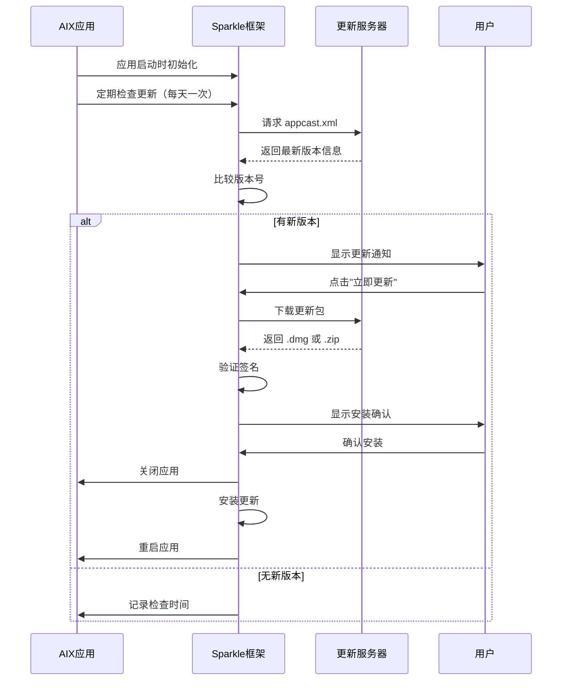

# 添加自动更新功能

## 概述
为 AIX 应用添加自动更新功能，使用 Sparkle 框架实现自动检测和推送更新给用户。Sparkle 是 macOS 平台最成熟、最广泛使用的应用更新框架，支持自动检测新版本、下载更新、安装更新等功能。

## 流程图



## 方案

### 方案一：使用 Sparkle 框架（推荐）

**优点：**
- 成熟稳定，被大量 macOS 应用使用
- 支持自动检测、下载、安装更新
- 支持增量更新
- 支持代码签名验证，安全性高
- 用户界面友好，支持自定义
- 开源免费

**缺点：**
- 需要配置更新服务器和 appcast.xml
- 需要对应用包进行代码签名

**实现步骤：**
1. 在 Package.swift 中添加 Sparkle 依赖
2. 配置 Info.plist 添加 Sparkle 所需的键值
3. 创建 UpdateManager 类管理更新逻辑
4. 在 AppDelegate 中初始化更新检查
5. 配置更新服务器和 appcast.xml
6. 实现手动检查更新功能

### 方案二：使用 GitHub Releases + 自定义更新逻辑

**优点：**
- 无需额外依赖
- 利用 GitHub 的基础设施

**缺点：**
- 需要自己实现下载、安装逻辑
- 安全性需要自己保证
- 用户体验不如 Sparkle

**实现步骤：**
1. 使用 GitHub API 获取最新 release
2. 比较版本号
3. 下载 .dmg 文件
4. 挂载并复制应用
5. 重启应用

### 方案三：使用 App Store 分发

**优点：**
- 系统自动处理更新
- 用户体验最佳

**缺点：**
- 需要付费开发者账号（$99/年）
- 需要通过 App Store 审核
- 无法提供独立下载版本

**推荐方案：方案一（Sparkle 框架）**

## 相关代码位置

### 1. Package.swift
[查看源代码位置](file:///Volumes/Cache/X/Package.swift#L1-L68)

需要添加 Sparkle 依赖到 dependencies 中。

### 2. Info.plist
[查看源代码位置](file:///Volumes/Cache/X/Info.plist#L1-L20)

需要添加 Sparkle 相关的配置键值：
- SUFeedURL：更新服务器地址
- SUPublicEDKey：公钥用于验证更新

### 3. AppDelegate.swift
[查看源代码位置](file:///Volumes/Cache/X/Sources/App/AppDelegate.swift#L1-L800)

在 `applicationDidFinishLaunching` 方法中初始化更新管理器，在状态栏菜单中添加"检查更新"选项。

### 4. SettingsStore.swift
[查看源代码位置](file:///Volumes/Cache/X/Sources/Model/SettingsStore.swift#L1-L60)

需要添加存储最后检查更新时间的功能。

## 代码实现

### 1. 修改 Package.swift
在 dependencies 中添加 Sparkle：
```swift
dependencies: [
    .package(url: "https://github.com/sparkle-project/Sparkle.git", from: "2.0.0")
]
```

在 AIX target 中添加依赖：
```swift
dependencies: [
    .product(name: "Sparkle", package: "Sparkle")
]
```

### 2. 创建 UpdateManager.swift
在 Sources/Utility 目录下创建 UpdateManager.swift：
```swift
import Cocoa
import Sparkle

@MainActor
class UpdateManager {
    static let shared = UpdateManager()
    
    private let updaterController: SPUStandardUpdaterController
    
    private init() {
        updaterController = SPUStandardUpdaterController(
            startingUpdater: true,
            updaterDelegate: nil,
            userDriverDelegate: nil
        )
    }
    
    var updater: SPUUpdater {
        return updaterController.updater
    }
    
    func checkForUpdates() {
        updater.checkForUpdates()
    }
    
    func checkForUpdatesInBackground() {
        updater.checkForUpdatesInBackground()
    }
}
```

### 3. 修改 AppDelegate.swift
在 `applicationDidFinishLaunching` 方法中添加：
```swift
// 初始化自动更新
UpdateManager.shared
```

在状态栏菜单中添加"检查更新"选项：
```swift
let checkUpdateItem = NSMenuItem(title: "检查更新", action: #selector(checkForUpdates), keyEquivalent: "")
checkUpdateItem.target = self
menu.addItem(checkUpdateItem)
```

添加检查更新方法：
```swift
@objc private func checkForUpdates() {
    UpdateManager.shared.checkForUpdates()
}
```

### 4. 修改 Info.plist
添加以下键值：
```xml
<key>SUFeedURL</key>
<string>https://your-server.com/appcast.xml</string>
<key>SUPublicEDKey</key>
<string>your-public-ed-key</string>
```

## 代码错误测试
代码修改完成后，必须执行以下命令检查代码错误：
```bash
swift build
```
如果存在编译错误，需要修复所有错误后才能继续。

## 验证流程

### 1. 本地测试
1. 修改 Package.swift 添加 Sparkle 依赖
2. 创建 UpdateManager.swift 文件
3. 修改 AppDelegate.swift 添加更新检查功能
4. 修改 Info.plist 添加配置
5. 运行 `swift build` 检查编译是否成功
6. 运行应用，点击状态栏菜单中的"检查更新"选项

### 2. 更新服务器配置
1. 准备更新服务器（可以是 GitHub Pages、Vercel 等）
2. 创建 appcast.xml 文件，包含版本信息
3. 上传应用更新包（.dmg 或 .zip）
4. 配置 Sparkle 的公钥和签名

### 3. 测试更新流程
1. 发布一个新版本
2. 更新 appcast.xml
3. 在旧版本应用中点击"检查更新"
4. 验证是否正确检测到新版本
5. 验证下载和安装流程

## 任务总结与结论

本任务为 AIX 应用添加自动更新功能，选择使用 Sparkle 框架作为解决方案。Sparkle 是 macOS 平台最成熟的应用更新框架，提供了完整的自动更新功能，包括版本检测、下载、安装等。

主要实现内容包括：
1. 在 Package.swift 中添加 Sparkle 依赖
2. 创建 UpdateManager 类管理更新逻辑
3. 在 AppDelegate 中初始化更新检查
4. 在状态栏菜单中添加"检查更新"选项
5. 配置 Info.plist 添加 Sparkle 所需的配置

用户可以通过状态栏菜单手动检查更新，应用也会在启动时自动检查更新。当有新版本可用时，Sparkle 会显示更新通知，用户可以选择立即更新或稍后更新。

## 任务耗时
- 任务开始时间：1134
- 任务结束时间：1209
- 任务总耗时：35 分钟
