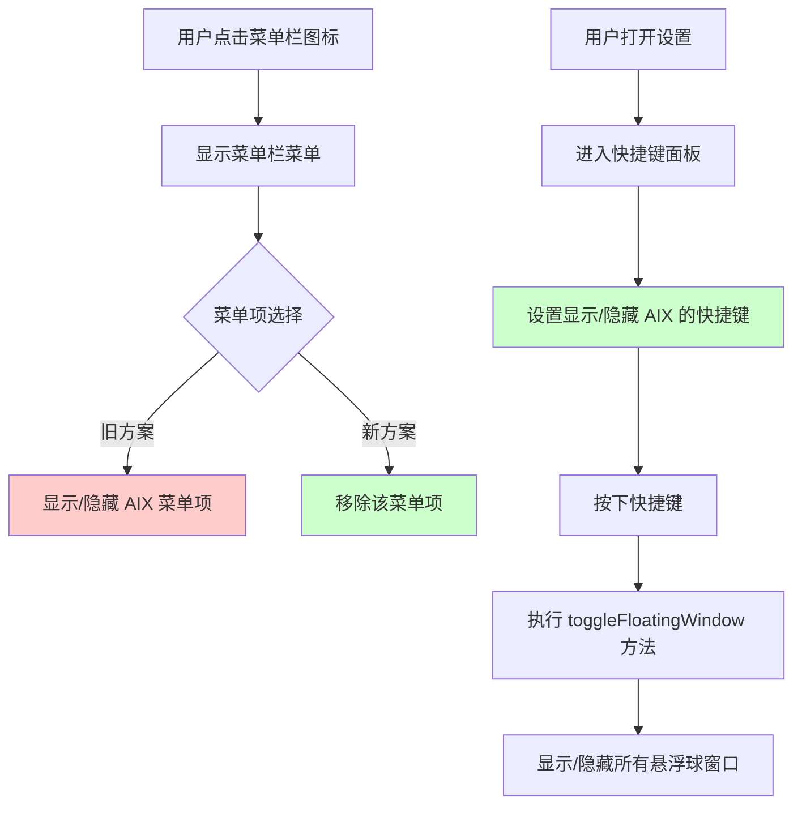

# 移除菜单栏右键菜单显示隐藏AIX项并添加快捷键

## 概述
本任务需要将菜单栏右键菜单中的"显示/隐藏 AIX"菜单项移除，并将该功能通过快捷键的方式添加到设置的快捷键面板中。这样可以简化菜单栏菜单，同时提供更高效的快捷键操作方式。

## 流程图


## 方案

### 方案一：使用 NSEvent 监听全局快捷键（推荐）
**优点**：
- 原生 macOS 方式，兼容性好
- 不需要额外的依赖库
- 可以在应用未激活时也能响应快捷键

**缺点**：
- 需要处理快捷键冲突
- 实现相对复杂

**实现步骤**：
1. 在 `FloatingButtonConfig` 中添加快捷键配置字段
2. 在 `AppDelegate` 中添加全局快捷键监听
3. 在设置面板中添加"快捷键"标签页
4. 移除菜单栏菜单中的"显示/隐藏 AIX"菜单项

### 方案二：使用 Carbon 框架的 EventHotKey
**优点**：
- 更底层的实现，性能更好
- 可以处理更复杂的快捷键组合

**缺点**：
- Carbon 框架已废弃，不建议使用
- 代码复杂度高

### 方案三：使用第三方快捷键库（如 HotKey）
**优点**：
- API 简洁易用
- 功能完善

**缺点**：
- 需要添加第三方依赖
- 增加项目复杂度

**推荐方案**：方案一，使用 NSEvent 监听全局快捷键

## 相关代码位置

### 1. 菜单栏菜单设置
[AppDelegate.swift:446-528](file:///Volumes/Cache/X/Sources/App/AppDelegate.swift#L446-L528)
- `setupStatusBarMenu()` 方法负责创建菜单栏菜单
- 第 449 行：`let showHideItem = NSMenuItem(title: "显示/隐藏 AIX", action: #selector(toggleFloatingWindow), keyEquivalent: "")`

### 2. 显示/隐藏功能实现
[AppDelegate.swift:670-687](file:///Volumes/Cache/X/Sources/App/AppDelegate.swift#L670-L687)
- `toggleFloatingWindow()` 方法实现显示/隐藏所有悬浮球窗口

### 3. 设置面板结构
[SettingsView.swift:1-100](file:///Volumes/Cache/X/Sources/View/SettingsView.swift#L1-L100)
- 设置面板主视图，包含多个标签页
- 需要添加"快捷键"标签页

### 4. 通用设置视图
[SettingsView.swift:100-199](file:///Volumes/Cache/X/Sources/View/SettingsView.swift#L100-L199)
- 通用设置视图，可以在此添加快捷键设置

### 5. 配置管理
[FloatingButtonConfig.swift](file:///Volumes/Cache/X/Sources/Model/FloatingButtonConfig.swift)
- 需要添加快捷键配置字段

## 实现细节

### 1. 修改 FloatingButtonConfig.swift
添加快捷键配置字段：
```swift
var toggleAIXHotkey: String // 显示/隐藏 AIX 的快捷键，格式如 "Cmd+Shift+A"
```

### 2. 修改 AppDelegate.swift
- 移除菜单栏菜单中的"显示/隐藏 AIX"菜单项（第 449 行）
- 添加全局快捷键监听
- 实现快捷键触发时调用 `toggleFloatingWindow()` 方法

### 3. 修改 SettingsView.swift
- 添加"快捷键"标签页
- 创建快捷键设置视图，允许用户自定义快捷键

## 代码错误测试
代码修改完成后，必须使用以下命令检查代码错误：
```bash
cd /Volumes/Cache/X/.git-worktrees/20260108-1143-移除菜单栏右键菜单显示隐藏AIX项并添加快捷键
swift build
```
如果有编译错误，需要修复所有错误后再继续。

## 验证流程
1. 打开应用，检查菜单栏菜单是否已移除"显示/隐藏 AIX"菜单项
2. 打开设置，检查是否新增"快捷键"标签页
3. 在快捷键面板中设置显示/隐藏 AIX 的快捷键（例如 Cmd+Shift+A）
4. 按下设置的快捷键，验证是否能够正确显示/隐藏所有悬浮球窗口
5. 在应用未激活时，验证快捷键是否仍然有效

## 任务总结与结论
本任务将菜单栏右键菜单中的"显示/隐藏 AIX"功能迁移到快捷键方式，简化了菜单栏菜单，同时提供了更高效的操作方式。通过使用 NSEvent 监听全局快捷键，确保快捷键在任何情况下都能正常工作。

## 任务耗时
- 任务开始时间：1143
- 任务结束时间：1213
- 任务总耗时：30 分钟
