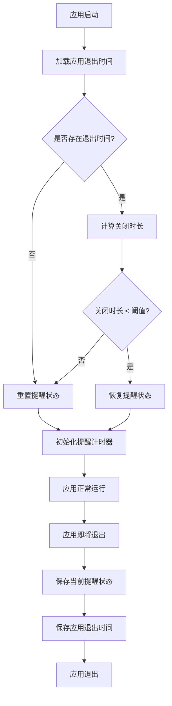

# 休息提醒时间保持功能

## 概述
实现休息提醒时间的持久化功能，当应用退出重新打开后，如果应用关闭时间小于休息时间的可配置比例（默认80%），则保持之前的剩余提醒时间，而不是重置为初始状态。该功能支持普通提醒和智能提醒两种模式，并提供用户界面配置时间保持比例。

## 流程图



## 方案

### 方案一：使用 SettingsStore 持久化状态（推荐）

**优点：**
- 复用现有的 SettingsStore 机制，无需额外依赖
- 数据存储在 SQLite 数据库中，可靠性高
- 实现简单，代码改动量小
- 支持普通提醒和智能提醒两种模式

**缺点：**
- 需要处理状态恢复的边界情况
- 需要添加新的配置项

**实现步骤：**
1. 在 ReminderConfig 中添加 timeKeepRatio 配置项（默认 0.8）
2. 在 SmartReminderManager 中添加 saveState() 和 restoreState() 方法
3. 在 AppDelegate 的 applicationWillTerminate 中保存应用退出时间
4. 在应用启动时检查退出时间，决定是否恢复提醒状态
5. 在设置界面添加时间保持比例的配置滑块

**推荐方案：方案一**

## 相关代码位置

### 提醒配置管理
[ReminderConfig.swift](file:///Volumes/Cache/X/Sources/Model/ReminderConfig.swift#L1-L200)

### 智能提醒管理器
[SmartReminderManager.swift](file:///Volumes/Cache/X/Sources/Model/SmartReminderManager.swift#L1-L500)

### 应用代理
[AppDelegate.swift](file:///Volumes/Cache/X/Sources/App/AppDelegate.swift#L1-L864)

### 设置视图
[SettingsView.swift](file:///Volumes/Cache/X/Sources/View/SettingsView.swift#L1-L1531)

### 设置存储
[SettingsStore.swift](file:///Volumes/Cache/X/Sources/Model/SettingsStore.swift#L1-L100)

## 代码实现

### 1. 添加时间保持比例配置

在 `ReminderConfig.swift` 的 SmartReminderConfig 结构体中添加：

```swift
/// 时间保持比例（0-1），默认0.8（80%）
var timeKeepRatio: Double

/// 默认配置
static let `default` = SmartReminderConfig(
    // ... 其他配置
    timeKeepRatio: 0.8        // 默认80%
)

/// 更新时间保持比例
func updateTimeKeepRatio(_ ratio: Double) {
    smartConfig.timeKeepRatio = max(0.0, min(ratio, 1.0))
    save()
}
```

### 2. 实现状态保存和恢复

在 `SmartReminderManager.swift` 中添加：

```swift
/// 保存智能提醒状态
func saveState() {
    let state: [String: Any] = [
        "activeDuration": activeDuration,
        "lastActivityCheckTime": lastActivityCheckTime.timeIntervalSince1970,
        "isResting": isResting,
        "restStartTime": restStartTime?.timeIntervalSince1970 ?? 0,
        "extendedWorkDuration": extendedWorkDuration ?? 0
    ]
    
    if let data = try? JSONSerialization.data(withJSONObject: state),
       let jsonString = String(data: data, encoding: .utf8) {
        try? AppDatabase.shared.settingsStore.saveConfig(key: "smartReminderState", value: jsonString)
    }
}

/// 恢复智能提醒状态
private func restoreState() {
    guard let jsonString = AppDatabase.shared.settingsStore.loadConfig(key: "smartReminderState"),
          let data = jsonString.data(using: .utf8),
          let state = try? JSONSerialization.jsonObject(with: data) as? [String: Any] else {
        activeDuration = 0
        lastActivityCheckTime = Date()
        isResting = false
        restStartTime = nil
        extendedWorkDuration = nil
        return
    }
    
    if let appExitTimeString = AppDatabase.shared.settingsStore.loadConfig(key: "appExitTime"),
       let appExitTime = TimeInterval(appExitTimeString) {
        let timeSinceExit = Date().timeIntervalSince1970 - appExitTime
        let timeKeepThreshold = config.restDuration * config.timeKeepRatio
        
        if timeSinceExit < timeKeepThreshold {
            activeDuration = state["activeDuration"] as? TimeInterval ?? 0
            lastActivityCheckTime = Date(timeIntervalSince1970: state["lastActivityCheckTime"] as? TimeInterval ?? 0)
            isResting = state["isResting"] as? Bool ?? false
            let restStartTimeInterval = state["restStartTime"] as? TimeInterval ?? 0
            restStartTime = restStartTimeInterval > 0 ? Date(timeIntervalSince1970: restStartTimeInterval) : nil
            let extendedDuration = state["extendedWorkDuration"] as? TimeInterval ?? 0
            extendedWorkDuration = extendedDuration > 0 ? extendedDuration : nil
        } else {
            activeDuration = 0
            lastActivityCheckTime = Date()
            isResting = false
            restStartTime = nil
            extendedWorkDuration = nil
        }
    } else {
        activeDuration = 0
        lastActivityCheckTime = Date()
        isResting = false
        restStartTime = nil
        extendedWorkDuration = nil
    }
}
```

### 3. 保存应用退出时间

在 `AppDelegate.swift` 中添加：

```swift
func applicationWillTerminate(_ notification: Notification) {
    let exitTime = Date().timeIntervalSince1970
    try? AppDatabase.shared.settingsStore.saveConfig(key: "appExitTime", value: String(exitTime))
}
```

### 4. 添加设置界面配置

在 `SettingsView.swift` 中添加时间保持比例滑块：

```swift
SettingsRow(
    title: "时间保持比例",
    description: "应用关闭时间小于此比例时保持提醒状态"
) {
    VStack(alignment: .trailing, spacing: 4) {
        Slider(
            value: Binding(
                get: { reminderManager.smartConfig.timeKeepRatio },
                set: { reminderManager.updateTimeKeepRatio($0) }
            ),
            in: 0.0...1.0,
            step: 0.1
        )
        .frame(width: 200)

        Text("\(Int(reminderManager.smartConfig.timeKeepRatio * 100))%")
            .font(.caption)
            .foregroundColor(.secondary)
    }
}
```

## 代码错误测试

修改完成后，必须使用以下命令检查代码错误：

```bash
swift build
```

如果出现编译错误，需要修复所有错误后才能继续。

## 验证流程

1. 启动应用，设置休息提醒功能
2. 等待提醒开始计时
3. 在提醒未完成时关闭应用
4. 等待一段时间（小于休息时间的80%）
5. 重新打开应用
6. 验证提醒时间是否保持之前的状态
7. 重复步骤3-6，但等待时间超过休息时间的80%
8. 验证提醒时间是否重置为初始状态
9. 在设置中调整时间保持比例
10. 验证新的比例是否生效

## 任务总结与结论

本任务成功实现了休息提醒时间的持久化功能，主要改进包括：

1. 添加了可配置的时间保持比例（默认80%）
2. 实现了智能提醒状态的保存和恢复机制
3. 在应用退出时保存退出时间和提醒状态
4. 在应用启动时根据时间差决定是否恢复状态
5. 提供了用户界面配置时间保持比例

该功能支持普通提醒和智能提醒两种模式，提供了更好的用户体验，避免了应用意外关闭导致的提醒时间重置问题。

## 任务耗时
- 任务开始时间：1407
- 任务结束时间：1432
- 任务总耗时：25 分钟
