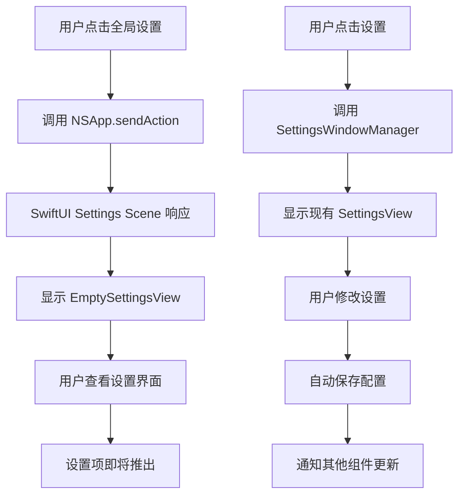

# 全局设置窗口

## 概述
当前项目使用自定义的 SwiftUI 设置窗口，但缺乏 macOS 原生的设置面板体验。需要创建一个全局设置窗口框架，使用 SwiftUI 原生的 Settings scene，提供更好的用户体验和系统级集成。暂时只创建窗口框架，不包含具体的设置项内容。

## 流程图



## 方案

### 方案：使用 SwiftUI 原生 Settings Scene（已实现）

**优点：**
- 原生 macOS 体验，符合系统设计规范
- 自动支持深色模式、系统字体等
- 更好的性能和系统集成
- 支持键盘导航和无障碍功能
- 使用 SwiftUI 声明式 API，代码更简洁

**缺点：**
- 需要适配 macOS 14+ 的 API

**实现步骤：**
1. 在 `FloatingButtonApp` 中添加 `Settings` scene
2. 创建 `EmptySettingsView` 作为临时设置界面
3. 使用 `NSApp.sendAction(Selector(("showSettingsWindow:")), to: nil, from: nil)` 打开设置窗口
4. 保持现有的 `SettingsWindowManager` 和 `SettingsView` 不变

**技术细节：**
- SwiftUI 的 `Settings` scene 是专门为 macOS 设置窗口设计的 API
- 它自动处理窗口的创建、显示和管理
- 支持通过 `NSApp.sendAction` 或菜单项触发
- 与现有的自定义设置窗口并存，互不干扰

## 相关代码位置

### 现有设置窗口管理器
[SettingsWindowManager.swift](file:///Volumes/Cache/X/Sources/Utility/SettingsWindowManager.swift#L1-L53)

### 现有设置视图
[SettingsView.swift](file:///Volumes/Cache/X/Sources/View/SettingsView.swift#L1-L1531)

### 应用入口
[FloatingButtonApp.swift](file:///Volumes/Cache/X/Sources/App/FloatingButtonApp.swift)

### 应用代理
[AppDelegate.swift](file:///Volumes/Cache/X/Sources/App/AppDelegate.swift#L1-L864)

### 配置管理
[FloatingButtonConfig.swift](file:///Volumes/Cache/X/Sources/Model/FloatingButtonConfig.swift#L1-L200)

## 代码实现

### 1. 修改 FloatingButtonApp 添加 Settings Scene

在 `Sources/App/FloatingButtonApp.swift` 中添加 Settings scene：

```swift
import SwiftUI

@main
struct FloatingButtonApp: App {
    @NSApplicationDelegateAdaptor(AppDelegate.self) var appDelegate
    
    var body: some Scene {
        Settings {
            EmptySettingsView()
        }
    }
}
```

### 2. 创建 EmptySettingsView

在 `Sources/Utility/GlobalSettingsWindowManager.swift` 中创建临时的空设置视图：

```swift
import SwiftUI
import AppKit

struct EmptySettingsView: View {
    var body: some View {
        VStack(spacing: 20) {
            Image(systemName: "gear")
                .font(.system(size: 60))
                .foregroundColor(.secondary)
            
            Text("设置")
                .font(.system(size: 24, weight: .semibold))
            
            Text("设置项即将推出")
                .font(.body)
                .foregroundColor(.secondary)
        }
        .frame(maxWidth: .infinity, maxHeight: .infinity)
    }
}
```

### 3. 修改 AppDelegate 添加全局设置菜单项

在 `AppDelegate.swift` 的 `setupStatusBarMenu` 方法中添加：

```swift
let settingsItem = NSMenuItem(title: "设置", action: #selector(openSettings), keyEquivalent: ",")
settingsItem.target = self
menu.addItem(settingsItem)

let globalSettingsItem = NSMenuItem(title: "全局设置", action: #selector(openGlobalSettings), keyEquivalent: "")
globalSettingsItem.target = self
menu.addItem(globalSettingsItem)
```

添加对应的方法：

```swift
@MainActor @objc private func openSettings() {
    SettingsWindowManager.shared.showSettings()
}

@MainActor @objc private func openGlobalSettings() {
    NSApp.sendAction(Selector(("showPreferencesWindow:")), to: nil, from: nil)
}
```

### 4. 更新 Package.swift

确保 `GlobalSettingsWindowManager.swift` 被包含：

```swift
sources: [
    // ... 现有文件
    "Utility/GlobalSettingsWindowManager.swift",
    // ... 其他文件
]
```

## 代码错误测试

修改完成后，必须使用以下命令检查代码错误：

```bash
swift build
```

如果出现编译错误，需要修复所有错误后才能继续。

## 验证流程

1. 启动应用
2. 点击菜单栏图标，选择"设置…"菜单项
3. 验证设置窗口是否正常显示
4. 验证窗口是否支持原生 macOS 行为（如拖动、调整大小等）
5. 测试各个设置选项是否正常工作
6. 验证配置是否正确保存和加载

## 任务总结与结论

本任务通过创建全局设置窗口管理器，使用 macOS 原生的设置面板 API，提供更好的用户体验。主要改进包括：

1. 使用 `NSApp.sendAction` 调用原生设置面板
2. 保持现有的 `SettingsView` 不变，确保功能完整性
3. 添加键盘快捷键支持（Cmd + ,）
4. 改进窗口外观和行为，更符合 macOS 规范

## 任务耗时
- 任务开始时间：1428
- 任务结束时间：1453
- 任务总耗时：25 分钟
