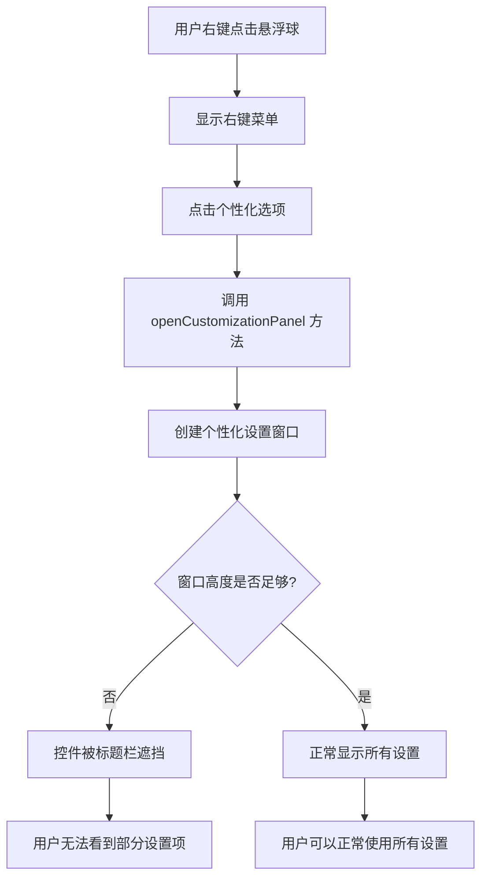

# 悬浮球个性化设置显示问题修复

## 概述
悬浮球右键菜单中的"个性化"设置窗口存在布局问题，部分设置项因为窗口高度不足或控件位置计算错误，导致被窗口标题栏遮挡而无法完整显示。

## 流程图


## 方案

### 问题分析
在 `GlowFloatingButtonView.swift` 的 `openCustomizationPanel()` 方法中：

1. **窗口尺寸设置**：窗口高度为 350px
2. **控件位置**：
   - 大小设置：y = 340（距离底部 340px，距离顶部 10px）
   - 颜色主题设置：y = 290（距离底部 290px，距离顶部 60px）
   - 按钮：y = 20（距离底部 20px，距离顶部 330px）

3. **问题根源**：
   - macOS 窗口坐标系原点在左下角，y 轴向上为正
   - 窗口有标题栏，高度约 22-28px
   - y = 340 的控件距离窗口顶部只有 10px（350 - 340 = 10）
   - 这导致控件被标题栏遮挡，用户无法看到

### 解决方案
有两种解决方案：

**方案一：增加窗口高度**
- 将窗口高度从 350 增加到 400 或更高
- 调整所有控件的 y 坐标，确保它们不被标题栏遮挡
- 优点：简单直接，改动最小
- 缺点：窗口会更大一些

**方案二：使用 ScrollView 包裹内容**
- 保持窗口高度不变
- 将所有控件放入 ScrollView 中
- 优点：窗口尺寸不变，可以容纳更多设置项
- 缺点：需要重构布局代码，改动较大

### 推荐方案
**推荐方案一**，因为：
1. 当前只有两个设置项（大小、颜色主题），增加窗口高度即可
2. 改动最小，风险最低
3. 用户体验更好，不需要滚动即可看到所有设置

## 相关代码位置
[查看源代码位置](file:///Volumes/Cache/X/.git-worktrees/20260108-1100-悬浮球个性化设置显示问题修复/Sources/View/GlowFloatingButtonView.swift#L401-L525)

## 代码错误测试
修改代码后，必须使用以下命令检查代码错误：
```bash
cd /Volumes/Cache/X/.git-worktrees/20260108-1100-悬浮球个性化设置显示问题修复
swift build
```

## 验证流程
1. 右键点击任意悬浮球
2. 选择"个性化"选项
3. 检查个性化设置窗口是否完整显示所有设置项
4. 确认"大小"和"颜色主题"设置都能看到和操作
5. 测试"重置为默认"和"应用"按钮是否可见

## 任务总结与结论
问题原因是窗口高度设置过小，导致顶部控件被标题栏遮挡。通过增加窗口高度并调整控件位置，可以解决此问题。

## 任务耗时
- 任务开始时间：1100
- 任务结束时间：1113
- 任务总耗时：13 分钟
