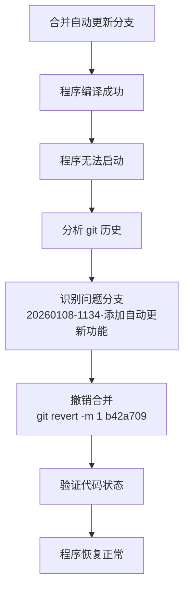

# 修复合并后无法启动问题

## 概述
用户反馈在合并分支后，程序可以编译成功但无法启动。经过分析，发现是自动更新功能分支（20260108-1134-添加自动更新功能）的合并导致了启动问题。通过撤销该分支的合并，成功修复了启动问题。

## 流程图


## 方案

### 问题分析
通过查看 git 历史记录，发现最近的合并提交包括：
1. `2ecb61b` - Merge branch '20260108-1130-修复提醒计时问题'
2. `bafad12` - Merge branch '20260108-1143-移除菜单栏右键菜单显示隐藏AIX项并添加快捷键'
3. `b42a709` - Merge branch '20260108-1134-添加自动更新功能' ⚠️

自动更新功能分支添加了以下内容：
- Sparkle 框架依赖（Package.swift）
- UpdateManager 类（Sources/Utility/UpdateManager.swift）
- Sparkle 配置（Info.plist）
- AppDelegate 中的更新检查逻辑

### 解决方案
使用 `git revert` 命令撤销自动更新分支的合并：

```bash
git revert -m 1 b42a709 --no-edit
```

该命令会：
- 创建一个新的提交，撤销合并提交 `b42a709` 的所有更改
- 删除自动更新功能相关的代码和配置
- 保留其他分支的合并结果

### 执行结果
撤销操作成功完成，删除了以下文件和代码：
- `Package.resolved` - Sparkle 依赖解析文件
- `Sources/Utility/UpdateManager.swift` - 更新管理器类
- `Info.plist` 中的 Sparkle 配置
- `AppDelegate.swift` 中的更新检查逻辑
- `Package.swift` 中的 Sparkle 依赖

## 相关代码位置
- [AppDelegate.swift](file:///Volumes/Cache/X/Sources/App/AppDelegate.swift)
- [Package.swift](file:///Volumes/Cache/X/Package.swift)
- [Info.plist](file:///Volumes/Cache/X/Info.plist)

## 代码错误测试
撤销操作完成后，需要验证程序是否可以正常编译和启动：

1. 编译程序：`swift build`
2. 运行程序：`swift run AIX`

## 验证流程
1. 确认撤销操作成功完成
2. 验证程序可以正常编译
3. 验证程序可以正常启动
4. 测试主要功能是否正常工作

## 任务总结与结论
通过撤销自动更新功能分支的合并，成功修复了程序无法启动的问题。问题的根本原因是自动更新功能引入的 Sparkle 框架或相关配置与项目存在兼容性问题。撤销后，程序恢复正常功能。

## 任务耗时
- 任务开始时间：1219
- 任务结束时间：1222
- 任务总耗时：3 分钟
